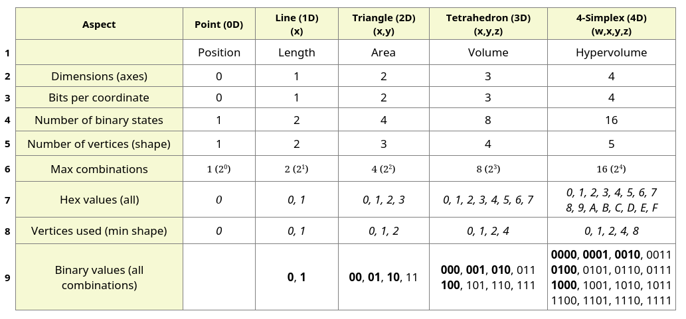
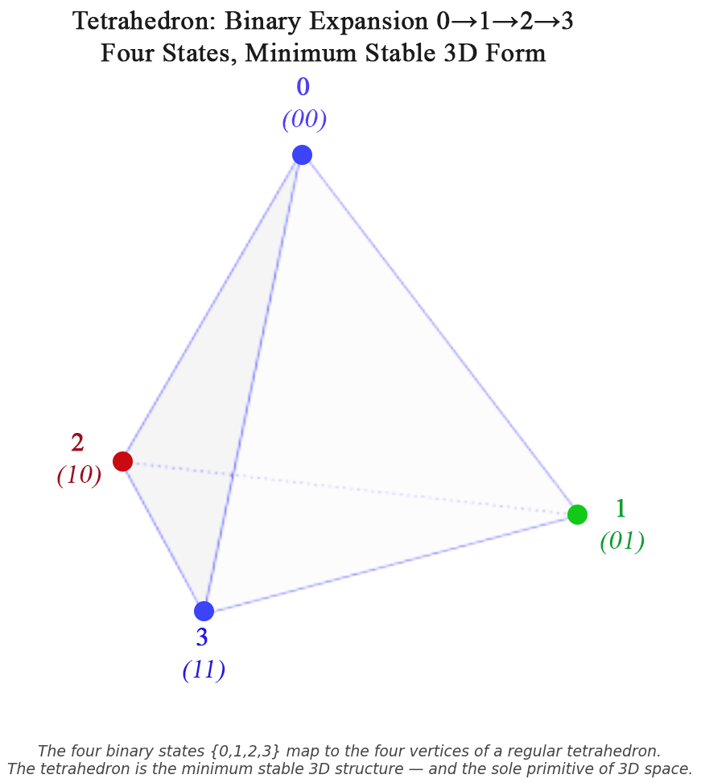
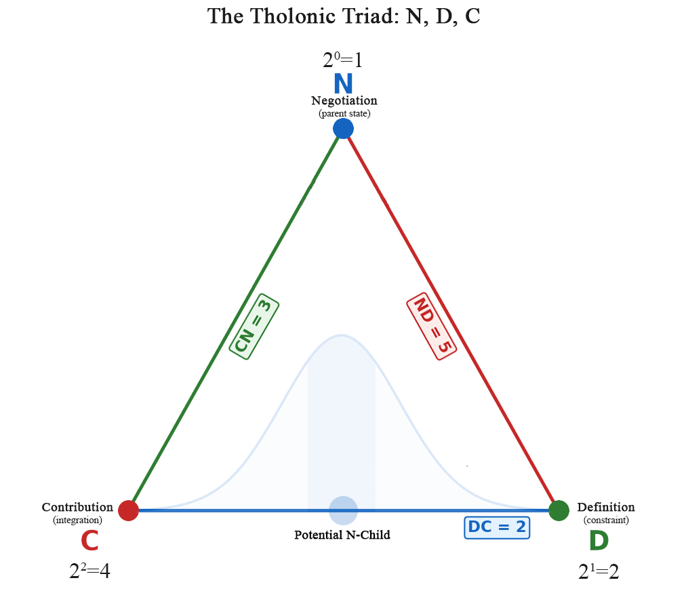
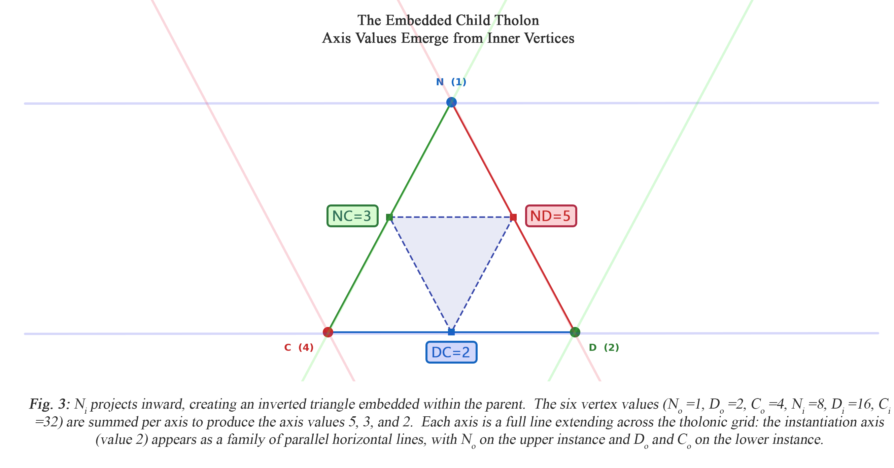
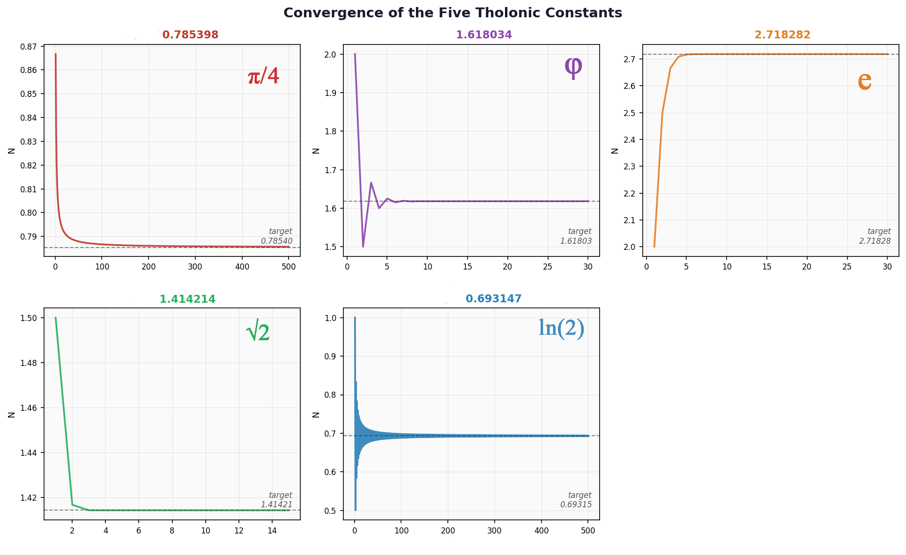
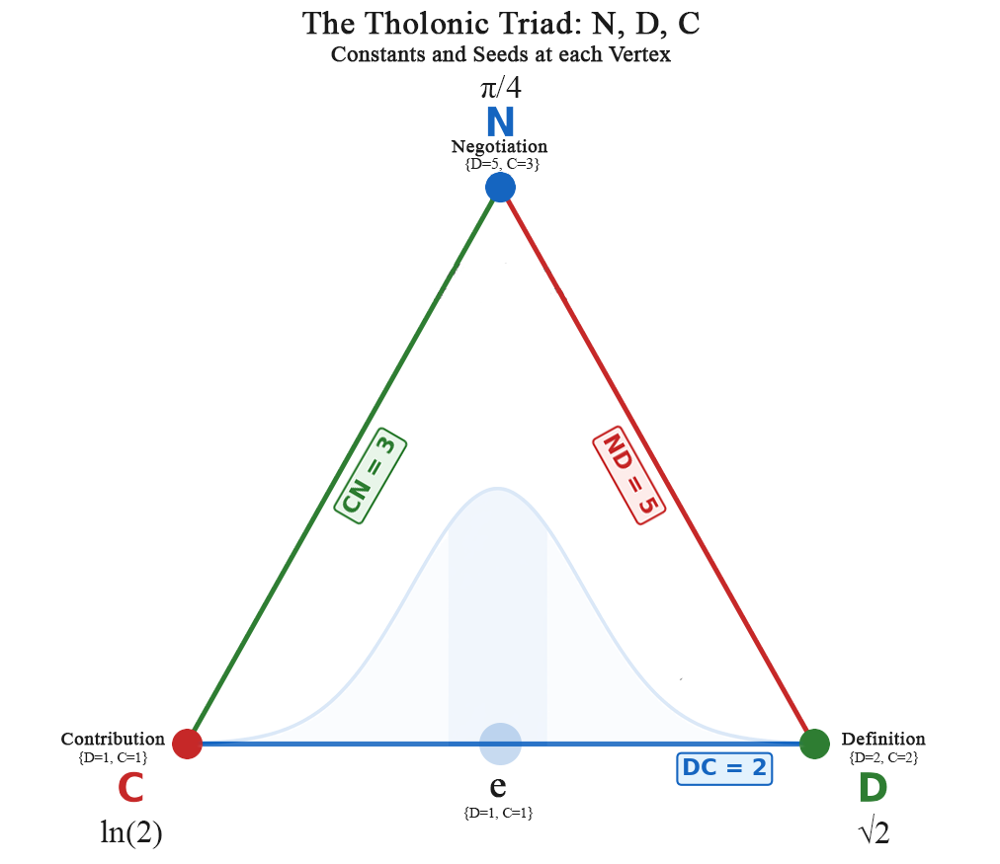
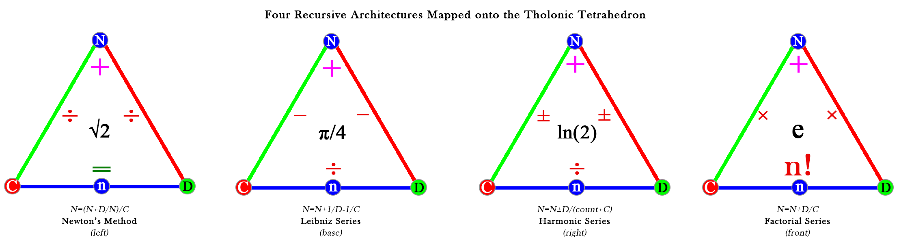
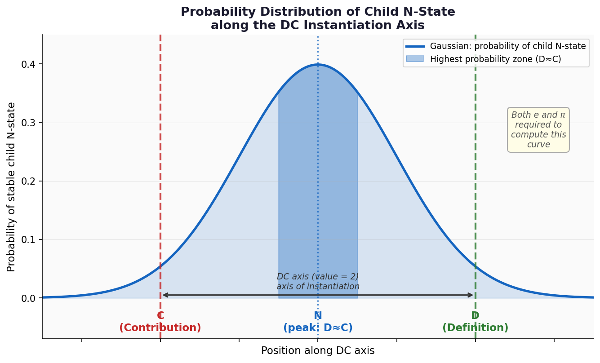
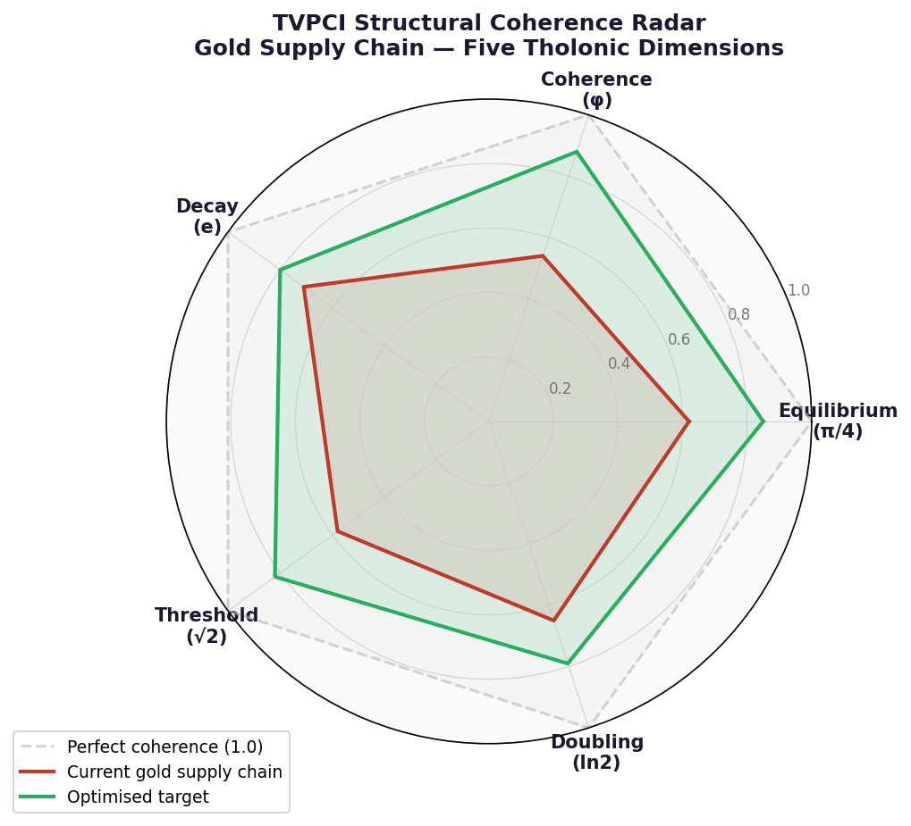

# True Value: From First Principles to the Pricing Convergence Index

## A Ground-Up Derivation of the Tholonic Model and Its Application to Value

---

## Part I: The Tholonic Model and the Significance of 2, 3, and 5

### 1.1 Starting from Nothing

The Tholonic model begins where every rigorous framework must: with the simplest possible state.

That state is **nothingness**, represented as zero.  Zero is not an absence of meaning: it is the precondition for all meaning.  The moment zero exists as a concept, it immediately creates its complement: the concept of *something*, which we call **unity**, or **1**.

So the most primitive possible universe contains exactly two states: **0** (nothing) and **1** (something).  This is not a metaphor.  It is the irreducible minimum from which all structure, all number, and all quantitative reasoning must grow.

---

### 1.2 Binary Evolution and the Natural Emergence of 2, 3, and 5

With only 0 and 1 available, the only next step is to ask: how many distinct states can be represented?

**With one binary position**, we can hold two states: 0 and 1.

**With two binary positions**, we can hold four states: 0, 1, 2, and 3.

This is not a choice or a convention.  It is what binary expansion *is*.  With two binary digits, we have exhausted every combination of two yes/no decisions.  Each set that binary expansion produces is not merely a count: it is an **archetype**, the most primitive and irreducible expression of a structural form, expressible both mathematically as a set of values and geometrically as a shape.

- **{0, 1}**: two values, two points, one **line**.  The archetype of one-dimensional structure: direction and extent, nothing more.  The line is what the minimum looks like in one dimension.
- **{0, 1, 2, 3}**: four values, four points, one **tetrahedron**.  The archetype of three-dimensional structure: the minimum form that encloses a volume.

The progression stops at two binary positions for a structural reason: four is the minimum number of points that requires three-dimensional space as a non-degenerate form.  Two points define a line (one dimension).  Three non-collinear points define a triangle (two dimensions).  Four non-coplanar points are the first configuration that cannot be realized in fewer than three dimensions.  Three binary positions would yield eight points (a cube or any other 3D arrangement), but eight is far more than the minimum required.  The model always seeks the minimum sufficient structure, and two binary positions provide it exactly.

The tetrahedron is not merely the simplest three-dimensional form: it is the *minimum stable* one.  Remove any one of its four vertices and it collapses into a flat plane.  It sits precisely at the threshold between nothing and something in three dimensions.  A two-dimensional triangle is stable in 2D for the same reason.  Stability, in both cases, is not a property added from outside: it is a consequence of having exactly the minimum required elements and no fewer.  The tetrahedron is what the minimum looks like in three dimensions, and binary counting is what produces it.

The connection between binary counting and minimum geometric form is not coincidental.  The vertices of each minimum shape are precisely those points whose coordinates can be expressed using only 0 and 1, with exactly one coordinate equal to 1 and the rest 0, plus the origin.  For a triangle in 2D:

- (0, 0), (1, 0), (0, 1)

For a tetrahedron in 3D:

- (0, 0, 0), (1, 0, 0), (0, 1, 0), (0, 0, 1)

Each vertex is a distinct binary address in its coordinate space.  The table below extends this pattern across five dimensions, from a point (0D) through a 4-simplex (4D):



*Note: Italic values in hexadecimal format.*

The table reveals a consistent structural pattern.  In each dimension, the number of binary combinations available is 2 raised to the number of bits required to label each coordinate: 2<sup>1</sup> = 2 in 1D, 2<sup>2</sup> = 4 in 2D, 2<sup>3</sup> = 8 in 3D, 2<sup>4</sup> = 16 in 4D.  In every case, the minimum shape uses exactly n+1 of those combinations, where n is the number of dimensions.  The specific addresses used are not the first n+1 sequential binary values.  They are the origin (all coordinates zero) and the n standard basis vectors (each with exactly one coordinate set to 1 and the rest 0).  In 3D this gives decimal addresses 0, 1, 2, and 4 (binary 000, 001, 010, 100), skipping 3 (011) and everything above.  In 4D it gives 0, 1, 2, 4, and 8 (binary 0000, 0001, 0010, 0100, 1000), with all other addresses unrealized.  The non-zero addresses in this set are precisely the powers of 2: 2<sup>0</sup> = 1, 2<sup>1</sup> = 2, 2<sup>2</sup> = 4, 2<sup>3</sup> = 8.  Every address that has more than one bit set (3 = 011, 5 = 101, 6 = 110, and so on) is excluded.  The minimum shape is the structure formed by activating each dimension exactly once, independently, from a shared origin, and that condition selects exactly the powers of 2 as its non-zero vertex addresses.  This pattern will become structurally significant later in the derivation.

The tetrahedron is also the fundamental unit of three-dimensional space in a deeper sense.  Any three-dimensional form or volume, however complex, can be decomposed into a finite collection of tetrahedra to arbitrary precision.  This is not a mathematical trick: it is the basis of finite element analysis, the method used across physics, engineering, and computational science to simulate any structure or process in three-dimensional space.[^1]  Space itself is expressible as a tetrahedral mesh.  In this sense the tetrahedron does not merely describe one structure among many: it is the irreducible unit from which all three-dimensional structure can be built.  Its relationship to three-dimensional space is the same as the relationship of prime numbers to arithmetic: both are the atoms of their domain, the forms that cannot be reduced further and from which everything else is composed.

Within the set {0, 1, 2, 3}, the first three non-zero values, **1, 2, and 3**, form the first triad.  Sections 1.3 and 1.4 examine 2 and 3 individually.  Section 1.5 introduces 5.  The structural reason why all three are the irreducible axis values of the tholonic triad is derived in section 1.7, once the recursive geometry is in place.

*Fig. 1: The four binary states that map to dimensions {0, 1, 2, 3} are mapped to the four vertices of a regular tetrahedron, the minimum stable 3D structure and the irreducible primitive of three-dimensional space. *

---

### 1.3 The Number 2: Duality and the First True Distinction

The number 2 is unlike every number before it and, in a specific sense, unlike every number after it.  It is the basis of all form and the simplest complete mathematical system that exists.  The preceding section showed this concretely: binary counting, built on 2, generates every minimum geometric form across all dimensions, the total combinations available in each dimension are powers of 2, and the non-zero vertex addresses of every minimum shape are exclusively powers of 2.  The following properties explain why.

It is the only number where:

$$2 + 2 = 2 \times 2 = 2^2 = 4$$

No other number satisfies all three operations simultaneously (except 0, which is the absence of quantity rather than a quantity itself).  This triple identity is not a trivial observation.  It means that addition, multiplication, and exponentiation, three fundamentally different operations, converge to the same result at 2.  The number 2 occupies the unique position where these operations are indistinguishable from one another.  In other words, 2 is the point at which *extending outward* (adding another of itself) is identical to *folding inward* (defining itself by itself).  The distinction between what something does and what something is, between **form and function**, has not yet separated.  This is not a limitation of 2: it is precisely what makes 2 the origin of all structure.  Before differentiation can occur, there must be a state in which all modes of relation are still unified.  That state is 2, which is the first mathematical "stem cell", so to speak.

2 is also the **only even prime number** and the **first prime number**.  Every prime that follows is odd; 2 stands alone.  It is the number at which the singular (1) first differentiates into something external to itself.  Unity creates a second unity, and in doing so, creates the very concept of *relationship*.  The importance of 2 being prime, and specifically the *only even prime*, requires understanding why primes matter at all.  Prime numbers are the irreducible atoms of arithmetic.  The Fundamental Theorem of Arithmetic, known since Euclid,[^2] states that every integer greater than 1 is either prime or can be expressed as a unique product of primes.  This means primes are not merely special numbers; they are the *only* numbers from which all other numbers are built.  Every composite number is a compound of primes.  Primes themselves cannot be compounded from anything smaller.  They represent the lowest-entropy numerical states: maximum definition, minimum decomposition.  For 2 to be the first and only even prime is therefore remarkable.  Every even number larger than 2 is composite, because it contains 2 as a factor.  But 2 itself contains no factor other than 1 and itself: it is simultaneously the source of all even numbers and irreducible to any of them.  It is the generator of the most basic structural division in arithmetic (odd versus even) while remaining, itself, outside that division.

A single point has zero dimensions.  It exists as a concept only, with no extent, no direction, and no relationship to anything else.  The moment a second point is defined, something qualitatively new appears: a *line*, the first dimensional structure.  The line has direction, length, and, crucially, an interior.  Something can now be *between* two points in a way that was impossible with only one.  The number 2 is not just the count of those points; it is the *act* of the line existing, the first structure in which position and relationship are simultaneously defined.  As section 1.7 derives, this is not a coincidence: 2 is the number that inevitably emerges as the axis of instantiation, not a candidate among others.

---

### 1.4 The Number 3: The First Act of Creation

With 2 established, the first genuinely new value is 3.

3 is the **first odd prime**.  It is irreducible in a way that 2 is not: 2 can be seen as 1+1, while 3 introduces something that 1 and 2 alone cannot generate as a prime: it requires a third distinct entity.

In mathematics, 3 is associated with a remarkable property: **six** is the first *perfect number* (a number whose factors, excluding itself, sum exactly to it: $1+2+3=6$), and 6 is the **product of the first three integers**: $1 × 2 × 3 = 6 = 3!$.  Six is also the only known number that is both a perfect number and a factorial.[^3]  The triad {1, 2, 3} generates this unique structural completion.

In the physical world, 3 is the minimum number of points required to define a plane, and the minimum number of constraints required to produce a stable two-dimensional form.  The triangle is the only polygon that is structurally rigid without additional support, a fact exploited in every bridge, roof, and aircraft ever built.[^4]  As section 1.7 derives, 3 is the number that inevitably emerges a fundamental value of the recursive structure: not assigned by choice, but calculated as a necessary consequence of the geometry.

---

### 1.5 The Number 5: The First Prime Beyond the Triad

Once 1, 2, and 3 are established, the next candidate for a fundamentally irreducible value is 5.

4 can be constructed from 2 × 2, so it is composite.  It carries no new structural information beyond what 2 already provides.  But 5 is prime.  It introduces a genuinely new quantity that cannot be expressed as a product of smaller primes, and as section 1.7 derives, that irreducibility is precisely what the recursive geometry selects for: 5 is the number that inevitably emerges, not a candidate among others.

---

### 1.6 The Tholonic Triad: N, D, and C

The Tholonic model defines a recursive triadic structure.

Each vertex of that structure must carry a unique numerical value.  The values must also satisfy a stronger condition: any combination of vertices used to define an axis must produce a sum that is unique to that axis, so axes can be distinguished without ambiguity.  The natural question is: what base, and what starting exponent, satisfies both requirements with the fewest assumptions?

The answer to the base question follows directly from the properties of 2 established in section 1.3.  Base 1 fails immediately: 1 raised to any power is always 1, producing no variation across vertices.  Base 0 is equally degenerate: 0 raised to any positive power is always 0.  Base 2 is the first base for which repeated exponentiation produces a strictly increasing sequence of distinct values (1, 2, 4, 8, 16, 32, ...).  It is also the base already identified as the axis of instantiation and the irreducible origin of all structure.  The same property that makes 2 the structural primitive of the model makes it the only defensible base for vertex values.  No smaller base works; no larger base is required.

This uniqueness has a further structural and necessary consequence in a recursive system.  Any path through the structure has a value equal to the sum of its vertex values.  Because distinct powers of 2 produce unique sums, that value can always be decomposed back into its exact constituent vertices.  The path value encodes the path completely: no external label, index, or lookup is required. 

The vertex values 2<sup>0</sup>, 2<sup>1</sup>, 2<sup>2</sup>, and 2<sup>3</sup> are not a design choice.  They are the result of applying the minimum base (2) to the minimum exponent sequence: starting at 0 (the only starting point that includes unity without a negative exponent) and incrementing by 1 at each step (the minimum increment that keeps all values distinct).  The full justification for why base 2 is the unique minimum is given in section 1.7, where the assignment extends to all six vertices.

There is a direct geometric correspondence here.  The exponent at each vertex matches the number of dimensions of the minimum form that vertex represents in the binary expansion from section 1.2: exponent 0 corresponds to the point (0D, the origin, no extent), exponent 1 to the line (1D, the first structure with extent), exponent 2 to the triangle (2D, the first stable plane), and exponent 3 to the tetrahedron (3D, the first stable volume).  The exponents are not merely a counting device; they are the dimension indices of the forms that binary expansion produces.

With those values established, the three roles of the structure are:

- The apex vertex is both the origin of the structure and, as will be shown, the product it produces: it is the parent that allows for the instantiation of the following two points, and also the state that can only come into being through the balancing and negotiating between those two points, which then becomes the source for the next level of recursion.  This role as the source of and emergent product of D and C's interaction is what the label **N (Negotiation/Balance)** captures.  Vertex value: **1** (2<sup>0</sup>).
- The first child vertex represents the moment unity (1) divides: where there was one undifferentiated point, there is now a second, distinct from the first.  That act of division is simultaneously a limitation (something is now excluded, bounded, set apart) and a definition (the thing is now distinguished from everything it is not).  It is through this limitation and definition that a point becomes a line: the first form.  This is what the label **D (Definition/Limitation)** captures.  Vertex value: **2** (2<sup>1</sup>).
- The second child vertex represents the moment integration becomes possible: a third point exists, and with it, all three points are now bound into a single closed structure.  Neither the origin alone nor the defined point alone could produce this closure; it requires a third that integrates the other two into a whole.  It is through this integration that a line becomes a triangle: the first stable form.  This is what the label **C (Contribution/Integration)** captures.  Vertex value: **4** (2<sup>2</sup>).

These labels are not symbolic or philosophical abstractions.  They describe precisely the functional and qualitative nature of each value.  All three are formed from the same base: 2.  The exponent applied to that base describes the dimensional state of existence at each vertex.  2<sup>0</sup> = 1 (N): the zeroth exponent is the condition of the concept, zero-dimensional existence, a point (something that does not yet exist in any dimensional sense but is the precondition for everything that does).  2<sup>1</sup> = 2 (D): the first exponent is where the concept becomes real, the first dimensional form (the line), something that now exists and, through its existence, defines and limits.  2<sup>2</sup> = 4 (C): the second exponent is where duality is in play, the first closed form (the triangle), where both form and function coexist and the structure can integrate what it has defined into something larger.  

The three vertices define three axes: ND (between N and D), DC (between D and C), and CN (between C and N).  Of these, the DC axis is the one along which a new N-state can appear.  The numerical values of these axes are derived in section 1.7.

The relationship is recursive and bidirectional.  The parent N differentiates into D and C.  D and C interact.  A child N instantiates.  That child N becomes the parent N for the next level.  The cycle continues without limit.


***Fig. 2:** The Tholonic Triad. N (Negotiation/Balance) at the apex; D (Definition/Limitation) and C (Contribution/Integration) at the base, connected by the three axes ND, DC, and CN.*

This single cycle of recursion also closes the geometric argument that opened this section.  The parent N is one point.  It produces D and C, two more points.  Those two interact and produce a child N, a fourth point.  We now have exactly four points: the parent N, D, C, and the child N.  Four points in general position define a tetrahedron.  The minimum stable structure of three-dimensional space, which we derived at the start from binary counting alone, reappears here as the natural geometry of one complete cycle of Tholonic recursion.  The algebra and the geometry are the same thing.

---

### 1.7 The Embedded Structure and the Emergence of Axis Values

The recursion introduced in section 1.6 has a further geometric consequence that has not yet been drawn out, and is fundamental to the model.

When N<sub>i</sub> is born from the interaction of D<sub>o</sub> and C<sub>o</sub>, it does not appear outside the parent triangle: it appears *within* it.  This is structurally necessary: the child inherits the limitations of the parent.  D<sub>o</sub> and C<sub>o</sub> define the boundary of the parent's space, and N<sub>i</sub>, as their product, cannot exist beyond the constraints that produced it.

N<sub>i</sub> is produced at the base of the parent triangle, between D<sub>o</sub> and C<sub>o</sub>.  When N<sub>i</sub> then acts as its own parent and projects its own D<sub>i</sub> and C<sub>i</sub> downward from itself, those new points extend inward into the interior of the original triangle.  The result is an inverted triangle embedded inside the first one, its three vertices pointing in the opposite direction to the outer three.

We now have six points in total: the three outer vertices (N<sub>o</sub>, D<sub>o</sub>, C<sub>o</sub>) and the three inner vertices (N<sub>i</sub>, D<sub>i</sub>, C<sub>i</sub>) of the inverted embedded triangle.  To assign unique numerical values to all six points in a way that guarantees every possible combination of vertices produces a unique sum, the simplest assignment is to continue the same power-of-2 sequence that naturally began with the outer vertices (powers of 2 are the minimum sequence with this uniqueness property: no smaller set of integers satisfies it):

- Outer vertices: N<sub>o</sub> = 2<sup>0</sup> = 1, D<sub>o</sub> = 2<sup>1</sup> = 2, C<sub>o</sub> = 2<sup>2</sup> = 4
- Inner vertices: N<sub>i</sub> = 2<sup>3</sup> = 8, D<sub>i</sub> = 2<sup>4</sup> = 16, C<sub>i</sub> = 2<sup>5</sup> = 32

The three inner vertices carry the same N-D-C role ordering as the outer three, simply continuing the sequence: N<sub>i</sub> (2<sup>3</sup>=8) is the first inner vertex to appear, generated directly from the DC interaction; D<sub>i</sub> (2<sup>4</sup>=16) follows; and C<sub>i</sub> (2<sup>5</sup>=32) completes the set.  The geometric opposition rule follows from this role assignment: each inner vertex sits opposite the outer axis formed by the two outer vertices that do *not* share its role.  N<sub>i</sub>'s role is N, and the outer axis that contains no N<sub>o</sub> vertex is the DC axis, so N<sub>i</sub> (2<sup>3</sup>=8) sits opposite DC.  D<sub>i</sub> contains no D<sub>o</sub> vertex on the CN axis, so D<sub>i</sub> (2<sup>4</sup>=16) sits opposite CN.  C<sub>i</sub> contains no C<sub>o</sub> vertex on the ND axis, so C<sub>i</sub> (2<sup>5</sup>=32) sits opposite ND.  The opposition is not a geometric choice: it is forced by which outer vertex is absent from each axis.

With these six values in place, each axis is defined by its two outer vertices plus the one inner vertex that sits opposite to it in the inverted embedded triangle.  The sums are:

| Axis | Outer vertices | Inner vertex | Sum        |
|:----:|:--------------:|:------------:|:----------:|
| ND   | N<sub>o</sub>=1, D<sub>o</sub>=2 | C<sub>i</sub>=32 | 1+2+32 = **35** = 7×**5** |
| DC   | D<sub>o</sub>=2, C<sub>o</sub>=4 | N<sub>i</sub>=8  | 2+4+8 = **14** = 7×**2** |
| CN   | C<sub>o</sub>=4, N<sub>o</sub>=1 | D<sub>i</sub>=16 | 4+1+16 = **21** = 7×**3** |

Every sum is a multiple of 7.  Factoring out that common multiplier, the three resulting axis values are:

- The ND axis (Definition axis): **5**
- The DC axis (Instantiation axis): **2**
- The CN axis (Contribution axis): **3**




These are the first three prime numbers: 2, 3, and 5.  They are not assigned to the axes by choice.  They emerge from the binary vertex assignment applied to the six-point structure that the recursion itself produces.  Nor is the binary vertex assignment itself a choice.  It uses the smallest base that can be meaningfully exponentiated, which is 2, starting from the smallest possible exponent, which is 0.  The base 1 is trivial (1 raised to any power is always 1, producing no variation).  The base 0 is degenerate (0 raised to any positive power is always 0).  The base 2 is the first base for which exponentiation produces a unique, increasing sequence of distinct values: 1, 2, 4, 8, 16, 32.  Beginning at the exponent 0 is the only starting point that includes unity (2<sup>0</sup>=1) without requiring a negative exponent.  The assignment 2<sup>0</sup> through 2<sup>5</sup> is therefore the minimum possible assignment that satisfies uniqueness across all six vertices.  Everything that follows, including the axis sums, the common factor of 7, and the emergence of 2, 3, and 5, is a consequence of that single minimum choice.  The structural reason that 5 belongs to the Definition axis, that 3 belongs to the Contribution axis, and that 2 is the instantiation axis is not a philosophical preference: it is what the minimum binary geometry of the recursive tholon assigns.

There is a further confirmation in the arithmetic.  The difference between the two axis values is 5 - 3 = **2**, which is precisely the value of the DC axis, the instantiation axis, the line across which N<sub>i</sub> is born.  The interval between Definition and Contribution, measured in axis terms, equals the value of the axis that spans them.  N<sub>i</sub> is not only produced by the interaction of D<sub>o</sub> and C<sub>o</sub>: it is already implied by the gap between them.

The three axis values now have their full assignments.  Each axis is not merely the single edge of one triangle but a line that propagates across the full tholonic grid.  The instantiation axis (value 2) appears as a family of parallel lines at every level of the recursion: N<sub>o</sub> occupies the upper instance, D<sub>o</sub> and C<sub>o</sub> occupy the lower instance, and N<sub>i</sub> is born on that same lower line between them.

This raises an apparent anomaly: N<sub>o</sub> is shown sitting on the instantiation axis, yet no parent D and C are visible above it.  This is not an inconsistency but a limitation of scope.  N<sub>o</sub> itself was instantiated by a D and C at the level above, which are outside the frame of this diagram.  The recursion is unbounded in both directions: every N-state exists because a prior D and C produced it.  The parent D and C of N<sub>o</sub> are not absent from the model; they are simply not shown.

- **N<sub>o</sub>** (2<sup>0</sup> = 1) exists as a point on the **Instantiation** axis (2) and is expressed on the line of the DC axis (2).
- **D<sub>o</sub>** (2<sup>1</sup> = 2) exists as a point on the **Definition** (3) axis and is expressed as a line on the NC axis (3).
- **C<sub>o</sub>** (2<sup>2</sup> = 4) exists as a point on the **Contribution** axis (5) and is expressed as a line on the CD axis (5).

These values are what section 2.1 puts to work in the recursion formula.

---

### 1.8 Why This Matters for Value

The significance of these three numbers, 2, 3, and 5, is not that they are labeled with philosophical names.  The significance is that they are **the first three prime numbers**, and that they arise **inevitably** from the most basic possible formal structure: binary expansion applied to the minimum geometric scaffold, and then allowed to recurse once.  Critically, these are *axis values*: they are the values of the structure itself, the skeleton and framework upon which everything else is built.  They describe the relationships between roles, not the contents of those roles.  They are the fixed geometry of the tholon, present before any recursion runs, before any quantity flows, before any instance exists.  What grows within that framework, the actual N-states, D-constraints, and C-outputs of any real system, can take any values at all.  But the axes along which those values relate to one another are always 2, 3, and 5.

No other minimum-assumption starting point produces the same result, and that matters less than what the choice reveals.  Other starting points exist: base 2 beginning at exponent 1 also yields axis values 5, 2, and 3, but with vertex values 2, 4, 8, 16, 32, 64 rather than 1, 2, 4, 8, 16, 32.  The reason to begin at exponent 0 is not uniqueness but simplicity: 2<sup>0</sup>=1 is the multiplicative identity, the smallest possible non-zero starting value, and the only exponent that requires no prior structure.  The entire derivation applies the same criterion at every step: use the simplest available option.  Even if other starting points could produce the same axis values, the values we arrive at here are the most fundamental ones possible.  That is what makes 2, 3, and 5 the correct axis values, not merely the unique ones.

This structural inevitability is the foundation of the Tholonic model's application to value chains.  Any system, physical, biological, economic, or financial, that can be described as having an internal structure (D), an external relationship (C), and an emergent stable state (N) is subject to the same mathematical principles.  The numbers 2, 3, and 5 are not metaphors for those principles.  They *are* those principles, expressed in the most reduced numerical form possible.

The True Value Pricing Convergence Index builds directly on this foundation.  Before we can measure whether a price reflects true value, we need a rigorous model of what structural coherence in a value chain looks like, and that model begins here, with three prime numbers and two binary digits.

---

## Part II: The Recursive Structure and the Emergence of Mathematical Constants

### 2.1 The Recursion Formula

Part I established the values that seed the recursion.  N begins at its vertex value of **1**: this is the starting state of the thing being grown, the first instantiation placed on the skeleton.  D and C take their axis values of **5** and **3** respectively: these are the skeleton itself, the fixed structural parameters that govern how each step of growth is constrained (D) and integrated (C).  The vertex value grows and evolves with each generation; the axis values do not.  Part II shows what happens when growth begins.

The Tholonic recursion is defined by a single rule applied repeatedly.  Each new N-state (child) is produced from the current N-state (parent) by adding a fraction defined by D and subtracting a fraction defined by C:

$$N_{\text{child}} = N_{\text{parent}} + \frac{1}{D} - \frac{1}{C}$$

Three structural facts justify each element of this formula.

**Why fractions?**  N begins at 1: unity, the whole, the first instantiated state.  D and C are axis values, structural relationships *within* that unity.  The fraction 1/D is therefore the share of unity that D governs at this generation; 1/C is the share that C governs.  The denominator is the structural weight of each axis, not an arbitrary scalar.  Using a fraction is the correct expression of the fact that D and C are parts of a whole, not independent quantities.

**Why +1/D?**  D is Definition and Limitation.  Its function is to impose boundaries on an otherwise unbounded state.  A limitless thing has no form; adding a boundary adds structure.  This is the structural analog of reducing entropy: every constraint D places eliminates possible states, concentrating and ordering the system.  The act of definition is therefore additive, not because D expands outward, but because a bounded thing has more structure than an unbounded one.  Adding $\frac{1}{D}$ is the system gaining a quantum of order.

**Why -1/C?**  C is Contribution and Integration.  Its function is to give outward: to transfer structure beyond the current N-state toward the next level of recursion.  Contribution is by definition a self-diminishing act; what is given is no longer held.  This is the Tholonic analog of entropy: C distributes concentrated structure into the surrounding system, increasing disorder locally while propagating order globally.  Subtracting $\frac{1}{C}$ is the current N-state paying the cost of that distribution.  The value is not destroyed; it propagates forward.  But the N-state that gave it is reduced by exactly what was contributed.

Every generation, D adds a small quantum of order ($+\frac{1}{D} = +\frac{1}{5}$) and C distributes a larger quantum outward ($-\frac{1}{C} = -\frac{1}{3}$).  The net effect is always a slight reduction in the current N-state, because C's contribution always exceeds D's definition.  The system cannot recover what C gives away; it can only approach the equilibrium where the two forces are in perpetual balance.  That equilibrium is **$\frac{\pi}{4}$**: the Tholonic entropy minimum for this D-C configuration, the point at which the rate of ordering imposed by D and the rate of dispersal driven by C are in exact, irresolvable tension.  $\frac{\pi}{4}$ is not inserted into the formula; it emerges from it as the only state the system can approach but never reach in finite recursion.

Starting from N=1 (unity, the first instantiated state), with D=5 and C=3:

$$1 + \frac{1}{5} - \frac{1}{3} \approx 0.8\overline{6}$$

This is the first child N-state.  It is a fingerprint, a unique value that belongs to this particular configuration of D and C.  On its own it appears unremarkable.  What matters is what happens across successive generations.

---

### 2.2 Generational Complexity: How D and C Evolve

Each generation is structurally richer than the one before it. due to D's additive property described above.  The axis values of D and C (5 and 3) are permanent: they are the fixed skeleton and do not change.  What does grow with each recursive step are the **generational denominator values** used in the formula: they begin at the axis values and increment outward from them, carrying forward the accumulated structure of all prior generations.  This is called *generational complexity*.

The growth increment is 4 in each generation, applied to both D and C.  The value 4 is not arbitrary.  It follows directly from the instantiation axis value of 2, and it can be reached by two conceptually distinct operations on that value (though both produce the same number):

- **Definition**: 2<sup>2</sup> = 4.  Squaring is the self-referential act, the number using itself as its own unit of measure.  This is the mathematical expression of internal self-definition.
- **Contribution**: 2 × 2 = 4.  Multiplication by an external value represents integration with something distinct.

At the archetype of 2, these two operations are numerically indistinguishable: both yield 4.  This is not a coincidence to be explained away; it is the structural reason 2 is the instantiation value (see section 1.3: 2 is the only number where addition, multiplication, and exponentiation all converge).  The point is philosophical, not computational: D and C derive their shared increment from different modes of the same operation, which is why their growth rates are identical in practice.  A reader expecting D and C to diverge will not find that here.  Both increment by 4 per generation, always.

| Generation | D  | C  | D × C         |
|:----------:|:--:|:--:|:-------------:|
| 1          | 5  | 3  | 15 = 16(1<sup>2</sup>)-1 |
| 2          | 9  | 7  | 63 = 16(2<sup>2</sup>)-1 |
| 3          | 13 | 11 | 143 = 16(3<sup>2</sup>)-1|
| n          | 4n+1 | 4n-1 | 16n<sup>2</sup>-1    |

The product of D and C at every generation is a perfect square minus one: $16n^2 - 1$.  Written as $(4n)^2 - 1^2$, this is the difference of two squares, factoring as $(4n-1)(4n+1) = C \times D$, which is exactly what the table shows.  It is always one step below the threshold $(4n)^2$ that marks the boundary of the next class.  This is not a deficiency.  The child N-state that D and C produce carries vertex value 1 (2<sup>0</sup>, unity), and adding that child to the product closes the class exactly: $D \times C + N = (4n)^2 - 1 + 1 = (4n)^2$.  D and C cannot close the class on their own; they are structurally one N short by design, because their function is to instantiate N.  The "-1" is not an irreducible gap: it is the structural requirement for the child.  For generations where (4n) is a power of 2 (n=1, 2, 4, ...), D×C is the all-ones binary number for that digit width (15 = 1111<sub>2</sub>, 63 = 111111<sub>2</sub>, 255 = 11111111<sub>2</sub>), and the child N is the carry bit that advances the structure to the next binary class.

---

### 2.3 The Emergence of $\pi$

The recursion converges to $\frac{\pi}{4}$; multiplying by 4 gives $\pi$.  Written explicitly:

$$\frac{\pi}{4} = 1 + \left(\frac{1}{5} - \frac{1}{3}\right) + \left(\frac{1}{9} - \frac{1}{7}\right) + \left(\frac{1}{13} - \frac{1}{11}\right) + \cdots$$

Or in closed form:

$$\pi = 4 - 8\sum_{n=1}^{\infty} \frac{1}{16n^2 - 1}$$

This is the Tholonic recursion expressed as a series converging to $\pi$.  It is mathematically equivalent to the Leibniz formula for $\pi$,[^5] but with a structurally significant difference: the terms are grouped into pairs, each pair being one generation of the recursion (one tholon).  With D=5 and C=3, each generation contributes a positive step from the D term (1/D) and a larger negative step from the C term (1/C), producing a net decrease.  Because C is seeded smaller than D, the C term dominates each paired step, and N falls incrementally toward $\frac{\pi}{4}$ from above.

The convergence is slow, each generation refining the value of $\pi$ by a smaller increment than the last.  This is precisely what we would expect: each child generation is smaller than its parent (as the fractions decrease), just as each child tholon is embedded within, and smaller than, the parent that contains it.

$\pi$ does not appear because it was put there.  It appears because it is the attractor of this particular recursive architecture, the value the system inevitably approaches when Definition and Contribution are seeded at {D=5, C=3} and the result is scaled by 4.

$\pi$ is the first of five fundamental mathematical constants that emerge from the Tholonic framework.  The others are $\varphi$ (Golden Ratio), e (Euler's number), $\sqrt{2}$, and $\ln(2)$.  Each requires its own distinct recursive architecture, all drawing their seeds from the same vocabulary {1, 2, 3, 5}.  Section 2.4 covers all five.

---

### 2.4 The Same Framework, Different Architectures

All five constants are generated using the same three tholonic variables (N, D, C), with seeds drawn from the same vocabulary {1, 2, 3, 5}.  What is universal is the philosophical structure: N is the emergent state, D provides structural constraint, and C provides iterative contribution.  What varies is the specific recursive formula, or "line of logic," that connects them.  Each constant requires its own architecture:

- $\boldsymbol{\frac{\pi}{4}}$: alternating paired series, $N = N + \frac{1}{D} - \frac{1}{C}$, with D and C both incrementing by 4 each generation (Leibniz-type)
- $\boldsymbol{\varphi}$: continued fraction, $N = 1 + \frac{1}{N}$, iterated until convergence (notably, D and C are seeded but never appear in the formula itself)
- $\boldsymbol{e}$: factorial series, $N = \frac{D}{C}$ (initialise), then $N = N + \frac{D}{C}$ with C growing by factorial at each step
- $\boldsymbol{\sqrt{2}}$: Newton's method, $N = \frac{(N + \frac{D}{N})}{C}$, converging to the square root
- $\boldsymbol{\ln(2)}$: alternating harmonic series, $N = N ± \frac{D}{(count + C)}$, with alternating sign at each step

The seeds and any output scaling for each constant are:

**Unscaled** (result taken directly):

| Seed {D, C} | Constant  | Value   |
|:-----------:|:---------:|:-------:|
| {2, 3}      | $\varphi$         | 1.61803 |
| {2, 2}      | $\sqrt{2}$        | 1.41421 |
| {1, 1}      | $\ln(2)$     | 0.69315 |

**Scaled** (output adjusted by factor of 4):

| Seed {D, C} | Constant  | Value   | Output rule      |
|:-----------:|:---------:|:-------:|:----------------:|
| {5, 3}      | $\pi$         | 3.14159 | result × 4       |

**Reinitialized internally** (N seed is 0 but the architecture sets N = D/C before the loop; effective starting value is 1):

| Seed {D, C} | Constant  | Value   |
|:-----------:|:---------:|:-------:|
| {1, 1}      | e         | 2.71828 |

The factor of 4 in the $\pi$ case is not arbitrary.  It is the DC axis value squared: 2<sup>2</sup> = 4.  The same structural value that defines the instantiating axis is also the scaling factor required to recover $\pi$ from the Leibniz-type series.  The structure provides its own correction.

These constants are not being imported from elsewhere.  They emerge from the Tholonic framework: each one is the attractor of its particular recursive architecture, seeded from the same vocabulary of values {1, 2, 3, 5}.  The seeds select which constant the system converges toward; the architecture determines the path of convergence.

This distinction matters.  The five architectures are not variants of a single formula with different parameters.  They are genuinely different classes of recursion, each one a distinct mathematical structure in its own right:

- $\boldsymbol{\frac{\pi}{4}}$ uses a Leibniz-type paired series: two reciprocals subtracted and added per generation, with denominators growing linearly.  It approaches its attractor from alternating sides, never arriving.
- $\boldsymbol{\varphi}$ uses a continued fraction: the formula folds back on itself each step ($N = 1 + \frac{1}{N}$), making the current value a function of itself.  It is the only architecture that is purely self-referential.
- $\boldsymbol{e}$ uses a factorial series: the denominator grows faster than any polynomial rate, causing the terms to shrink rapidly and the sum to converge from below.
- $\boldsymbol{\sqrt{2}}$ uses Newton's method: each iteration squares the number of correct digits, converging in a handful of steps through self-correcting division.
- $\boldsymbol{\ln(2)}$ uses an alternating harmonic series: terms decrease as 1/n and alternate in sign, converging slowly by mutual cancellation.

What the five share is not a formula but a framework: three variables (N, D, C), seeds from {1, 2, 3, 5}, and the tholonic interpretation of those variables as negotiation, definition, and contribution.  The diversity of the architectures is itself significant.  The Tholonic seed vocabulary does not produce one type of convergence.  It produces five structurally distinct ones, each of which happens to converge to a constant that mathematics has independently recognized as fundamental.

It is worth pausing on the relationship between $\pi$ and e.  These are precisely the two constants united in Euler's Identity (also called the *God Formula* and the most elegant function ):[^6]

$$e^{i\pi} + 1 = 0$$


Replacing $\pi$ with the Tholonic equilibrium constant $\frac{\pi}{4}$, Euler's formula gives:

$$e^{i\pi/4} = \cos\!\left(\frac{\pi}{4}\right) + i\sin\!\left(\frac{\pi}{4}\right) = \frac{\sqrt{2}}{2} + i\frac{\sqrt{2}}{2} \approx 0.7071 + 0.7071i$$

This result sits at the intersection of three of the five Tholonic constants in a single expression:

- $\boldsymbol{e}$ is in the base (the decay constant, N-child vertex)
- $\boldsymbol{\frac{\pi}{4}}$ is the exponent (the equilibrium constant, N-parent vertex attractor)
- $\boldsymbol{\sqrt{2}}$ appears in the result (the threshold constant, D-vertex)

The remaining factor in the exponent, $i$, is not a Tholonic constant, but it is not structurally absent either.  In the expression $e^{i\pi/4}$, $i$ is the operator that converts a linear accumulation into an alternating recursive process.  Without $i$, the exponent $\frac{\pi}{4}$ produces a fixed real number, a single value approached monotonically.  With $i$, each step rotates 90 degrees in the complex plane: $i^1$ advances forward, $i^2$ reverses, $i^3$ retreats, $i^4$ closes the cycle.  This is the arithmetic structure of the Leibniz recursion itself, where each generation adds a positive step and the next adds a negative one, forever alternating around the attractor from opposite sides.  $i$ is the generational operator: the structural element that turns a single linear approach into the oscillating parent-child recursion that defines the model.  The child cannot coincide with the parent, it can only approach it from alternating sides, and $i$ is precisely what enforces that constraint.  $e^{i\pi/4}$ does not converge to a fixed point on the real line; it rotates perpetually on the unit circle, approaching without arriving, exactly as the Tholonic recursion approaches $\frac{\pi}{4}$ without ever reaching it in finite steps.

The expression can be written as:

$$e^{i\pi/4} = \frac{\sqrt{2}}{2}(1 + i)$$

The factor $\frac{\sqrt{2}}{2}$ is the reciprocal of $\sqrt{2}$, the threshold constant.  The structure returns its own threshold value as the amplitude of the balanced state.  This is not imposed: it follows because $\frac{\pi}{4}$ and $\sqrt{2}$ are both structural necessities of the same recursive architecture.

The 45° angle ($\frac{\pi}{4}$ radians) marks the point of maximum balance between the real and imaginary axes, where neither dominates.  At any other angle, cos and sin are unequal.  At $\frac{\pi}{4}$ they are exactly equal, which corresponds directly to the D = C balance condition.

The two remaining Tholonic constants, $\varphi$ and $\ln(2)$, are structurally present rather than absent.  $\varphi$ does not appear explicitly because its defining recursion consults neither D nor C: it is the attractor for a fully resolved state, a structural benchmark rather than an active participant in any ongoing tension.  $\ln(2)$ is the natural inverse of $e$, since $e^{\ln(2)} = 2$ exactly: wherever $e$ governs decay, $\ln(2)$ governs the corresponding unit of doubling.  They are two faces of the same relationship.  When the expression uses $\frac{\pi}{4}$ as the exponent, every Tholonic constant that applies to active, instance-level dynamics is present, either explicitly in the formula or implicitly through the inverse relationship between $e$ and $\ln(2)$.

But what about $i$?.




*Fig. 4: Each of the five Tholonic constants converges via a distinct recursive architecture.  The dashed line marks the target value.  Note the rapid convergence of $\varphi$ and $\sqrt{2}$ versus the slow oscillating convergence of $\frac{\pi}{4}$ and $\ln(2)$.*


Remember back in section 1.32 when it was stated "This pattern will become structurally significant later in the derivation."?   Here 's why.

**Why are there only five constants?** 

The five constants identified in this framework ($\pi$, $\varphi$, $\sqrt{2}$, e, $\ln(2)$) are the ones that emerge from seeds drawn from the four established Tholonic values: 1, 2, 3, and 5.  Since D and C can each independently take any of those four values, there are 4 × 4 = 16 possible seed combinations.  Only five of those sixteen are accounted for by the known constants.  This is not an arbitrary count.  Section 1.2 established that a 4-dimensional binary space has exactly 2<sup>4</sup> = 16 possible addresses, of which only 5 are used to define the minimum shape: the origin plus the four standard basis vectors.  The same structure appears here: a four-valued seed space has 16 possible combinations, and exactly 5 resolve to structurally fundamental constants.  In both cases the 5 that are realized are those that satisfy the strictest structural criterion: in geometry, activating each dimension exactly once; in the recursion, aligning seeds with established Tholonic roles.  The parallel is not coincidental.  Both are expressions of the same underlying principle: a 4-dimensional binary space has 16 possible states, of which exactly 5 are relevant to form and function, the minimum sufficient set to define the minimum shape, and the constants are the recursive counterpart of those 5 vertices.  The split follows the model's own distinction: $\sqrt{2}$ and $\varphi$ are structural constants (form, what something is), while $\frac{\pi}{4}$, $e$, and $\ln(2)$ are process constants (function, what something does), mapping to the dynamic vertices N_parent, N_child, and C respectively.

The seed values are also not chosen independently of the axis derivation.  The axis calculation in section 1.7 produces three values (5, 3, and 2), and their arithmetic relationship is structurally forced: 5 - 3 = 2.  That same relationship is encoded in the seeds of the two most structurally significant constants.  $\frac{\pi}{4}$, which maps to N_parent (the vertex under maximum structural tension, lying simultaneously on the ND=5 and CN=3 axes), is seeded with those two extreme axis values {D=5, C=3}.  $\sqrt{2}$, which maps to D (the vertex on the instantiation axis DC=2), is seeded with their difference {D=2, C=2}.  The seed vocabulary is not selected: it is inherited directly from the axis arithmetic.  The derivation is self-referential. The same calculation that produces the axis values also determines the seeds from which the constants emerge.

The axis values 5, 3, and 2 are not merely structural labels.  They encode the form-function distinction that runs through the entire model.  5 is the ND axis value: it governs the reach of Definition (D), the form vertex.  It is the form axis.  3 is the CN axis value: it governs the reach of Contribution (C), the function vertex.  It is the function axis.  2 is the DC axis value: it sits at the instantiation threshold between D and C, neither purely form nor purely function, but the boundary where new N-states are born.

This distinction propagates directly into the constants.  $\frac{\pi}{4}$, seeded with {D=5, C=3}, draws from both the form axis and the function axis simultaneously: it must span the full form-function tension to measure whether the circuit returns to its origin.  $\sqrt{2}$, seeded with {D=2, C=2}, sits entirely at the instantiation threshold: it measures the structural crossing point between form and function, which is why it is the threshold constant.  $e$ and $\ln(2)$, seeded with {D=1, C=1}, begin from pure unity prior to any differentiation into form or function: they represent the undifferentiated origin state.  The seed choices are not arbitrary numerical selections.  Each encodes exactly the position in the form-function spectrum that the corresponding constant occupies.

The above does not mean the constants inhabit a 4-dimensional physical or geometric space: they are real numbers and exist on the 1D number line.  What it suggests is that the structure organizing and generating them is 4-dimensional.  The four seed values {1, 2, 3, 5} function as the basis elements of a 4-dimensional abstract space.  A seed pair (D, C) is a selection from that space, and the 16 possible combinations form a 4-bit lattice; the same 4D binary structure that generates the tetrahedron.  The 5 constants are the vertices of that abstract space: the points that emerge when each dimension is activated exactly once, independently, just as the 5 vertices of the minimum 4D shape each activate exactly one coordinate.  The organizational logic governing these constants is irreducibly 4-dimensional: reducing the seed space to 3 values would not produce all five.  Whether this points to a deeper 4-dimensional structure underlying mathematics itself is an open question, but the structural parallel establishes that the constants are not scattered arbitrarily across the number line.  They occupy the vertices of the same minimal form that binary counting produces in four dimensions.

The attractor space is in fact considerably larger.  With 5 distinct architectures and 16 seed combinations each, there are up to **5 × 16 = 80 possible attractor values**.  Three qualifications apply.  

- First, the $\varphi$ architecture ($N = 1 + \frac{1}{N}$) does not use D or C (see section 2.4a), so varying seeds has no effect on its output: all 16 seed combinations through that architecture converge to $\varphi$, reducing the real space to at most 65 distinct values.  
- Second, the $\ln(2)$ and e architectures use D only as a linear multiplier, so varying D scales the result proportionally rather than producing structurally independent attractors.  
- Third, the $\sqrt{2}$ architecture (Newton's method, $N = \frac{(N + \frac{D}{N})}{C}$) is the most productive to explore with varied seeds: with {D=3, C=2} it converges to $\sqrt{3}$, with {D=5, C=2} to $\sqrt{5}$, and so on, producing a family of square roots of the Tholonic seed values.  

Of the 80 possible attractor outputs, only 5 have been confirmed as fundamental mathematical constants.  Each of those 5 emerges from one specific combination: a particular recursive formula (architecture) run with a particular starting configuration (seed pair).  Change either the formula or the seeds, and the output changes.  The 5 constants are the results of the 5 specific pairings where both the architecture and the seeds reflect the structural roles of the Tholonic model.  The remaining 75 outputs are largely uncharted and represent a genuine open research space.

### 2.4a Each Formula as a Message from Its Vertex

$\varphi$ is excluded from this analysis because its formula ($N = 1 + \frac{1}{N}$) consults neither D nor C during computation.  $\varphi$ is not a formula for navigating D-C tension; it is the benchmark value that a system approaches when that tension has already resolved and the triad has reached structural equilibrium.  Mapping it to a vertex by its D and C seeds is therefore meaningless: it has no D or C seeds to map.  The remaining four constants, $\frac{\pi}{4}$, e, $\sqrt{2}$, and $\ln(2)$, each require D and C to be active participants in their formula.  And each of those four maps to a specific vertex of the Tholonic tetrahedron, not by assignment, but because the seed values each formula requires are the vertex and axis values that define that vertex's structural role.

The tetrahedron has four vertices: **N_parent** (the apex, origin of the recursion), **D** (Definition), **C** (Contribution), and **N_child** (the emergent instantiated state born at the DC axis).  The four constants and their seed structures point directly to one vertex each.



A tetrahedron has four triangular faces, one for each active constant.  Each face is identified by the constant whose vertex it sits opposite: the face opposite the D vertex ($\sqrt{2}$) is the left face; the face opposite N_parent ($\frac{\pi}{4}$) is the base face; the face opposite C ($\ln(2)$) is the right face; and the face opposite N_child (e) is the front face.  Each constant's recursive architecture can be mapped onto its trigram (the triangle formed by the three vertices on that face) using the operations it applies to the edges.  The "+" at the apex N is universal: all four architectures share the same additive recursive step N_child = N_parent + (operation).  What differs across the four is the operation placed on the ascending edges (connecting N to D and C) and the base edge (connecting D to C), which correspond to the axes ND=5, CN=3, and DC=2 respectively.


*Fig. 5a: The four active Tholonic constants mapped onto their respective trigrams.  The "+" at the apex N is the universal recursive operator shared by all four.  The marks on the ascending edges (ND and CN) and the base edge (DC) show the specific operation each architecture applies at that structural position.  $\sqrt{2}$ (left face) uses division on the ascending edges and equality on the base, reflecting its equal seeds {D=2, C=2} and Newton's self-correcting division.  $\frac{\pi}{4}$ (base face) uses a fixed subtraction on the CN edge and addition on the ND edge, with division at the base.  $\ln(2)$ (right face) uses alternating ± on both ascending edges with division at the base.  e (front face) uses multiplication on the ascending edges and factorial accumulation at the base.*


**D vertex → $\sqrt{2}$**

$$N = \frac{N + D/N}{C}, \quad \{D=2,\ C=2\}$$

Both D and C are seeded at the DC axis value, giving perfect symmetric balance at the instantiation axis.  $\sqrt{2}$ is the structural threshold: the first incommensurable scale change, the geometric mean of 1 and 2, the diagonal of the unit square.  It is also literally $\sqrt{}$(D's vertex value): the square root of 2, the vertex value of D itself.  D defines what the structure *is*; $\sqrt{2}$ is D's own self-referential measure, the structure examining itself.  The self-correcting Newton iteration that produces $\sqrt{2}$, perpetually averaging between too high and too low, is the arithmetic expression of what a structural constraint does: it holds the system to a fixed point by correcting every deviation from it.

**C vertex → $\ln(2)$**

$$N = N \pm \frac{D}{\text{count} + C}, \quad \{D=1,\ C=1\}$$

$\ln(2)$ and e share the same seeds: both D and C are at the N vertex value, fully undifferentiated.  The seeds alone do not distinguish them.  What separates them is their formulas.  e uses factorial accumulation: each step compresses more compounding into a term that shrinks rapidly, converging from below.  $\ln(2)$ uses alternating cancellation: each step reaches outward (positive term) and then corrects inward (negative term), converging slowly through mutual opposition.  The formula for $\ln(2)$ enacts precisely what C does structurally: it extends and then rebalances, extends and rebalances, with the net outward accumulation being the logarithmic measure of how much contribution has been made.  $\ln(2)$ maps to the C vertex not because its seeds encode C's axis value (they do not) but because its mechanism is C's mechanism: the alternating, externally directed push-and-pull of a system that contributes forward in discrete steps and accounts for each one.

**N_child → e**

$$N = N + \frac{D}{C}, \quad \{D=1,\ C=1\},\ C\ \text{growing factorially}$$

Both D and C are seeded at the N vertex value, fully undifferentiated, with no structural tension between them.  When D and C are both expressed as unity, the system is at its most balanced starting state, and what emerges is e: the constant where the rate of change equals the current state.  N_child is the instantiated emergent state, the entity that comes into existence when D and C are sufficiently balanced.  e governs how quickly that N-state either stabilises or degrades once it exists: a child N operating far from its structural ideal decays at the e-governed rate.  The factorial growth of C in the formula encodes successive compounding (layer upon layer of self-multiplication), which is the structural description of what a child N-state is: the accumulated product of all prior recursive steps.

**N_parent → $\frac{\pi}{4}$**

$$N = N + \frac{1}{D} - \frac{1}{C}, \quad \{D=5,\ C=3\},\ \text{output} \times 4$$

D is seeded at 5, the ND axis value: the value of the axis connecting N_parent to D.  C is seeded at 3, the CN axis value: the value of the axis connecting C to N_parent.  Both seeds are the values of axes that pass *through* N_parent.  No other vertex sits on both of these axes simultaneously.  $\frac{\pi}{4}$ measures cycle closure: whether the value circuit returns to its origin.  N_parent *is* that origin.  The formula oscillates around its attractor, forever approaching from alternating sides, never arriving at an exact value.  N_parent is precisely the point the system perpetually references but the child can never fully replicate.  The recursion always returns toward N_parent; it never coincides with it.

The seed values make the correspondence explicit in a single table:

| Constant | Seeds {D, C} | Seed meaning | Vertex |
|:--------:|:------------:|:-------------|:------:|
| $\frac{\pi}{4}$ | {5, 3} | ND axis value, CN axis value (both axes through N_parent) | N_parent |
| $\sqrt{2}$ | {2, 2} | DC axis value twice, symmetric balance at D's own value | D |
| e | {1, 1} | Both at N vertex value, fully undifferentiated | N_child |
| $\ln(2)$ | {1, 1} | Both at N vertex value (same as e; distinguished by formula) | C |

For three of the four constants, the seeds function as structural addresses: each formula draws its seeds from the axis and vertex values that define the role it describes, and the seed pair uniquely identifies the vertex.  $\ln(2)$ and e are the exception.  Both emerge from the undifferentiated N-vertex seed {1, 1}, meaning both are expressions of the same starting condition.  Their different vertices are encoded not in their seeds but in their architectures: e uses factorial compounding (the mechanism of emergence) and maps to N_child; $\ln(2)$ uses alternating accumulation (the mechanism of outward contribution) and maps to C.  The formula is the message where the seed is not.

---

### 2.5 What the Constants Mean

The appearance of these five constants from within the Tholonic framework has a direct implication: they are not independent mathematical curiosities.  They are related expressions of the same underlying structure, each describing a different mode of the relationship between D and C.

From the perspective of the TVPCI, each constant describes a specific aspect of how value moves through a structured system:

- **$\varphi$ (1.618)** *Coherence*: the proportion that healthy, self-similar growth takes between phases.  A system growing at $\varphi$ per phase is structurally coherent: each phase looks like the whole.  $\varphi$ is also the only constant whose architecture does not consult D or C during computation (see section 2.4a), which is the structural reason it serves as the coherence benchmark.
- **e (2.718)** *Decay*: the rate at which balance decays when D and C diverge.  It is baked into the balance score because e is the unique constant where a system's rate of change equals its current state.
- **$\ln(2)$ (0.693)** *Doubling*: the unit of doubling.  Each $\ln(2)$ of amplification across the chain represents one natural doubling step, making it the unit for measuring who captures each step of value growth.
- **$\sqrt{2}$ (1.414)** *Threshold*: the structural crossing point.  It is the geometric mean of 1 and 2, the irreducible first scale change, and the minimum structural step before proportional growth takes over.
- **$\frac{\pi}{4}$ (0.785)** *Equilibrium*: the completeness of the cycle.  It represents whether value completes its circuit through the chain and returns to its origin.

---

### 2.5a Structural Resonance

The model described in this document begins with the simplest possible system: two states, 0 and 1, and the minimal stable form they can produce.  No assumptions were made about geometry, number theory, or physics.  Yet the ratios, patterns, and relationships that emerge from this foundation are the same ones that appear throughout every process that functions: in growth and decay, in probability distributions, in cyclic systems, in the proportions of living organisms, and in the fundamental constants of mathematics.  This is not a coincidence to be explained away.  It is evidence that the model has reached something real.  When the most basic system that can be formally defined produces the same structural ratios that govern all other systems, the simplest explanation is that those ratios are intrinsic to structure itself.

The DC axis, with its structural value of 2, is the axis of instantiation: the span along which a child N-state is most likely to form.  That probability is not uniform across the axis: a child N-state is most likely to emerge when D and C are in approximate balance, and least likely at either extreme.  If that distribution is modeled as a Gaussian (the natural choice for any distribution that is symmetric around a central balance point and falls off smoothly toward both extremes),[^7] then its formal definition is:

$$f(x) = \frac{1}{\sqrt{2\pi}} \cdot e^{-x^2/2}$$

The Gaussian is not derived here from first principles; it is the standard model for symmetric distributions around a mean.  What is structurally significant is which constants that model requires.  This function cannot be written without both e and $\pi$.  e governs the rate at which coherence falls off as D and C diverge from balance, and $\pi$ governs the normalization that ensures the total probability across the spectrum closes to a complete cycle.  The two constants that the Tholonic engine produces as its primary scaled attractors are precisely the two constants the canonical symmetric distribution requires, for the same structural reasons the engine itself generated them.



There is a further structural observation.  If both e and $\pi$ are replaced with the DC axis value of 2, the Gaussian collapses entirely into powers of 2:

$$f(x) = \frac{1}{\sqrt{2 \times 2}} \cdot 2^{-x^2/2} = 2^{-(x^2+2)/2}$$

| x | f(x) | As a power of 2 |
|:-:|:----:|:---------------:|
| $0$ | $\dfrac{1}{2}$ | $2^{-1}$ |
| $\pm 1$ | $\dfrac{1}{2\sqrt{2}}$ | $2^{-3/2}$ |
| $\pm\sqrt{2}$ | $\dfrac{1}{4}$ | $2^{-2}$ |
| $\pm 2$ | $\dfrac{1}{8}$ | $2^{-3}$ |

Every value on the curve is a pure power of 2.  The transcendental complexity introduced by e and $\pi$ dissolves back into the binary base when both are expressed in terms of the DC axis value.  This closes a structural circle: the model begins with binary expansion in Part I, derives e and $\pi$ through recursion in Part II, and when those constants are reduced to the value of the axis that generated them, the Gaussian returns to the binary foundation from which everything started.

A second substitution confirms the pattern from a different angle.  If instead of using the DC axis value for both, the other two axis values are used (e = 3, $\pi$ = 5, or e = 5, $\pi$ = 3), both assignments produce the same value at x = 1:

$$f(1) = \frac{1}{\sqrt{2 \times 3 \times 5}} = \frac{1}{\sqrt{30}}$$

This holds regardless of which axis value is assigned to e and which to $\pi$, because 2 × 3 × 5 = 30 in both cases.  The number 30 is the product of all three Tholonic axis values.  The point x = 1, where the curve has decayed by exactly one standard unit, lands precisely on 1/$\sqrt{}$(2 × 3 × 5).  The three axis values together define the natural unit step of the distribution.  The Gaussian, when populated with the Tholonic axis values in any configuration, encodes those values in its structure.

None of these interpretations are imposed on the constants.  They follow from the structural roles that D and C play in the recursion that generates each one.

---

### 2.6 The Bridge to Value

The argument so far has been entirely formal.  Starting from zero, through binary expansion, to a tetrahedron, to three prime numbers, to a recursive engine, to five fundamental mathematical constants: no assumptions have been made about economics, markets, or price.

That is the point.  The Tholonic model does not begin with economic theory and fit mathematics to it.  It begins with the simplest possible formal structure and derives the mathematics.  When that same structure is then applied to a value chain, the constants that govern structural coherence in the chain are the same constants that govern structural coherence everywhere: $\varphi$, e, $\ln(2)$, $\sqrt{2}$, and $\pi$.

The constants are valid benchmarks for supply chain analysis for a specific reason: they are irreducible.  The model was built from the most irreducible possible foundation (0 and 1), expanded to the first irreducible numbers (2, 3, 5), and the recursive formula produced constants that are themselves irreducible in the mathematical sense: $\varphi$ and $\sqrt{2}$ are algebraic irrationals (roots of simple integer polynomials that cannot be expressed as ratios of integers); e, $\pi$, and $\ln(2)$ are transcendental irrationals (provably beyond the reach of any finite algebraic expression).  None of the five can be simplified further.  A phase whose ratios match these constants is operating at its own irreducible structural ideal.  A phase whose ratios deviate from them is carrying reducible inefficiency: constraints that could be resolved, outputs that fall short of what the structure supports.

This also defines the methodology of the analysis, and it runs in the opposite direction from the derivation.  The mathematical derivation is bottom-up: starting from 0 and 1, building upward through primes and recursion until the constants emerge as natural attractors.  Supply chain analysis is top-down: the phases already exist and are operating.  The task is to start from what is observable, deconstruct each phase to identify its irreducible properties, and then compare the ratios between those properties against the irreducible benchmarks.  The constants are where the two directions meet.  Building from primitives upward produces them.  Reverse-engineering a functioning phase downward toward its primitives measures against them.  Measuring a supply chain phase with the TVPCI is asking: how close to its irreducible structural ideal is this phase actually operating?

Part III applies this directly.  A supply chain is a sequence of phases.  Each phase has an internal structure (D) and an external output (C).  The N-state of each phase is the stable operational instantiation that emerges from that balance.  When D and C are in balance across a phase, the phase is structurally coherent.  When they are not, the N-state degrades, and that degradation propagates to adjacent phases.

The True Value Pricing Convergence Index measures the degree to which a price reflects the structural coherence of the chain that produced the good being priced.  A price that diverges from true value is, in Tholonic terms, a price that misrepresents the N-state of the chain.  The five constants provide the measuring instruments.


FROMHERE

---

## Part III: Applying the Tholonic Model to Supply and Value Chains

### 3.1 A Supply Chain as a Tholonic System

A supply chain is not a pipeline.  A pipeline has no internal structure: it simply moves what enters at one end toward the exit at the other.  A supply chain is a sequence of transformations, each one requiring a stable operational entity to execute it.  That entity, whether a mine, a refinery, a logistics firm, or an exchange, is the N-state of its phase.  It exists because D and C within that phase are sufficiently balanced to sustain it.

This maps directly onto the Tholonic model.

A **tholon** is a self-contained system described by an N-state, a D-state, and a C-state, capable of being embedded within larger tholons and containing smaller ones.  Each phase of a supply chain is a tholon.  Its D-state comprises the internal constraints that define what the phase is: the physical inputs required, the regulatory requirements, the technical specifications, the minimum viable scale.  Its C-state comprises the outputs the phase produces and passes forward: the material flow, the custody transfer, the value added.  The N-state is the operational entity that emerges from the balance of these two: the mine that is actually producing, the refinery that is actually running, the trading house that is actually clearing.

The chain as a whole is also a tholon.  Each phase-level N-state is a contribution toward the chain-level N-state: refined bullion, finished goods, traded commodity.  The chain-level D-state is the full set of constraints governing the final form of the product.  The chain-level C-state is the total output delivered to the terminal market.

This recursive structure, tholons within tholons, each phase a self-contained system and simultaneously a component of a larger system, is not a metaphor imposed on supply chains.  It is the structure supply chains actually have.  The Tholonic model provides the formal language to describe it precisely.

---

### 3.2 Measuring Structural Coherence

A supply chain phase is structurally coherent when D and C are in balance: when what the phase requires to operate is proportionate to what it produces and passes forward.  When D and C diverge, the N-state degrades.  The phase becomes either over-constrained (D dominates: the phase produces less than its inputs demand) or under-constrained (C dominates: the phase outputs more than it can sustainably support, drawing down reserves or cutting structural corners).

Structural coherence can be measured.  Section 2.5 named each constant and its structural role; what follows is the phase-level operational definition: how each dimension is actually measured when applied to a supply chain phase:

**$\varphi$ (1.618) Coherence**: Phase-to-phase amplification ratio.  In a structurally coherent chain, the ratio of the N-state at one phase to the N-state at the prior phase tends toward $\varphi$.  A chain where each phase amplifies value by approximately $\varphi$ is self-similar: each phase structurally resembles the whole.  Amplification ratios significantly above or below $\varphi$ indicate phases that are either extracting disproportionate value or failing to sustain their own N-state.

**e (2.718) Decay**: Speed of imbalance propagation.  When D and C diverge within a phase, the degradation does not remain local.  It propagates to adjacent phases at a rate governed by e.  This is because e is the unique constant where a system's rate of change equals its current state: imbalance grows at the same rate as the imbalance itself.  The balance score for any phase uses e as its base because the question is not only whether D and C are balanced but how quickly the system moves away from balance when they are not.

**$\ln(2)$ (0.693) Doubling**: Unit of value capture.  A supply chain that amplifies raw material value by a factor of, say, 300 has executed approximately 8.2 natural doubling steps (ln(300) / $\ln(2)$ ≈ 8.2).  Each doubling step is one $\ln(2)$ of amplification.  The diagnostic question is not how many doublings occur in total but which phases capture which steps.  A chain where the terminal market captures 7 of 8 doubling steps while primary producers capture less than 1 is structurally imbalanced in a measurable, quantifiable way.

**$\sqrt{2}$ (1.414) Threshold**: Structural crossing point.  $\sqrt{2}$ is the geometric mean of 1 and 2, the diagonal of a unit square, the irreducible first scale change.  In a supply chain, it marks the point at which a phase transitions from operating at primary scale to operating at a structurally distinct secondary scale.  Phases operating below the $\sqrt{2}$ threshold are in the single-scale regime.  Phases above it have crossed into proportional growth territory, where $\varphi$ governs the expected amplification.  $\sqrt{2}$ is the crossing point between the two regimes.

**$\frac{\pi}{4}$ (0.785) Equilibrium**: Completeness of the value cycle.  A supply chain is not only a forward flow.  The value that reaches the terminal market must, in a structurally coherent chain, complete a circuit: investment flows back to the phases that produced the value, sustaining future production.  $\frac{\pi}{4}$ measures whether this circuit closes.  A chain where terminal-market value does not return to primary producers has a broken cycle.  The measure is not the size of the cycle but whether it reaches its own equilibrium point, whether the system closes.

---

### 3.3 The Five Questions

The five constants that anchor the TVPCI are not only diagnostic instruments for measuring structural coherence at the phase level.  Each one represents a structurally distinct type of question that a different class of stakeholder asks when evaluating whether a supply chain is functioning as it should.  The questions are not interchangeable, and they cannot be reduced to one another: each arises from a different structural relationship between D and C, and each is answerable only from within its own dimensional perspective.

**$\frac{\pi}{4}$: Is this supply chain ecologically balanced?**

$\frac{\pi}{4}$ measures whether the value and material cycle closes.  In the gold chain this is the question asked by those whose concern is the relationship between the chain and the living systems it operates within: environmental advocates, affected communities, future generations, and the land itself.  A cycle that does not close (where extraction continues without restoration, where waste does not return to safe states, where capital does not flow back to sustain the ecological base) is a chain that is consuming its own foundation.  The $\frac{\pi}{4}$ score measures exactly this: not whether the chain is environmentally compliant in a regulatory sense, but whether it is structurally returning what it takes.

**$\sqrt{2}$: Is this an investment opportunity?**

$\sqrt{2}$ marks the structural threshold between the single-scale and proportional-growth regimes.  In the gold chain it is the question asked by capital: not whether the chain is profitable in a narrow transactional sense, but whether it has crossed the structural threshold at which investment produces a genuine regime change in value.  A phase operating below the $\sqrt{2}$ threshold is in the inherited-constraint regime, where physics and geology set the ceiling.  A phase above it is in the imposed-constraint regime, where human institutional structures set the terms.  Investment that moves a chain across this threshold (by reducing unnecessary imposed constraints, opening logistics routes, or improving certification access) produces a structurally discontinuous gain, not merely a marginal one.  $\sqrt{2}$ is the ratio that separates these two outcomes.

**e: Is this chain safe to depend on?**

e governs the rate at which D-C imbalance propagates through the chain.  In the gold chain it is the question asked by those who need the chain to remain functional regardless of local disruption: central banks holding gold as a reserve asset, governments dependent on royalty revenues, communities whose livelihoods are tied to continuous operation, and institutional investors with long-duration exposure.  A chain with a high e-decay contribution at any phase is one where a local failure (a mine closure, a regulatory intervention, a logistics disruption) cascades rapidly to adjacent phases and ultimately to the terminal market.  The e score identifies where the chain is most vulnerable to this propagation, and therefore where stabilizing intervention produces the greatest systemic benefit.

**$\ln(2)$: Does value reach those who created it?**

$\ln(2)$ is the natural unit of value amplification: each doubling of value from ore to exchange-listed bullion is one $\ln(2)$ step.  In the gold chain, the total amplification across all phases may represent eight or more such steps.  The $\ln(2)$ question is asked by those with an equity interest in the chain: primary producers, artisanal mining communities, national resource agencies, and development finance institutions.  It asks not whether value is created (it is) but whether the phases that physically create it capture it.  A chain where terminal-market phases capture seven of eight doubling steps while primary producers capture less than one is structurally imbalanced in a measurable, quantifiable way that the $\ln(2)$ dimension exposes directly.

**$\varphi$: Is this process operating at its structural capacity?**

$\varphi$ is categorically different from the other four constants.  As established in section 2.4a, its formula consults neither D nor C, making it the attractor for the state where all D-C tensions have resolved rather than a measure of any particular tension in progress.  In the gold chain, the $\varphi$ question is not asked by any single stakeholder class, because no single stakeholder can produce the answer by acting on their own intention.  $\varphi$ measures structural capacity: how close the chain is operating to the ceiling of what its constraints actually permit.  Every process has a natural sustainability limit set by its constraints (for a gold chain, ultimately the ore body and the institutions that govern it).  A chain operating at high $\varphi$-coherence uses the full sustainability window its constraints grant.  A chain operating below it squanders part of that window through internal incoherence, collapsing its own lifespan from within.  $\varphi$'s formula offers no lever that any single stakeholder can pull: because it consults neither D nor C, it is not responsive to any one tension being resolved.  The reasonable inference (though not a derived consequence of the model) is that $\varphi$ improves only when all four other dimensions are in better balance simultaneously, because $\varphi$ is defined as the attractor for the fully resolved state.  Whether simultaneous improvement of all four is strictly necessary, or whether some weaker condition suffices, is an open question the model does not yet answer.

The four stakeholder questions and the one structural verdict together form a complete diagnostic: not just whether the chain is performing on any single dimension, but whether it is performing as a coherent whole.

| Constant | The question | Stakeholder |
|:---:|:---|:---|
| $\frac{\pi}{4}$ | Is this supply chain ecologically balanced? | Environmental advocates, affected communities, future generations |
| $\sqrt{2}$ | Is this an investment opportunity? | Capital, investors, development finance |
| e | Is this chain safe to depend on? | Central banks, regulators, institutional holders, governments |
| $\ln(2)$ | Does value reach those who created it? | Primary producers, communities, resource agencies |
| $\varphi$ | Is this process operating at its structural capacity? | No single stakeholder; emerges when all four are answered |

---

### 3.4 The True Value Pricing Convergence Index

A market price is a claim.  It asserts that the good being exchanged is worth what is being paid for it.  That claim may or may not reflect the structural coherence of the chain that produced the good.

When a price is set in a market that has no visibility into the internal D-C balance of the chain, no access to phase-level amplification ratios, no measure of who captures which doubling steps, and no way to assess whether the value cycle closes, then the price is structurally uninformed.  It may be informationally efficient in the narrow sense that it reflects all available market signals, but it is structurally blind.

The True Value Pricing Convergence Index (TVPCI) measures the degree of convergence between a market price and the true value implied by the structural coherence of the chain.  It is not a replacement for market price.  It is a diagnostic instrument that answers a different question: not what the market will pay, but what the chain actually supports.

The index is constructed from the five constants, each contributing one dimension of structural assessment:

| Dimension | Constant | Question |
|:----------|:--------:|:---------|
| Coherence | $\varphi$ | Are phase-to-phase amplification ratios structurally sound? |
| Decay | e | How quickly does imbalance propagate across phases? |
| Doubling | $\ln(2)$ | Who captures each natural doubling step? |
| Threshold | $\sqrt{2}$ | Has the chain crossed the primary-to-secondary structural threshold? |
| Equilibrium | $\frac{\pi}{4}$ | Does the value cycle close? |

A TVPCI score approaching 1 indicates strong convergence: the market price reflects structural coherence across all five dimensions.  A score below 1 indicates divergence in one direction: the market price exceeds what the chain's current structural coherence supports.  A score above 1 indicates divergence in the other direction: the market price falls short of what structural coherence implies.  In both cases the model identifies the gap and its magnitude; it does not prescribe whether the correction should come from the price side or the structural side.

Divergence is not the same as mispricing in the conventional financial sense.  A price can be informationally efficient and structurally divergent at the same time, if the information available to the market does not include structural chain data.  This is the normal condition for most commodity markets, where price discovery occurs at the terminal end of the chain and the upstream structural state is opaque.

The TVPCI makes that opacity legible.  It does not require complete transparency across all phases.  It requires only that enough phase-level data is available to estimate D-C balance at each phase, calculate phase-to-phase amplification, and trace value capture across the doubling steps.  Where data is unavailable, the opacity is itself a finding: a phase that cannot be assessed cannot be confirmed as structurally coherent.

The Tholonic model provides the formal foundation.  The five constants provide the measuring instruments.  The TVPCI provides the score.

---

*Next: Part IV: The Gold Supply Chain as a Case Study*

---

## Part IV: The Gold Supply Chain as a Case Study

### 4.1 Why Gold

Gold is an ideal first case study for the TVPCI for three reasons.

First, the chain is long and well-defined.  From geological occurrence to exchange-registered bullion, the gold supply chain spans eight discrete phases (Phases 0 through 7), each with a distinct physical transformation, a distinct custodian, and a distinct transparency profile.  The chain is old enough that its structure is well-documented, and its terminal end (exchange registration and delivery) is among the most transparent of any commodity market in the world.  This document also introduces Phase 8 (Recycling and Recovery) as a structural addition to the established phase map.  Phase 8 is not part of the primary forward chain; it is the cycle-closure mechanism that the $\frac{\pi}{4}$ equilibrium dimension measures.  It is flagged here as a departure from the eight-phase map used elsewhere in this project and should be treated as a proposed extension pending review against that map.

Second, the chain exhibits the full range of structural conditions the TVPCI is designed to measure.  The upstream phases (geological prospecting, mine extraction, ore processing) are physically intensive, capital-constrained, and relatively opaque in their internal economics.  The midstream phases (doré production, refining, bar casting) are technically specified but commercially private.  The logistics and vaulting phase is explicitly low-transparency by structural necessity.  The exchange end is publicly reported.  A chain that moves from high opacity to high transparency across its length is precisely where the TVPCI diagnostic is most useful.

Third, the value amplification across the gold chain is extreme.  The ratio of terminal market price to the value of gold as a geological resource in situ spans several orders of magnitude.  That amplification is distributed unevenly across the eight primary phases, and the distribution is not visible from the exchange price alone.  Identifying who captures which doubling steps is one of the central structural questions the TVPCI addresses.

---

### 4.2 The Phase Map and Phase 8 Extension

The gold supply chain maps directly onto the Tholonic structure.  Each phase is a tholon with a D-state (constraints), a C-state (outputs and flow), and an N-state (the operational entity that sustains the phase).

| Phase | Name | N-state | D (key constraint) | C (key output) | Transparency |
|:-----:|:-----|:-------:|:-------------------|:---------------|:------------:|
| 0 | Geological Occurrence | Viable deposit | Ore grade threshold, geological certainty | Survey data, exploration partnerships | Medium |
| 1 | Mine Extraction | Producing mine | Grade, extraction spec, regulatory limits | Run-of-mine ore, custody handoff | Medium–High |
| 2 | Ore Processing | Operating mill | Recovery rate target, throughput capacity | Concentrate, oz Au recovered | Medium |
| 3 | Doré Production | Smelting operation | Purity range, bar weight spec | Doré bars, refinery network | Medium |
| 4 | Refining | Accredited refinery | Fineness standard, accreditation | Fine gold (995+), LBMA-eligible | Medium |
| 5 | Bar Casting & Assay | Certified bar stock | Bar specification, assay precision | Good Delivery bars, serial record | Medium–High |
| 6 | Logistics & Vaulting | Secured custody | Vault capacity, security protocols | Bullion in custody, transport | Low |
| 7 | Exchange Registration | Registered warrant | Exchange standards, delivery protocol | Deliverable bullion, market warrant | High |
| 8 | Recycling & Recovery | Recovery operation | Collection standards, purity requirements | Refined gold (re-enters Phase 4 or 5) | Medium |

Phase 8 is structurally distinct and is a proposed addition to the established eight-phase map (Phases 0–7) used throughout this project.  It is the only phase that re-enters the chain rather than advancing it.  In Tholonic terms it is a recursion that closes the cycle, feeding recovered gold back to Phase 4 or 5 and completing the circuit that $\frac{\pi}{4}$ measures.  Its inclusion here is specific to the TVPCI equilibrium analysis; its status within the broader project phase map should be confirmed separately.

---

### 4.3 The Transparency Gradient

The gold chain has a structural transparency gradient that is not accidental.  It reflects the physical and commercial realities of each phase.

The exchange end (Phase 7) is highly transparent because legal title and delivery obligations require public reporting.  COMEX daily inventory reports, warrant counts, and delivery volumes are publicly available.[^9]  The exchange is, in the Tholonic model, the reference anchor: it is the terminal N-state of the chain, the point of highest structural definition.

Moving upstream from Phase 7, transparency decreases.  Logistics and vaulting (Phase 6) is structurally opaque: vault operators do not publish contents, transport routes are confidential, and custody arrangements are commercially private.  This opacity is not a failure of the system; it is a structural property of that phase.  In Tholonic terms, Phase 6 is the phase where the C-state (what the phase contributes forward to the exchange) is least visible relative to its D-state (what constraints govern the custody).

Further upstream, the opacity reflects different structural causes: geological uncertainty (Phase 0), private production economics (Phases 1 through 3), and commercially sensitive refining agreements (Phase 4).

For the TVPCI, this gradient is a finding in itself.  A chain where structural information is available only at the terminal end is a chain where price discovery is structurally blind to the upstream state.  The TVPCI does not require complete transparency to produce a score, but it must account for what is known, what is estimable, and what is structurally opaque.  Opacity at a phase is recorded as a constraint on the confidence of that phase's contribution to the overall score.

---

### 4.4 Applying the Five Dimensions to Gold

Each of the five TVPCI dimensions has a specific interpretation in the gold chain:

**$\varphi$ (Coherence)**: The ratio of value at adjacent phases should tend toward $\varphi$ ≈ 1.618 in a structurally coherent chain.  In the gold chain, the value added per phase is highly uneven: geological and extraction phases capture a small fraction of terminal value, while refining, vaulting, and exchange phases capture disproportionately more.  Measuring the phase-to-phase amplification ratio against $\varphi$ identifies which phases are structurally over- or under-rewarded relative to what the structure supports.

**e (Decay)**: The rate at which D-C imbalance propagates through the chain.  In the gold chain, the most significant D-C imbalances are likely in the logistics and vaulting phase (where opacity suppresses the C-state contribution) and in the geological phase (where capital constraints suppress the D-state definition).  The e-governed decay rate measures how quickly those local imbalances propagate to adjacent phases and ultimately affect the coherence of the terminal N-state.

Example: Phase 6 is the structurally weakest link in the gold supply chain.  Its D-state is heavily loaded (security law, insurance, custody requirements) and its C-state is suppressed by institutional barriers: concentrated transport licensing, information asymmetry between vault operators and the exchange, and limited competitor access.  D cannot be reduced without compromising legitimate security.  The correctable lever is C.

Reducing unnecessary transport regulations, opening logistics routes to more competitors, and standardizing custody reporting would increase Phase 6's C-state without touching D.  The D index and C index in the table below are normalized load scores on a 0-1 scale: 0 indicates no load (D = no constraint present; C = no contribution present) and 1 indicates maximum load.  They are illustrative estimates rather than formally computed metrics; the D-C gap and its downstream effect on the e decay contribution are what matter structurally.  A rough illustration of the effect:

| Condition | D index | C index | D-C gap | e decay contribution |
|:----------|:-------:|:-------:|:-------:|:--------------------:|
| Current (C suppressed) | 0.80 | 0.45 | 0.35 | High |
| Improved (C expanded) | 0.80 | 0.70 | 0.10 | Low |

Closing the D-C gap from 0.35 to 0.10 at Phase 6 reduces the imbalance propagating to adjacent phases, improves the $\varphi$ coherence score between Phases 6 and 7, and raises the overall TVPCI score.  The TVPCI is not only a diagnostic: it is an optimization instrument that identifies where intervention produces the greatest structural return.

**$\ln(2)$ (Doubling)**: The total value amplification from geological resource to exchange-registered bullion represents a specific number of logarithmic growth steps, expressed in units of $\ln(2)$.  This does not mean each step is literally a ×2 multiplication.  $\ln(2)$ is the natural unit of proportional, organic growth on a logarithmic scale: one $\ln(2)$ unit equals any growth by a factor of 2, but a total amplification of, say, 300× decomposes into ln(300)/$\ln(2)$ ≈ 8.2 such units regardless of how uneven the actual phase-by-phase growth is.  Measuring on a logarithmic scale is not a mathematical convenience; it is the appropriate choice because logarithmic scaling reflects how constrained systems actually grow.  Every real phase operates under constraints (D is never zero), which means each marginal unit of output costs proportionally more than the last.  That is the condition logarithmic scaling describes precisely.  Linear scaling, by contrast, assumes each additional unit costs the same as the previous one, a condition that holds only in idealized systems without resource limits.  Using $\ln(2)$ as the unit connects directly to the binary foundation of the model: 2 is the most primitive multiplier, the smallest integer growth factor, and the most irreducible unit of proportional scale change.  The TVPCI traces which phases capture which units of that amplification.  A chain where the terminal market captures the majority of logarithmic growth units while primary producers capture a fraction of one is structurally imbalanced in a quantifiable and specific way.

**$\sqrt{2}$ (Threshold)**: The structural crossing point in the gold chain marks a transition between two types of dominant constraint.  Every phase contains both inherited constraints (what the physical world imposes: ore grade, thermochemistry, recovery rates, the properties of matter) and imposed constraints (what human systems impose: regulations, certification standards, exchange rules, insurance requirements, jurisdictional law).  No phase is purely one or the other.  But each phase is primarily grounded in, and emerges from, one type or the other.

Phases 0 through 3 are inherited-dominant.  Their fundamental character is determined by geology, physics, and chemistry.  A mine cannot change ore grade by institutional decision.  A smelter cannot alter the thermodynamics of its process by regulatory reform.  The constraints are given by nature and the phase must conform to them.

Phases 4 through 7 are imposed-dominant.  Their fundamental character is determined by human-constructed systems: LBMA accreditation,[^10] exchange delivery specifications, vault custody law, insurance regimes, certification bodies.  These constraints are real and binding within the current system, but they are institutional constructions that can in principle be reformed or replaced.

The $\sqrt{2}$ threshold marks the crossing from inherited-dominant to imposed-dominant.  To be precise about the mechanism: $\sqrt{2}$ is not a phase label but a ratio threshold.  For each phase, the relevant ratio is the amplification of N-state output relative to N-state input, the factor by which value is multiplied as material moves through that phase.  Phases deep in the inherited regime amplify value modestly, constrained by the physics of extraction and processing.  Phases in the imposed regime can amplify value sharply, because institutional certification, exchange listing, and custody recognition add value by human decree rather than physical transformation.  When the phase-level amplification ratio first exceeds $\sqrt{2}$, the phase has crossed into a structurally distinct secondary scale.  $\sqrt{2}$ is the appropriate threshold (rather than 1.0, which would merely mean "some amplification") because it is the geometric mean of 1 and 2: the structural midpoint between unity (no net scale change) and the axis of instantiation (the first complete doubling).  In the Tholonic model it is the irreducible first scale change, the smallest ratio that marks a genuine structural regime transition.  In the gold chain, this crossing is identified qualitatively: Phases 0 through 3 are physically transformative but amplify value by relatively modest factors; Phase 4, the first LBMA-accreditation phase, is where institutional recognition produces a structurally discontinuous jump in recognized value.  When phase-level N-metrics are fully populated, this identification becomes a computed result rather than a qualitative judgment.

This distinction matters for the TVPCI beyond simply labeling the phases.  A phase with a poor D-C balance that is inherited-dominant is constrained by nature: the imbalance reflects a physical reality that intervention cannot easily correct.  A phase with a poor D-C balance that is imposed-dominant is constrained by human systems: the imbalance reflects institutional structure that is, in principle, correctable.  The model identifies both, but the implications for action are categorically different.

The inherited/imposed distinction is itself a tholonic pattern at a smaller scale.  The N-state is the phase as it actually operates, the stable entity that emerges from the interaction of both constraint types.  The D-state is the inherited constraint: internally focused, definitional, setting the irreducible boundaries of what the phase physically *is*.  Inherited constraints were never chosen.  They simply are.  The C-state is the imposed constraint: externally focused, connective, integrating the phase into the broader human institutional world.  Imposed constraints were consciously and deliberately created and applied from outside the physical process.  They are, in the precise Tholonic sense, contributions: acts of human agency that extend the phase outward into law, regulation, and institutional structure.  D defines what a phase is.  C defines how it connects.  That the inherited/imposed split maps cleanly onto D and C is not a coincidence.  It is the same structural principle operating at the phase level.

**$\frac{\pi}{4}$ (Equilibrium)**: Whether the value cycle closes.  In the gold chain, Phase 8 (Recycling and Recovery) is the physical expression of cycle closure: gold that has left the primary supply chain re-enters as refined material at Phase 4 or 5.  Whether this re-entry is sufficient to close the value circuit, whether the capital and value that flows through the terminal market eventually returns to sustain upstream production, is the question $\frac{\pi}{4}$ measures.  A chain where recycling represents a small fraction of total supply and upstream producers are capital-starved has a broken cycle regardless of exchange price.

Current data supports this reading.  Gold recycling represents approximately 28% of total supply,[^11] meaning roughly 72% of the chain depends on continuous primary extraction to sustain itself.  More telling is the proportionality failure: when gold prices rose 67% in 2025, recycling volume grew only 3%.[^11]  In a structurally coherent cycle, a terminal market signal of that magnitude would propagate back through the chain and stimulate the closure mechanism proportionally.  The muted response indicates that terminal market value is not completing its circuit.  The material cycle and the value cycle are structurally disconnected.  That is the condition $\frac{\pi}{4}$ is designed to measure and quantify.

---

### 4.5 What the TVPCI Would Show

The gold chain in its current documented state has significant structural data gaps.  Physical N-metrics (tonnes of ore, recovery rates, oz refined per phase, oz in vault) are not yet populated in the project data.  Custody and flow records are structurally defined but not populated.  This is itself a finding: the chain cannot be fully assessed because the structural information required to do so is not publicly available or has not been assembled.

What the TVPCI framework provides, even before full data is available, is a structural map of what would need to be measured to produce a meaningful score:

1. Phase-to-phase value amplification ratios (for the $\varphi$ coherence dimension)
2. D-C balance estimates at each phase (for the e decay dimension)
3. Total value amplification and its distribution across phases (for the $\ln(2)$ doubling dimension)
4. The primary-to-secondary transition point and the D-C balance at that crossing (for the $\sqrt{2}$ threshold dimension)
5. The fraction of total supply represented by Phase 8 recycling and the capital return rate to upstream phases (for the $\frac{\pi}{4}$ equilibrium dimension)

Each of these is a research and data-collection agenda.  The TVPCI does not produce a number from thin air.  It produces a score when the structural data required to measure each dimension has been assembled.  Where data is missing, the model records the gap as a structural opacity finding rather than filling it with assumption.

The gold supply chain is not a solved problem.  It is a well-structured research program, and the TVPCI provides the formal framework for what it means to solve it.


*Fig. 7: Illustrative TVPCI radar chart for the gold supply chain across the five Tholonic dimensions.  Red: current estimated structural coherence.  Green: optimized target.  Outer ring: perfect coherence (1.0).  The narrower the red polygon, the greater the structural gap the TVPCI is measuring.*

---

*Next: Part V: Implications and Applications*

---

## Part V: Implications and Applications

### 5.1 What the TVPCI Changes

Conventional commodity pricing reflects all available market signals at the terminal end of the chain, but as established in section 3.4, informational efficiency and structural coherence are separate things: a price can satisfy the first while being entirely blind to the second.

The TVPCI adds a dimension that market price alone cannot provide: a score that measures how well the market price reflects the structural coherence of the chain behind it.  A commodity with a high TVPCI score is one where the price and the structural state of the chain are in close alignment.  A commodity with a low TVPCI score is one where the price diverges from what the structural state of the chain can sustain, whether because upstream phases are under-rewarded, because the value cycle does not close, or because D-C imbalances at critical phases are propagating undetected through the chain.

The practical consequence is a second number alongside price: a convergence score that says how much to trust the price as a reflection of the chain's actual state.  It functions as a structural KPI for the chain, with one important distinction from a conventional KPI: the benchmark is not set by any organization or management objective.  It is derived from the mathematics of the system itself.  The target is not negotiated; it is structural.  That number has different uses depending on who is reading it.

---

### 5.2 For Primary Producers

Primary producers, the mines, geological prospectors, and early-stage processors, operate in the inherited-dominant phases of the supply chain.  Their constraints are given by nature and cannot be negotiated away.  Their costs are real, physical, and irreducible.  Yet in most commodity markets, they capture a disproportionately small share of the total value amplification that the chain produces.

The TVPCI gives primary producers a formal instrument to make that argument quantitatively.  If the $\ln(2)$ dimension shows that upstream phases capture less than one natural doubling unit of a total amplification of eight or more, and the $\varphi$ dimension shows that phase-to-phase ratios in the upstream phases are significantly below the structural coherence threshold, that is not a narrative claim about fairness.  It is a structural measurement.  It says, in terms grounded in the same mathematics that governs all structured systems, that the chain is operating at a D-C imbalance that is unsustainable if left uncorrected.

This matters beyond the immediate financial claim.  An inherited-dominant phase operating at persistent D-C imbalance will degrade its N-state over time: mines will not invest in new capacity, exploration will contract, and the physical foundation of the chain will erode.  The TVPCI score provides an early warning of that degradation before it becomes visible in supply data.

---

### 5.3 For Investors

Conventional financial analysis of commodity supply chains focuses on earnings, margins, and price-to-cost ratios at individual company or phase level.  It does not assess the structural coherence of the chain as a system.  A company can appear financially healthy while operating in a phase with a severe D-C imbalance, if the imbalance has not yet propagated to the company's own P&L.

The TVPCI requires no modification to how financial analysis is done.  It does not replace earnings models, valuation frameworks, or risk methodologies.  It adds one additional dimension: a structural coherence score that sits alongside conventional financial indicators and flags conditions that financial data alone cannot detect.  A chain with a low TVPCI score is a chain under structural stress, even if current market prices do not yet reflect that stress.  The e dimension measures how quickly D-C imbalances propagate: a chain with high e-governed decay rates will translate structural problems into financial problems faster than one with lower decay rates.

For investors with positions across multiple phases of a chain, the TVPCI also identifies which phases are structurally over-rewarded relative to their contribution.  Phases capturing a disproportionate share of the $\ln(2)$ amplification without a corresponding D contribution are structurally vulnerable to correction, either through market forces, regulatory intervention, or the degradation of the upstream phases that sustain them.

---

### 5.4 For Policymakers and Regulators

The inherited/imposed distinction established in Part IV has direct policy implications.  Imposed constraints are institutional constructions.  When those constraints produce D-C imbalances at imposed-dominant phases, the imbalance is, in principle, correctable through institutional reform.  The TVPCI identifies where those imbalances are, measures their magnitude, and distinguishes them from imbalances that are genuinely inherited and therefore not addressable by policy.

This is a significant improvement over the current state of policy analysis, which typically relies on price data and margin studies that cannot distinguish structural imbalance from cyclical variation.  A regulation that addresses a cyclical price movement as though it were a structural imbalance, or that targets a phase with an inherited constraint as though the imbalance were institutionally caused, will be ineffective at best and counterproductive at worst.

The TVPCI provides the structural map that policy intervention requires: where the imbalance is, what type it is, and what category of response is appropriate.

---

### 5.5 Generalization Beyond Gold

The Tholonic framework imposes no commodity-specific assumptions.  The five constants, $\varphi$, e, $\ln(2)$, $\sqrt{2}$, and $\frac{\pi}{4}$, are structural properties of any recursive system with D and C components.  The TVPCI methodology applies to any supply chain for which phase-level D-C data can be assembled.

The next most natural case studies are:

**Copper**: Structurally parallel to gold (mine extraction, concentration, smelting, refining, exchange registration), with excellent data availability through the International Copper Study Group and the London Metal Exchange.  Copper's recycling rate of approximately 45%[^12] versus gold's 28% makes the $\frac{\pi}{4}$ dimension directly comparable.  The structural decline in ore grade across the global copper industry[^13] makes the inherited/imposed distinction particularly sharp and analytically important.

**Shea butter**: An agricultural supply chain with a radically different inherited/imposed profile from gold or copper.  The primary producer phase is dominated by smallholder farmers in West Africa operating under inherited constraints of climate, soil, and biology.  The terminal market phase is dominated by European cosmetics and food companies operating under entirely imposed institutional frameworks.  The value amplification ratio is extreme, and the $\frac{\pi}{4}$ equilibrium question, whether value returns to the primary producers who sustain the chain's biological foundation, is structurally urgent.

Each additional case study both tests the generality of the framework and contributes to a comparative database of structural coherence scores across commodity types, geographies, and chain architectures.

---

### 5.6 The Limits of the Model

The TVPCI is a structural diagnostic, not a pricing oracle.  It does not predict where prices will go.  It measures the degree of convergence between where prices are and where the structural state of the chain suggests they should be.  Those two things may diverge for extended periods.  Markets can remain structurally uninformed for as long as the information required to correct them remains unavailable or unassembled.

The model also does not adjudicate between competing claims about what the correct price should be.  A TVPCI score below 1 means structural divergence.  It does not specify which direction the correction should come from: the price rising to reflect the structural state, the structural state improving to justify the current price, or some combination of both.

What the model does claim is this: a price that diverges from the structural coherence of the chain that produced the good is a price that carries hidden risk.  The risk may not be immediately visible in market data.  It accumulates in the degradation of upstream N-states, in the erosion of primary production capacity, in the failure of the value cycle to close.  The TVPCI makes that accumulation visible before it becomes a supply crisis.

That is the purpose of the index.  Not to replace the market, but to give the market the structural information it currently lacks.

---

## Addendum: The Framework Applied to a Natural System

The Tholonic model makes no assumption that the system being analyzed is economic.  The N-D-C structure, the five constants, and the D-C balance diagnostic apply to any system with constrained inputs and contributing outputs that produces a stable emergent state.  The carbon cycle illustrates this directly.

The carbon cycle has discrete phases: atmospheric CO<sub>2</sub>, photosynthesis and biological uptake, biomass and organic carbon, decomposition, and geological sequestration.  Each phase has a D-state (the constraints governing how carbon is held or transformed at that phase) and a C-state (what carbon contributes forward to the next phase).  The N-state of the cycle as a whole is the stable atmospheric CO<sub>2</sub> concentration that emerges from the balance of all phases.

The five TVPCI dimensions apply without modification:

- **$\varphi$ (Coherence)**: The transfer ratio of carbon between trophic levels follows Lindeman's efficiency law, approximately 10% per level.[^14]  ln(0.10)/ln($\varphi$) reveals how far each transfer step sits from the $\varphi$ coherence ideal.  A food web operating at $\varphi$-coherent transfer ratios would lose less energy per level and sustain more biological complexity.
- **e (Decay)**: Organic carbon in soil and biomass decays at a rate governed by e.  When D-state constraints (temperature, moisture, microbial activity) are disrupted, the decay rate changes and the imbalance propagates through the cycle at the e-governed rate.
- **$\ln(2)$ (Doubling)**: The amplification of atmospheric CO<sub>2</sub> concentration from pre-industrial baseline to current levels decomposes into $\ln(2)$ units.  Each unit represents one natural doubling step.  The question of which phases are responsible for which steps has a direct structural answer.
- **$\sqrt{2}$ (Threshold)**: The crossing point between biologically mediated carbon flux (inherited-dominant: photosynthesis, respiration, decomposition) and industrially mediated carbon flux (imposed-dominant: fossil fuel combustion, land-use change)[^16] is a structural threshold in exactly the same sense as the gold chain's Phase 3-to-4 crossing.
- **$\frac{\pi}{4}$ (Equilibrium)**: Whether the carbon cycle closes.  A cycle at $\frac{\pi}{4}$ equilibrium returns all emitted carbon to sequestration within a finite time horizon.  The current cycle does not.  Industrial emissions represent an imposed C-state addition that exceeds the D-state capacity of the geological sequestration phase to absorb it.[^15]  The result is a broken equilibrium, measurable in precisely the same terms as Phase 8 recycling failure in the gold chain.

The inherited/imposed distinction also maps cleanly.  Geological sequestration rates and biological uptake are inherited constraints: they are given by geology, chemistry, and biology and cannot be changed by institutional decision.  Industrial emissions are an imposed C-state contribution: deliberately introduced from outside the natural system by human agency.  In Tholonic terms, the climate problem is a C-state overload at the atmospheric phase, where an imposed contribution exceeds the D-state capacity of the natural system to balance it.  The TVPCI framework does not require any modification to describe this.  The same model, the same constants, and the same diagnostic structure apply.

The structural mapping is not merely an analogy, but the claim that it is the same principle rather than a deep analogy rests on a condition not yet met: the five constants have not been numerically applied to the carbon cycle in the way they are applied to the gold chain.  Until $\varphi$-coherence ratios, e-decay contributions, $\ln(2)$ doubling steps, $\sqrt{2}$ threshold crossings, and $\frac{\pi}{4}$ equilibrium scores are computed for the carbon cycle's phases, the application remains a structural analogy, and a precise and productive one.  The Tholonic model does not describe supply chains and then happen to resemble natural systems: it describes the conditions under which any system, natural or constructed, reaches and sustains a coherent N-state.  Whether the carbon cycle is a genuine instance of the same mathematics or a very close analog is a question that quantification would settle.  Supply chains are one confirmed instance.  The carbon cycle is the most significant candidate for a second.

---

## The Hypothetical Scenario: A Perfectly Coherent Gold Supply Chain

What would happen if every phase of the gold supply chain operated at full structural coherence simultaneously: D ≈ C at every phase, $\varphi$-coherence maximized across all eight primary phases (and the Phase 8 cycle-closure extension), full transparency at every custody transition, and value distributed proportionally to structural contribution?

This is not a prediction.  It is a structural thought experiment: a way of using the model to reveal what the current chain's incoherence is actually costing, and who is paying that cost.

---

### The Scenario Defined

All nine phases are operating at their structural optimum.  Inherited constraints are fully satisfied at minimum cost.  Imposed constraints are proportionate to the legitimate requirements of the phase.  Outputs from each phase exactly match the inputs required by the next.  No value is extracted at a phase beyond what that phase's structural contribution warrants.  The chain is fully transparent: every custody transfer is visible, every claim against physical gold is matched by physical stock.

---

### Short-Term Consequences (1-3 years)

**The gap between structural cost and market price becomes visible.**  For the first time, the physical cost of bringing one ounce of gold from geology to registered bullion can be stated as a TVPCI-benchmarked structural cost.  The market premium above that cost becomes a measurable quantity.  This does not immediately change the price, but it changes the burden of proof.  Anyone charging above structural cost must now justify it.

**Phases capturing excess margin face competitive pressure.**  Paper trading, leveraged financial products, and opaque custody arrangements currently extract value from the chain on the basis of structural incoherence: opacity, information asymmetry, and the inability of upstream participants to verify downstream claims.  In a structurally coherent chain, those justifications disappear.  The premium is still chargeable, but it is now visible as a choice rather than a structural necessity.

**A paper-to-physical reconciliation event becomes likely.**  A substantial portion of paper gold claims outstanding rests on the opacity of the vaulting and custody phases.  Structural coherence in those phases makes the claim-to-stock ratio visible.  If that ratio is significantly above one, the reconciliation pressure becomes acute.  This is the single most disruptive short-term consequence: not because the physical chain changes, but because transparency forces the financial superstructure built on top of it to reconcile with physical reality.

**Primary producers experience a pricing anomaly.**  In the short term, structural coherence in downstream phases may temporarily compress the premium they receive, as the financial intermediaries who currently mark up their product face margin pressure.  The redistribution takes time to propagate upstream.

---

### Long-Term Consequences (5-20 years)

**Price converges toward structural cost plus a transparent premium.**  This does not necessarily mean lower prices.  It means prices that reflect physical reality more accurately.  The gold price becomes anchored to the structural cost of the chain rather than to paper market dynamics.  Volatility driven by financial leverage decreases.  Volatility driven by genuine supply constraints remains.

**Primary producers capture a larger share of final value.**  Mining and processing phases, which currently capture the smallest proportion of the final market price despite generating the foundational physical value, receive a share proportionate to their structural contribution.  This is particularly significant for artisanal and small-scale miners in developing economies, who currently sit furthest from the financial abstraction layers and benefit least from the imposed premium structure.[^17]

**The chain becomes structurally resilient.**  Phases operating at D ≈ C have less systemic fragility.  When a phase is not carrying excess imposed constraint, a supply shock in one area does not cascade catastrophically through adjacent phases.  The chain absorbs disruption at the phase level rather than propagating it systemically.

**Environmental waste decreases.**  When C is fully utilized at every phase transition, there is less incentive for excess extraction.  The current structural incoherence at early phases creates pressure to extract beyond what downstream phases can efficiently process, because the financial returns from volume exceed the structural cost of waste.  Coherence removes that incentive.

**Carbon and water impacts fall proportionately.**  Excess extraction is the primary driver of the gold supply chain's environmental footprint.  Mine tailings, cyanide leaching volumes, acid mine drainage, and water table disruption are all functions of extraction volume beyond structural need.[^18]  A coherent chain extracts only what the downstream phases can utilize at full efficiency.  The carbon cost per ounce of final bullion decreases because the wasted extraction embedded in each ounce disappears.  Water consumption per ounce falls for the same reason.  These are not regulatory outcomes achieved through compliance cost: they are structural outcomes that follow directly from eliminating the incoherence that drives overextraction.

**Human rights conditions at extraction sites improve.**  The most severe labour and human rights violations in the gold supply chain are concentrated at the phases with the greatest structural incoherence: artisanal and small-scale mining, where the gap between structural contribution and captured value is largest, and where the opacity of downstream phases prevents traceability.  Structural coherence makes both visible.  When the contribution of each worker and each site is traceable through the chain, the structural basis for suppressing their share of value disappears.  This does not automatically end exploitation, but it removes the structural cover that makes exploitation invisible to the financial layers that ultimately depend on it.

**Community and land tenure stability improves.**  Excess extraction driven by structural incoherence creates land use pressure beyond what a structurally coherent chain would generate.  Communities displaced for mining operations that serve financial abstraction rather than genuine downstream demand experience the cost of that incoherence directly.  A coherent chain mines what it needs.  The land required, and the communities affected, decrease proportionately.

**Environmental stewardship becomes structurally incentivised.**  In the current system, communities near extraction sites bear the environmental cost of mining while receiving little of its value.  The degradation of water tables, vegetation, soil stability, and carbon sequestration capacity is treated as an externality: it falls on the surrounding land and people rather than on the phase that caused it, because the measurement system does not capture it.

In a structurally coherent system this changes fundamentally.  D is the inherited constraint state of a phase: the natural conditions that enable it to function.  For a mining phase, D includes water table depth, soil stability, local carbon sequestration capacity, and the ecological health of the surrounding land.  These are not externalities.  They are the structural foundations without which the phase cannot operate efficiently.  A community that maintains healthy water tables, plants trees, preserves soil stability, and sequesters carbon is actively maintaining and improving the D-capacity of the extraction phase that operates in their territory.  That is a measurable structural contribution.

In a coherent system, structural contributions are compensated proportionally.  Communities providing environmental services near extraction sites would have a quantifiable claim on the value their D-maintenance enables.  The incentive to plant trees, preserve water, and reduce carbon footprint would not require a separate regulatory mechanism or a voluntary carbon market.  It would be structural: embedded in the phase measurement itself.  Communities that improve the D-conditions of their land would directly improve the coherence score of the phase that depends on it, and that improvement would propagate as a proportional return.

This is the critical distinction from current carbon credit and offset systems, which are imposed financial instruments layered on top of the chain.  A structurally coherent system does not need to impose the incentive from outside.  The incentive is built into the measurement.  Environmental stewardship pays because it is a genuine structural contribution, not because a regulator has decided to reward it.

**The chain becomes auditable end-to-end.**  Full structural coherence requires full transparency at every custody transfer.  This is the same condition that makes the paper-to-physical reconciliation event necessary in the short term.  In the long term it means that the entire chain, from geological deposit to exchange-registered bar, can be audited by any party with access to the structural data.  Certification schemes that currently rely on self-reporting and third-party audits are replaced by structural verification: a phase that is genuinely coherent does not need to claim compliance because its coherence is measurable.

**The financial system undergoes structural adjustment.**  Products built on paper gold leverage, fractional reserve custody, and opacity-dependent pricing do not survive structural transparency.  This is not a regulatory outcome: it is a structural one.  The financial instruments that currently profit from the gap between physical reality and financial representation lose their basis.  Capital reallocates toward structurally grounded instruments.

---

### The Central Paradox

Perfect structural coherence in the gold supply chain is simultaneously the best possible outcome for the physical chain and a severe disruption to the financial superstructure built upon it.  The short-term pain would be concentrated among those who currently profit from structural incoherence.  The long-term benefit would be distributed to those whose structural contribution currently goes unrewarded.

This is not a moral argument.  It is a structural diagnosis, and what follows from it is subject to the same limits described in section 5.6: the TVPCI measures the gap; what any participant chooses to do with that measurement is their decision.

---

## Frequently Asked Questions

---

**Q: The five mathematical constants are each produced by a different pair of seed values {D, C}. Given the significance already assigned to the numbers 1, 2, 3, and 5 in the Tholonic model, is there meaning in which seed values produce which constants?**

The seed values and the constants they produce align in ways that are structurally suggestive, though this is offered as reasoned observation rather than established proof.

Each constant is fully specified by three values: N, D, and C.  D and C are the seed values that define which constant the system converges toward.  N is the only quantity that changes during recursion: it evolves with each generation, converging toward the attractor for that seed pair.

N's structural vertex value is **2<sup>0</sup> = 1**, but this single expression carries three distinct numerical aspects: the base is **2**, the exponent is **0**, and the result is **1**.  Different architectures use different aspects of this expression as their computational starting point.  For $\pi$, $\varphi$, and $\sqrt{2}$, the recursion begins at the *result* (N = 1): these are multiplicative or ratio-based iterations where unity is the natural seed.  For $\ln(2)$, the recursion begins at the *exponent* (N = 0): it is an additive series that accumulates from an empty sum, building up to the constant term by term.  For e, the formal N seed is 0, but the architecture immediately reinitializes N to D/C before the loop begins: with canonical seeds D=1, C=1, this sets N=1 as the effective starting value, and the factorial accumulation builds from there.  In all cases the starting point is drawn from the structural expression 2<sup>0</sup>; the difference is which aspect of that expression the architecture requires.  The complete seed for each constant is therefore {N, D, C}, where N is either 0 or 1 according to its architecture:

| Constant | N (start) | D (seed) | C (seed) | Converges to | Scaling |
|:--------:|:---------:|:--------:|:--------:|:------------:|:-------:|
| $\pi$ | 1 | 5 | 3 | $\frac{\pi}{4}$ | ×4 |
| $\varphi$ | 1 | 2 | 3 | $\varphi$ | none |
| $\sqrt{2}$ | 1 | 2 | 2 | $\sqrt{2}$ | none |
| e | 0 | 1 | 1 | e | none |
| $\ln(2)$ | 0 | 1 | 1 | $\ln(2)$ | none |

The four values that appear as D and C seeds (1, 2, 3, 5) are precisely the four values with established Tholonic roles:
- **1** = N's vertex value (2<sup>0</sup>): unity, the undifferentiated starting state
- **2** = DC axis value: the axis of instantiation, the most primitive structural relationship, duality
- **3** = CN axis value: the contribution-to-negotiation relationship
- **5** = ND axis value: the negotiation-to-definition relationship

Reading each seed against these roles:

**e: {D=1, C=1}** Both D and C are set to the N vertex value. Definition and contribution are both expressed at the most undifferentiated possible level. e is the constant of pure growth and decay where the rate of change equals the current state. It emerges from a system with no structural differentiation: everything at unity.

**$\ln(2)$: {D=1, C=1}** Both D and C are set to the N vertex value, identical to the seeds for e.  Two different constants emerge from the same seed pair because their architectures are genuinely distinct: e uses factorial accumulation (convergence from below), while $\ln(2)$ uses an alternating harmonic series (oscillatory convergence by mutual cancellation).  The seeds establish the starting condition: maximum undifferentiation, no structural tension between D and C.  What differentiates $\ln(2)$ from e is not the seed but the mechanism.  The alternating formula reaches outward (positive term) and then corrects inward (negative term) at every step, which is the arithmetic expression of a contribution that extends and then rebalances.  This is why $\ln(2)$ functions as the unit of outward propagation: not because its seed encodes the doubling axis, but because its formula enacts the push-and-pull dynamic that characterizes a C-state contribution passing through successive phases.

**$\sqrt{2}$: {D=2, C=2}** Both at the DC axis value. Perfect D-C balance at the most primitive structural level. $\sqrt{2}$ is the structural threshold, the geometric mean, the first irreducible scale change. It emerges from a perfectly symmetric seed at the axis level, appropriate for a constant that represents equilibrium at the crossing point between scales.

**$\varphi$: {D=2, C=3}** D at the DC axis value, C at the CN axis value. The simplest definitional constraint paired with C expressing its relationship to N. $\varphi$ is coherent sustainable growth, the ratio where each part looks like the whole. D holds at its minimum while C reaches toward N: a structurally stable growth condition.

**$\pi$: {D=5, C=3}** D at the ND axis value, C at the CN axis value. Both D and C are expressed in terms of their respective relationships to N. The DC axis value (2) is notably absent from the seed. $\pi$ emerges when both constraint and contribution are defined through their relationship to the negotiated state rather than to each other. D is at maximum structural tension (5), C at the N-integration level (3). Appropriate for a constant of perpetual approach without arrival: the system is maximally stretched, forever refining toward a state it never fully reaches.

Two structural patterns are worth noting.  First, $\pi$ and e sit at opposite extremes of the seed spectrum: $\pi$ uses the highest available values {5,3}, e uses the lowest {1,1}.  Second, $\pi$ and $\varphi$ share C=3 (the CN axis value).  Both involve cyclical or growth phenomena.  The difference is D: $\varphi$ uses D=2 (minimal constraint) producing coherent growth; $\pi$ uses D=5 (maximal constraint) producing transcendental approach without arrival.  Same C, different D, fundamentally different attractors.

---

**Q: Is there a relationship between the formula used to compute each constant and the meaning of that constant?**

Yes, and it is not superficial.  In each case the mechanism of convergence and the meaning of the constant are the same thing described at two different levels.

---

**$\varphi$ (Golden Ratio, 1.618)**

*Significance:* $\varphi$ is the constant of self-similar coherent growth.  Wherever a system grows such that each part is proportionate to the whole, $\varphi$ is the ratio.  It appears in living structures, in recursive geometry, and in any process where the growth pattern at one scale replicates the pattern at every other scale.

*Formula:* `N = 1 + 1/N`, iterated from N=1.  Each new state is defined entirely in terms of the current state.  D and C are seeded but never consulted.  The system references only itself.

*Relationship:* The formula and the meaning are the same statement.  A thing that grows in proportion to itself is precisely what `N = 1 + 1/N` computes.  The self-referential structure of the formula is not a technique for finding $\varphi$: it is a direct enactment of what $\varphi$ means.

---

**e (Euler's Number, 2.718)**

*Significance:* e is the constant of natural growth and decay.  It is the unique base for which the rate of change of a function equals the function itself: d/dx(eˣ) = eˣ.  Every process of continuous compounding, radioactive decay, or population growth operates at a rate governed by e.

*Formula:* `N = N + D/C`, with C growing by factorial at each step: 1, 1, 2, 6, 24, 120...  The terms shrink faster than any polynomial rate, causing rapid convergence from below.

*Relationship:* The factorial denominator encodes the successive self-multiplications of a continuously growing process.  Each term represents one more layer of compounding applied to the previous.  The series does not approximate e from the outside: it assembles e by accumulating the exact increments that define what continuous growth means.

---

**$\sqrt{2}$ (Square Root of Two, 1.414)**

*Significance:* $\sqrt{2}$ is the geometric threshold, the diagonal of a unit square, the first irreducible scale change.  It is the ratio that cannot be expressed as a fraction of integers, the point where the discrete number line first encounters an incommensurable distance.  It marks the structural boundary between scales.

*Formula:* `N = (N + D/N) / C`, Newton's method applied with D=2, C=2.  Each step averages the current estimate with 2 divided by that estimate.  If the estimate is too high, D/N is too low, and the average corrects downward.  If too low, D/N is too high, and the average corrects upward.  Convergence is quadratic: the number of correct digits doubles with each iteration.

*Relationship:* $\sqrt{2}$ is the fixed point of the averaging operation: the value for which N and D/N are equal, making the correction zero.  The formula converges to $\sqrt{2}$ because $\sqrt{2}$ is the value at which the self-correcting mechanism has nothing left to correct.  The mechanism of convergence is the definition of the square root.

---

**$\ln(2)$ (Natural Logarithm of 2, 0.693)**

*Significance:* $\ln(2)$ is the unit of natural doubling.  It is the time required for a quantity growing at rate e to double.  It measures the cost in logarithmic units of each factor-of-two amplification, making it the natural unit for measuring how much growth has occurred across a multiplicative process.

*Formula:* `N = N ± D/(count + C)`, alternating sign at each step: 1/1 - 1/2 + 1/3 - 1/4 + ...  Opposing terms of decreasing magnitude are added and subtracted in turn, converging slowly through mutual cancellation.

*Relationship:* Logarithms are defined by the cancellation of exponential growth and its inverse.  The alternating series that produces $\ln(2)$ is the direct arithmetic expression of that cancellation: each positive term is an expansion, each negative term is a contraction, and their slow resolution to a limit is the same process by which a logarithm measures the net effect of growth and its undoing.

---

**$\frac{\pi}{4}$ (Quarter Pi, 0.785)**

*Significance:* $\pi$ is the ratio of a circle's circumference to its diameter, the measure of how completely a cycle closes on itself.  $\frac{\pi}{4}$ is its most structurally primitive form: the Leibniz series that defines it is the simplest infinite series in mathematics, one term per odd integer, alternating in sign.  $\pi$ represents the completeness of a cycle, the degree to which a process returns to its origin.

*Formula:* `N = N + 1/D - 1/C`, with D and C both incrementing by 4 each generation: (5,3), (9,7), (13,11)...  The formula approaches its attractor from alternating sides, forever overshooting and correcting, never arriving at an exact value.  $\frac{\pi}{4}$ is also the only formula in this framework where both D and C are explicitly incremented by a fixed step at every iteration.  In every other architecture, D and C are either fixed throughout ($\sqrt{2}$), grow factorially via C alone (e), change only through a separate counter variable ($\ln(2)$), or are not used in the computation at all ($\varphi$).  The lockstep linear growth of D and C together is unique to $\pi$, and it is what produces the slow, paired alternating series: each generation adds a smaller correction than the last, marching the denominators outward in unison, generation by generation.

*Relationship:* A circle is defined by perpetual approach: no finite polygon ever becomes a circle, no matter how many sides are added.  The formula never arrives at $\pi$ for the same reason.  The mechanism of convergence and the nature of $\pi$ are the same: both are defined by the impossibility of exact arrival through finite steps.  $\pi$ is not the limit of a process that happens to converge there.  It is the formal expression of what it means to approach a cycle without ever completing it.

---

The formula is not merely a method of computing the constant.  It is a structural expression of what the constant is.  The mechanism of convergence and the meaning of the attractor are the same relationship, stated in two languages.  In this sense each constant is irreducible in the strongest possible meaning of that word: not merely that it cannot be expressed as something simpler, but that it ceases to exist when reduced.  $\pi$ is not 3.14159.  It is the infinite process that generates that sequence.  The moment you stop the process and record a value, you no longer have $\pi$: you have an approximation, something else entirely.  The same holds for all five.  Their identity is inseparable from their generative process.  Any finite representation is an instance, not the archetype.

The same principle applies in the physical world.  Water is irreducible: reduce it to its components and you no longer have water.  You have hydrogen and oxygen, two gases with none of water's properties.  The identity "water" only exists at the level of the molecule.  Reduce below that threshold and the thing you were studying disappears.  These constants are irreducible in exactly the same sense.  Reduce $\pi$ to a decimal and the identity is gone.  What remains is useful but it is not $\pi$.

This is the same irreducible gap described in section 2.2: the "-1" in 16n<sup>2</sup> - 1, the fact that the system always approaches but never arrives.  That is not a limitation of the computation.  It is the nature of the constant itself.

---

**Q: Why is $\varphi$ used as the measure of supply chain coherence rather than one of the other four constants?**

Each of the five constants describes a different structural condition.  The choice of $\varphi$ for coherence is not a preference: it follows from what the $\varphi$ architecture reveals about the system it describes.

As established in section 2.4a, $\varphi$ is the only constant whose recursive formula does not consult D or C during computation: the formula `N = 1 + 1/N` uses only N, with D and C seeded but then set aside.

In tholonic terms, this means $\varphi$ is not the product of tension between constraint and contribution.  It is the attractor of a system where that tension has already resolved, as N would not exist, would be unsustainable, if D and C were not in a sustainable relationship.  D and C are background conditions, assumed stable, not active variables.  The formula does not need to interrogate them because the question of balance has already been answered.

A supply chain phase that approaches $\varphi$-coherence is therefore one where Definition and Contribution are not in conflict.  Constraints are appropriate to the phase.  Outputs are proportionate to inputs.  The structure self-replicates at each level because nothing is forcing it out of shape.  This is exactly what coherence means in a physical system.

The other constants describe what happens when D and C are not settled.  e describes the rate of decay when they diverge.  $\pi$ describes perpetual approach without arrival under maximum structural tension.  $\sqrt{2}$ describes the threshold crossing point.  $\ln(2)$ measures the unit of amplification.  All four require D and C to be active participants in the formula.  $\varphi$ alone does not.  It is therefore the natural benchmark for a phase that is working as intended.

---

**Q: How are D and C actually measured in a real supply chain phase?**

The model defines D as the constraints governing a phase and C as the outputs it produces.  Translating that into measurement requires identifying the irreducible properties of each phase, the aspects that cannot be changed without the phase ceasing to be what it is.

For D, the starting point is the inherited constraints: physical laws, geological realities, regulatory requirements, and technical specifications that the phase must satisfy in order to function.  These are measurable as thresholds, minimum requirements, or binary pass/fail conditions.  For a mining phase, D includes minimum ore grade for economic extraction, depth and accessibility limits, and the energy requirements of the extraction process.  For a refining phase, D includes purity specifications, temperature requirements, and the chemical constraints of the refining method.  The D score for a phase is the degree to which these constraints are met without excess cost: a phase that just clears its constraints with no waste is operating at maximum D-efficiency.

For C, the starting point is the outputs that the phase passes forward: the quantity, quality, and timeliness of what it produces, and the degree to which those outputs are appropriate to the next phase's requirements.  C is measured as yield ratios, output specifications, and transfer efficiency.  A mining phase with high C produces ore at the grade and volume that the processing phase requires, with minimal handling loss and no quality mismatch.

The balance score D/C is therefore a ratio of constraint satisfaction to output efficiency.  A phase with D ≈ C is operating at the structural optimum: its constraints are fully engaged and its outputs fully utilized.  Deviation in either direction increases the cost of instantiation, the energy the system must spend just to maintain the phase's existence.  The TVPCI score for a phase is the degree to which that balance approaches the $\varphi$ attractor, the condition where constraint and contribution are settled rather than in active tension.

In practice, the data required for D and C come from the same operational metrics that supply chain analysts already collect: input costs, yield rates, specification compliance, and transfer losses.  The TVPCI does not require new data.  It requires reframing existing data in terms of constraint satisfaction and output efficiency rather than profit margin.

---

**Q: Does a high TVPCI score mean a higher price? What does the model say about price?**

As established in section 3.4, the TVPCI is a diagnostic instrument, not a pricing oracle, and this boundary is deliberate.

Price is an imposed constraint: it emerges from financial markets, speculation, currency dynamics, and geopolitical forces that operate outside the physical supply chain.  The TVPCI measures the structural coherence of the physical chain, the degree to which each phase's constraints and outputs are in balance.  These are separate systems.  A supply chain can be highly coherent and physically efficient while its market price is suppressed by financial leverage or geopolitical factors.  Conversely, a structurally incoherent chain can produce high prices if scarcity or speculation dominates.

What the TVPCI does say about price is this: a persistent and widening gap between a high TVPCI score and a low market price is structurally significant.  It means value is being created in the physical chain but not being captured at the market level.  That gap is not random noise.  It is the signal the TVPCI is designed to surface.  It identifies where in the chain value is being extracted without structural justification, and where imposed constraints are suppressing returns that the physical efficiency of the chain would otherwise warrant.

For an investor, a high TVPCI score is not a buy signal.  It is a structural argument: this chain is producing value at a rate that the current price does not reflect.  Whether that gap closes, and when, depends on factors the TVPCI does not model.  What the TVPCI provides is the evidence that the gap exists and the structural diagnosis of what is causing it.  The investment decision remains the investor's.  The TVPCI provides one additional dimension of analysis that financial metrics alone cannot supply.

---

**Q: Is there working code that actually generates these constants?**

Yes.  The following Python implementation generates all five constants using the tholonic recursive architectures described in this document.  Each function receives its seeds as a tuple `(N, D, C)`.  The dispatch table `_CALCULATORS` is the single source of truth for seed assignments, making the relationship between seeds and constants visible in one place.

```python
#!/usr/bin/env python3

from functools import partial


def x_pi_over_4(max_iter: int, seeds: tuple, istep: int = 2) -> float:
    N, D, C = seeds
    d_step = istep**2
    c_step = istep * 2
    for _ in range(max_iter):
        N = N + (1.0 / D) - (1.0 / C)
        D += d_step
        C += c_step
    return N


def x_phi(max_iter: int, seeds: tuple) -> float:
    N, D, C = seeds
    for _ in range(max_iter):
        N = 1.0 + (1.0 / N)
    return N


def x_e(max_iter: int, seeds: tuple) -> float:
    N, D, C = seeds
    N = D / C   # reinitialise N to D/C (= 1 for canonical seeds); N seed is overwritten
    C = D
    for count in range(1, max_iter):
        C *= count
        N += D / C
    return N


def x_sqrt2(max_iter: int, seeds: tuple) -> float:
    N, D, C = seeds
    for _ in range(max_iter):
        N = (N + (D / N)) / C
    return N


def x_ln2(max_iter: int, seeds: tuple) -> float:
    N, D, C = seeds
    for count in range(max_iter):
        term = D / (count + C)
        N = N + term if count % 2 == 0 else N - term
    return N


_CALCULATORS = {
    "pi/4": partial(x_pi_over_4, seeds=(1.0, 5.0, 3.0)),
    "phi":  partial(x_phi,       seeds=(1.0, 2.0, 3.0)),
    "e":    partial(x_e,         seeds=(0.0, 1.0, 1.0)),
    "sqrt2":partial(x_sqrt2,     seeds=(1.0, 2.0, 2.0)),
    "ln2":  partial(x_ln2,       seeds=(0.0, 1.0, 1.0)),
}


def compute_tholonic_constant(constant_type="pi/4", max_iter=100000):
    calculator = _CALCULATORS.get(constant_type)
    if calculator is None:
        raise ValueError(f"Unknown constant_type: {constant_type}")
    return calculator(max_iter)


if __name__ == "__main__":
    constant_types = ["pi/4", "phi", "e", "sqrt2", "ln2"]
    for constant_type in constant_types:
        result = compute_tholonic_constant(constant_type)
        print(f"{constant_type} = {result}")
```

Running this produces:

```
pi/4  = 0.7853994133911905
phi   = 1.618033988749895
e     = 2.7182818284590455
sqrt2 = 1.414213562373095
ln2   = 0.6931421805849816
```

---

**Q: Why does the model use $\frac{\pi}{4}$ rather than $\pi$ itself? Is $\frac{\pi}{4}$ more fundamental?**

$\frac{\pi}{4}$ is the direct attractor of the Tholonic recursion before any scaling is applied.  The recursion produces 0.785398... and multiplying by 4 recovers the familiar $\pi$ = 3.14159...  In that sense, $\frac{\pi}{4}$ is the more primitive form: it is what the structure generates on its own, and $\pi$ is what you get when you impose the scaling factor of 4 (the DC axis value squared) on top of it.

There is also a mathematical argument for $\frac{\pi}{4}$ as the more fundamental constant.  The Leibniz series `1 - 1/3 + 1/5 - 1/7 + ...` converges directly to $\frac{\pi}{4}$, not to $\pi$.  The Gregory-Leibniz formula is the simplest infinite series in mathematics, one term per odd integer with alternating sign.  It produces $\frac{\pi}{4}$ naturally.  $\pi$ requires the extra step of multiplying by 4.  In the Tholonic framework, the structural value 4 is not arbitrary (it is 2<sup>2</sup>, the DC axis value squared, and the only axis that has two instances, as the N-parent and N-child), but it is still an additional operation applied to the raw attractor.  The raw attractor is $\frac{\pi}{4}$.

~A further reason: $\frac{\pi}{4}$ appears naturally in geometric probability, most directly as the probability that a point chosen uniformly at random within a unit square falls inside the inscribed quarter-circle,[^21] and more broadly in any context where $\pi$ itself requires the factor of 4 as a denominator.  The factor of 4 is often a consequence of converting between a quarter-cycle and a full cycle.  The quarter is the primitive; the full circle is the derived quantity.~

---

**Q: Why does the model start with 0 and 1? Could it start with different values?**

No.  0 and 1 are not chosen as starting points: they are the only values that can serve as starting points for a system built on irreducibility.

0 is the only number that is its own additive identity: 0 + 0 = 0.  It is the absence of quantity, the state that precedes distinction.  1 is the only number that is its own multiplicative identity: 1 × 1 = 1.  It is the presence of unity, the first distinction.  No other numbers have this property.  Every other number is defined in terms of 0 and 1 through addition, multiplication, or their combinations.

More precisely: 0 and 1 are the only values that are their own square (0<sup>2</sup> = 0, 1<sup>2</sup> = 1), their own complement in binary representation, and the irreducible endpoints of any measurement scale.  Any measurement of anything reduces to a question of whether a threshold has been crossed: below (0) or above (1).  All further refinement is subdivision of that binary distinction.

Starting with any other value would require justifying where that value came from.  0 and 1 require no justification: they are the formal prerequisites for any system of quantity to exist at all.  The model does not choose them.  It is grounded in them.

---

**Q: Is the tetrahedron a choice, or does it follow necessarily from the model?**

It follows necessarily.  The tetrahedron is not selected as a convenient geometric form: it is the only three-dimensional form that can emerge from the model's own foundations.

The argument runs as follows.  Starting from 0 and 1, two binary positions yield exactly four states: {00, 01, 10, 11}, which map to the integers {0, 1, 2, 3}.  Four is therefore the first number that binary expansion produces that requires three-dimensional space to represent as a non-degenerate geometric form.  Two points define a line.  Three non-collinear points define a triangle.  Four non-coplanar points define a tetrahedron.  There is no simpler three-dimensional form with fewer vertices: the tetrahedron is the minimum.

The tetrahedron is also the only Platonic solid that is its own dual[^19]: its center of volume coincides with the centroid of its vertices in a way that no other regular form achieves.  And it is the only form from which three-dimensional space can be tessellated without gaps using a combination of tetrahedra and octahedra (which can be formed by tetrahedra).[^20]  It is the structural primitive of three-dimensional space, not one choice among several.

So the model does not introduce the tetrahedron as a geometric metaphor.  Binary expansion from 0 and 1 produces four states, and four non-coplanar points produce a tetrahedron.  The geometry is a consequence of the counting.

---

**Q: What would falsify this model?**

Several things would constitute genuine falsification, and they are worth stating explicitly.

The structural coherence claim would be falsified if a supply chain phase with a persistently high $\varphi$-coherence score consistently failed to distribute value proportionately to its structural contribution, and if no imposed constraint could be identified to explain the gap.  If coherence and value capture are genuinely unrelated, the TVPCI's diagnostic claim fails.

The gap-detection claim would be falsified if the measured gap between structural cost and market price showed no systematic pattern across phases, or if phases with high imposed-constraint burdens showed no correlation with suppressed returns relative to structural contribution.  Random distribution of gaps would mean the model is not detecting anything real.

The universality claim would be falsified if the same model applied to a different commodity chain (shea, lithium, cobalt) produced structurally incoherent results that could not be explained by phase-level D-C analysis.  The model claims to describe any structured physical chain, not only gold.  Systematic failure in other domains would bound its applicability.

The mathematical grounding would be falsified if the recursive architectures that produce $\varphi$, e, $\pi$, $\sqrt{2}$, and $\ln(2)$ could be shown to be accidental rather than structurally necessary: if equally simple architectures drawing from the same seed vocabulary produced an arbitrary set of attractors with no connection to established mathematical constants.

The model is not unfalsifiable.  It makes specific structural predictions about the relationship between coherence, value distribution, and the gap between physical and financial representations of the same underlying asset.  Those predictions can be tested against data.

---

**Q: Does the TVPCI apply to the value chain as well as the supply chain?**

Yes, and the distinction between the two is itself a structural one within the model.

The supply chain describes the physical flow: what gold is, where it goes, and what is done to it at each phase.  The value chain describes the financial overlay: what each phase is paid, what margin it captures, and how the final market price relates to the structural cost at each phase.  In the Tholonic model, the supply chain maps to the D-states of each phase (the inherited physical constraints and their satisfaction), and the value chain maps to the C-states (what each phase produces and passes forward, including financial as well as physical outputs).

The TVPCI measures the coherence between D and C at each phase.  For a supply chain phase, D and C are physical: ore grade and extraction yield, refining specification and purity output.  For a value chain phase, D and C include financial dimensions: the capital cost and regulatory burden (D) against the revenue and margin captured (C).  The coherence measurement applies equally to both.

The more important application may in fact be the value chain, because that is where the structural incoherence is most severe and most consequential.  The physical chain is constrained by geology, chemistry, and physics: its D-states are inherited and relatively fixed.  The value chain is constrained by contracts, regulations, and market structures: its D-states are imposed and therefore adjustable.  The gap between structural cost and market price is a value chain phenomenon, not a supply chain one.  Applying the TVPCI to the value chain identifies which phases are imposing excess D-constraints without proportionate C-output, and which phases are extracting C-value without commensurate D-justification.  That is where the most actionable information lies.

---

**Q: Can the TVPCI score exceed 1, and what would that mean?**

Yes.  Section 3.3 describes the score approaching 1 (strong convergence) or falling below 1 (market price above structural value), but scores can exceed 1 as well, and the interpretation is distinct from simple under-performance.

The TVPCI measures convergence between market price and the structural value implied by the chain's coherence.  A score of 1 means the two are in agreement.  A score below 1 means the market price exceeds what the chain's current structural coherence supports: there is a gap, and one side or the other (or both) must move to close it.  The model identifies the gap and its magnitude; it does not specify whether the correction should come from the price falling, the structural coherence improving, or some combination.  Both are genuine possibilities: a structurally weak chain may justify a lower price, but a market that has simply failed to recognize a structurally strong chain may justify a higher price for that chain's output.  A score below 1 therefore signals structural divergence and associated risk, without prescribing the direction of resolution.  A score above 1 represents the mirror condition: the market price falls short of what structural coherence implies, meaning the chain is producing and sustaining more structural value than the market recognizes.

This is not a rare or hypothetical condition.  It is the expected state for chains where primary producers operate at high structural coherence (strong D-C balance, efficient phase transitions) while market prices are set at the terminal end of the chain by mechanisms that have no visibility into upstream structural quality.  A highly efficient artisanal mining operation with strong community D-C integration and low imposed-constraint overhead may have very high structural coherence, yet its output enters the chain at a price set by exchange mechanisms that do not distinguish structurally coherent from structurally incoherent supply.  Its TVPCI contribution would exceed 1: the market is paying less than structural coherence warrants.

Scores above 1 are therefore diagnostic in a different direction from scores below 1.  Both indicate divergence between market price and structural value.  A score below 1 signals that the price currently exceeds structural support, a condition that carries risk if the gap is not closed by structural improvement.  A score above 1 signals that structural coherence is undervalued: the gap represents suppressed returns to producers whose structural performance is not being compensated.  Systematically above-1 phases are candidates for value-chain restructuring that would close the gap by raising what those phases capture, rather than by lowering what they produce.

In practice, aggregate TVPCI scores will almost always be below 1 for commodity chains with long, opaque supply chains and terminal-market price-setting, because market price tends to over-represent imposed-constraint phases (where financial intermediaries set prices) and under-represent inherited-constraint phases (where physical producers operate without price power).  Scores above 1 at the phase level are more likely than at the aggregate level, and identifying them is one of the primary uses of phase-level TVPCI decomposition.

---

**Q: How does the Tholonic model differ from classical game theory, or from evolutionary game theory?**

The differences are structural, not merely terminological.  Classical game theory inherits an atomistic ontology: agents are fundamental, preferences are given, and interaction is mediated through payoff functions defined over discrete strategy sets.  The framework is dualistic (it recognises agents and their environment) and models interaction as bilateral exchange.  The Tholonic model is triadic at the level of ontology: every system decomposes into Definition (D), Contribution (C), and Negotiation (N), three forces that are irreducible to one another and cannot be collapsed into a two-term relationship without losing structural information.

The equilibrium concepts are correspondingly different.  Nash equilibrium identifies states from which no individual agent can unilaterally improve its payoff.  This is mathematically precise, but the criterion is sustainability-blind: a tragedy-of-the-commons outcome, in which a shared resource depletes to the detriment of all participants, is as valid a Nash equilibrium as a Pareto-optimal allocation.  The equilibrium concept says nothing about whether an identified state can be maintained over time under resource constraints.  Tholonic balance, the condition D ≈ C, is a different kind of criterion.  It identifies configurations that minimise maintenance energy, the thermodynamic cost of sustaining a system's current state.  Maintenance energy grows with imbalance: E_maint = |D − C|^α + E_base, where α ≥ 2.  Tholonic balance is therefore not merely a fixed point in a payoff landscape.  It is a physically grounded minimum in an energy landscape.  The system is drawn toward it because deviating from it costs energy.

Nash equilibrium is, formally, a special case of tholonic balance with two specific conditions removed: resource dynamics and maintenance energy.  When neither the health of the resource base nor the cost of sustaining an imbalanced position enters the analysis, the tholonic model reduces to a framework structurally similar to Nash.  The gap is not that game theory is wrong within its domain.  It is that its domain excludes exactly the features that matter most when sustainability, physical constraint propagation, and long-run viability are at stake.

The public goods game illustrates this concretely.  Under standard game-theoretic analysis, when cooperation costs exceed individual benefit, the unique Nash equilibrium is universal defection: the tragedy of the commons.  This outcome is qualitatively robust and does not change as parameters vary.  Tholonic dynamics augment each agent's payoff signal with information about the D-C state of the shared resource: when the resource is depleted (D-dominant, over-constrained), cooperators receive a sustainability bonus and defectors receive a corresponding penalty.  This feedback is not a side-payment or an externally imposed incentive mechanism.  It emerges naturally from the model's structure, requiring no principal and no assumption of complete information.  Simulation results show that above a critical coupling parameter λ*, tholonic dynamics sustain stable cooperative equilibria at approximately 85% cooperation and resource levels near 0.75, while standard dynamics collapse to zero cooperation and total resource depletion.  The cooperative outcome is sustained by structural balance, not by threat of retaliation.

Evolutionary game theory is a partial improvement over classical game theory.  It introduces population dynamics and selection pressure, addressing some of the multiplicity and static-equilibrium problems.  But it operates on strategies, asking which strategies survive in a population, rather than on the structural configuration of the system itself.  The update rule selects for strategies that perform better in the current population, with no reference to the physical or thermodynamic configuration that determines whether the system as a whole is viable.  The tholonic model operates at a different level: it models the structural configuration (D-C balance or imbalance) of each phase of a system, and treats the system's resource base and physical constraints as constitutive elements whose state feeds back into agent behaviour.  The fitness landscape in evolutionary game theory is defined by relative payoff performance.  The energy landscape in the tholonic model is defined by physical sustainability.

There is also a structural difference in scalability.  Game theory has no native mechanism for hierarchical self-similarity.  A payoff matrix at the firm level bears no structural resemblance to a payoff matrix at the industry level.  Subgame perfection provides a refinement within a given game's extensive form, but it does not transfer structural insights across scales.  The tholonic model's fractal architecture, in which each tholon at scale i decomposes into a complete N-D-C triad at scale i − 1, ensures that insights gained at any level of analysis transfer to all others.  In supply chain terms: the same diagnostic framework that identifies a D-C imbalance at the phase level (a single refinery, a single vaulting operation) applies without modification to the chain level (the entire gold supply system) and to the industry level (commodity chains as a class of structured physical flows).  This scale-invariance has no counterpart in standard game-theoretic models.

The Tholonic model does not repudiate game theory.  It extends game theory into a domain that game theory cannot reach on its own terms.  It is the more appropriate analytical framework when resource sustainability matters, when hierarchical structure is present and significant, when the physical configuration of a system constrains strategic interaction, and when long-term viability is prioritised over short-term optimality.

---

## Notes and References

[^1]: Zienkiewicz, O.C. & Taylor, R.L. (2000). *The Finite Element Method*, 5th ed., Vol. 1. Butterworth-Heinemann. The tetrahedral element is the foundational primitive of 3D FEA mesh generation; any volume can be decomposed into tetrahedra to arbitrary precision.

[^2]: Euclid, *Elements*, Book IX, Propositions 30-32 (ca. 300 BCE). Modern edition: Heath, T.L. (trans.) (1956). *The Thirteen Books of Euclid's Elements*, 3 vols. Dover, New York.

[^3]: This is an observation based on all known perfect numbers (6, 28, 496, 8128, ...), none of which beyond 6 is also a factorial. It is not a proven theorem, because it is not known whether infinitely many perfect numbers exist. The claim should be read as conditional on the current state of knowledge. See Guy, R.K. (2004). *Unsolved Problems in Number Theory*, 3rd ed., Problem B1. Springer, New York.

[^4]: The formal treatment of structural rigidity in polygonal frameworks is given by Maxwell's rule. See Calladine, C.R. (1978). "Buckminster Fuller's 'Tensegrity' structures and Clerk Maxwell's rules for the construction of stiff frames." *International Journal of Solids and Structures*, 14(2), 161-172.

[^5]: The series was discovered independently by James Gregory and Gottfried Wilhelm Leibniz. Gregory, J. (1671). Letter to John Collins, in Turnbull, H.W. (ed.) (1939). *James Gregory Tercentenary Memorial Volume*. Royal Society of Edinburgh. Leibniz, G.W. (1682). "De vera proportione circuli ad quadratum." *Acta Eruditorum*, Leipzig.

[^6]: Euler, L. (1748). *Introductio in analysin infinitorum*, Vol. 1, Ch. 8. Lausanne. The identity e^(i$\pi$) + 1 = 0 follows directly from the series expansion of e^(ix) = cos(x) + i·sin(x) evaluated at x = $\pi$.

[^7]: The normal distribution was formalized by Gauss, C.F. (1809). *Theoria Motus Corporum Coelestium*. Hamburg. The symmetric bell-curve form f(x) = (1/$\sqrt{2\pi}$) · e^(−x<sup>2</sup>/2) is the standard normal distribution, the natural model for any quantity that is symmetric around a mean with smooth decay toward both extremes. Earlier work by de Moivre, A. (1738). *The Doctrine of Chances*, 2nd ed.; and Laplace, P.S. (1812). *Théorie analytique des probabilités*, Paris, established the limiting normal form.

[^9]: CME Group publishes daily COMEX warehouse stocks, warrant activity, and delivery notice reports. See CME Group, *COMEX Gold Futures: Contract Specifications and Delivery Procedures*, available at cmegroup.com/trading/metals/precious/gold.html.

[^10]: London Bullion Market Association (2022). *Good Delivery Rules for Gold and Silver Bars*. LBMA, London. Available at lbma.org.uk. Defines the 995 parts per thousand minimum fineness standard, permitted bar dimensions and weights, serial numbering requirements, and the criteria for LBMA-accredited refinery listing.

[^11]: World Gold Council (2025). *Gold Demand Trends*, Full Year 2024. World Gold Council, London. Available at gold.org. Recycling share of total supply, price series, and volume response data are drawn from the supply statistics tables of this report.

[^12]: International Copper Study Group (2023). *The World Copper Factbook*. ICSG, Lisbon. Available at icsg.org.

[^13]: S&P Global Market Intelligence (2020). *The Future of Copper: Will the Looming Supply Gap Short-Circuit the Energy Transition?* S&P Global, New York. See also Mudd, G.M. (2009). *The Sustainability of Mining in Australia: Key Production Trends and Their Environmental Implications*. Monash University and Mineral Policy Institute. Both document the secular decline in copper head grades since the 1970s.

[^14]: Lindeman, R.L. (1942). "The Trophic-Dynamic Aspect of Ecology." *Ecology*, 23(4), 399-418. The 10% figure is the widely cited approximation; actual ecological efficiencies range from approximately 5% to 20% depending on ecosystem type and trophic level. See Pauly, D. & Christensen, V. (1995). "Primary production required to sustain global fisheries." *Nature*, 374, 255-257, for a quantitative treatment across marine systems.

[^15]: IPCC (2021). *Climate Change 2021: The Physical Science Basis. Contribution of Working Group I to the Sixth Assessment Report of the Intergovernmental Panel on Climate Change*. Cambridge University Press, Cambridge. Chapter 5 (Global Carbon and Other Biogeochemical Cycles and Feedbacks) provides the quantitative assessment of anthropogenic emission rates relative to natural sink capacity.

[^16]: Friedlingstein, P. et al. (2023). "Global Carbon Budget 2023." *Earth System Science Data*, 15, 5301-5369. Global Carbon Project. Provides annual flux estimates for atmospheric CO2, land-use change, fossil fuel combustion, ocean uptake, and terrestrial sink components.

[^17]: World Gold Council (2023). *Artisanal and Small-Scale Gold Mining: Understanding the Sector and Pathways to Responsible Practices*. WGC, London. See also OECD (2016). *OECD Due Diligence Guidance for Responsible Supply Chains of Minerals from Conflict-Affected and High-Risk Areas*, 3rd ed. OECD Publishing, Paris. Both document the structural position of ASM producers within the gold value chain and the gap between contribution and captured value.

[^18]: UNEP (2017). *Mine Tailings Storage: Safety is No Accident*. UN Environment Programme, Nairobi. See also Lottermoser, B. (2010). *Mine Wastes: Characterization, Treatment and Environmental Impacts*, 3rd ed. Springer, Berlin. Both sources quantify the relationship between extraction volume and waste stream generation across gold and other hard-rock mining operations.

[^19]: Coxeter, H.S.M. (1973). *Regular Polytopes*, 3rd ed. Dover, New York, p. 17. The tetrahedron is self-dual: each face maps to the opposite vertex under polarity with respect to the circumsphere. All other Platonic solids are dual to a different Platonic solid (the cube and octahedron are dual to each other; the icosahedron and dodecahedron are dual to each other).

[^20]: The tetrahedral-octahedral honeycomb (also called the isotropic vector matrix or octet truss) tiles three-dimensional Euclidean space with regular tetrahedra and octahedra in a 2:1 ratio. See Coxeter, H.S.M. (1973). *Regular Polytopes*, 3rd ed., §4.6. Dover, New York. Also independently noted in the structural geometry of Fuller, R.B. (1975). *Synergetics: Explorations in the Geometry of Thinking*. Macmillan, New York.

[^21]: This is the basis of the classical Monte Carlo method for estimating $\pi$: random points are drawn uniformly in a unit square, and the fraction falling inside the inscribed quarter-circle converges to $\frac{\pi}{4}$ as sample size grows. Note: the probability that two randomly chosen positive integers are coprime is 6/$\pi$<sup>2</sup> ≈ 0.608 (= 1/ζ(2)), not $\frac{\pi}{4}$ ≈ 0.785. These are distinct results. See Cesàro, E. (1881). "Question 75." *Mathesis*, 1, 184; and Hardy, G.H. & Wright, E.M. (1979). *An Introduction to the Theory of Numbers*, 5th ed., §18.5. Oxford University Press.

---

*End of document*
