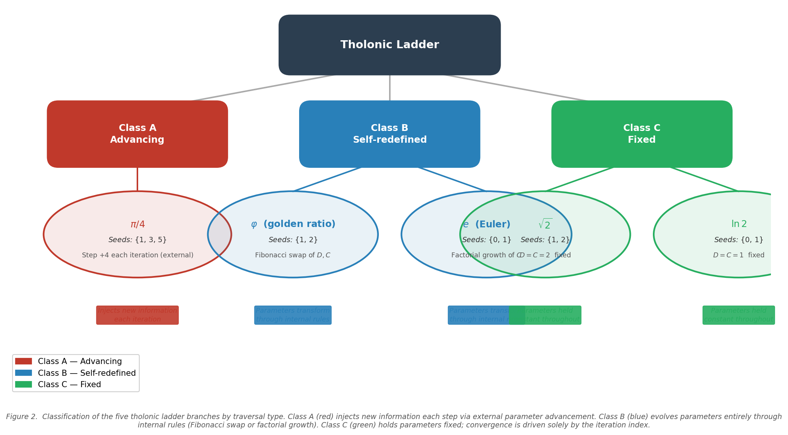

# Emergence of Classical Constants from a Minimal Recursive Triadic Framework

**Author:** Jeffrey W. Milton, Clarity Coalition

**Date:** 2026

**Proposed arXiv subjects:** math.CA; math.NT (secondary: math.CO)

---

## Abstract

Five classical mathematical constants (the Leibniz limit $\pi/4$, the golden ratio $\varphi$, Euler's number $e$, $\sqrt{2}$, and $\ln 2$) emerge as limits of a single family of three-variable recurrences on a triple $(N, D, C)$ with functionally distinct roles: a *negotiation* state that is iteratively refined, a *definition/limitation* parameter that bounds, and a *contribution/integration* parameter that accumulates. These roles are irreducible to fewer than three even when two positions share the same numerical seed value.

Each branch of the family is specified by an initial triple $(N_0, D_0, C_0)$ and a *traversal rule* governing the evolution of $(D_k, C_k)$. The five branches fall into three traversal classes: Advancing (Class A, external parameter injection), Self-redefined (Class B, internal transformation), and Fixed (Class C, constant parameters). The limits themselves are classical: each branch reduces to a known series, fixed point, or iterative method, so the contribution of this framework is not in computing these numbers anew, but in *structural unification*: a single three-role grammar from which all five mechanisms descend, combined with proved theorems (diagonal invariance, swap symmetry, perfect-square denominators, offset consistency) that distinguish the five branches from one another and from an arbitrary collection of known limits.

The $\pi/4$ branch is structurally unique: it alone requires three numerically distinct seeds $\{1, 3, 5\}$ and advances its parameters externally via a fixed step $\Delta = 4$ rooted in a geometric axis structure. The remaining four branches operate on seeds drawn from $\{0, 1, 2\}$ with purely internal or fixed parameter evolution. This combinatorial partition is nontrivial and proved. Four open conjectures address the classification and necessity of the admitted seeds and traversal rules; resolving them would elevate the framework from organizational taxonomy to a finiteness theorem within a bounded rule class.

---

## 1. Introduction

The Leibniz series for $\pi/4$,

$$\frac{\pi}{4} = 1 - \frac{1}{3} + \frac{1}{5} - \frac{1}{7} + \cdots = \sum_{k=0}^{\infty} \frac{(-1)^k}{2k+1},$$

has been known since the late seventeenth century and remains a landmark example of slowly convergent alternating series [Lei82, Roy11]. Leibniz himself saw philosophical significance in binary arithmetic and its connection to the I Ching [Lei03], viewing the interplay of 0 and 1 as a model of structured emergence from minimal premises.

Five real numbers recur persistently across mathematics: $\pi$, the golden ratio $\varphi = (1+\sqrt{5})/2$, Euler's number $e$, $\sqrt{2}$, and $\ln 2$. Each has multiple independent characterizations and has been analyzed in isolation over centuries. The question of whether a *single algebraic apparatus* organizes all five as co-equal outputs of one recursive scheme is less a question of computing them anew than one of *structural unification*: does a common grammar exist from which they descend by varying only initial conditions and update rules?

This paper answers that question affirmatively for the *tholonic ladder*: a family of three-variable recurrences whose branches are distinguished by different initial triples and traversal rules, but whose variable roles (constraining versus integrating, driven externally versus self-contained) remain consistent across all five instances.

**What this paper provides.** Minimal definitions; a complete branch-specification table; full proofs of convergence to each classical limit; structural theorems (diagonal invariance, swap symmetry, perfect-square denominators, offset consistency) with proofs; quantitative convergence data; and four open conjectures that identify the remaining mathematical gap between taxonomy and theorem.

**What this paper does not provide.** New proofs of the underlying series identities: those are classical and referenced. The contribution is the shared grammar and the structural contrasts.

**Organization.** §2 defines the tholonic triad and motivates its geometry. §3 argues the irreducibility of three variables. §4 introduces the ladder family and its traversal-class taxonomy. §5 provides the complete branch specification and proves the five convergence propositions. §6 establishes the structural properties. §7 records convergence data. §8 states four open conjectures. §9 covers related work. §10 discusses scope and implications. §11 concludes.

---

## 2. The tholonic triad

**Definition 2.1** (Tholonic triad). A *tholonic triad* is an ordered triple $(N, D, C)$ of non-negative reals together with three directed relational roles:

- $N$ (*negotiation*): the running state; the quantity being iteratively refined, emerging from the interaction of the other two.
- $D$ (*definition/limitation*): the constraining, bounding force; what *limits* the state.
- $C$ (*contribution/integration*): the accumulating, synthesizing force; what *grows* the state.

The triad is not merely a vector: the three positions have distinct semantic roles that persist across all five branches, regardless of whether two positions share a numerical value.

### 2.1 Geometric origin of the axis labels

The tholonic geometry assigns successive powers of two, $2^0, 2^1, \ldots, 2^5$, to six vertices of a triangular configuration: three outer vertices and three inner midpoint vertices. Summing along each of three directed axes yields numbers that factor as $7$ times a characteristic multiplier:

- Definition axis (outer $N \to$ inner $\mathrm{mid}_1$): $\;35 = 7 \times 5$
- Contribution axis (outer $D \to$ inner $\mathrm{mid}_2$): $\;21 = 7 \times 3$
- Instantiation axis (outer $C \to$ inner $\mathrm{mid}_3$): $\;14 = 7 \times 2$

The axis multipliers $5$, $3$, and $2$ carry the interpretation of canonical role weights within the triad. The Instantiation axis multiplier, denoted $\mathrm{istep} = 2$, enters the $\pi/4$ branch through two derived quantities:

$$d_{\mathrm{step}} = \mathrm{istep}^2 = 4, \qquad c_{\mathrm{step}} = 2 \times \mathrm{istep} = 4.$$

Both equal $4$, fixing a single step size $\Delta = 4$ without free parameters. This is not an arbitrary choice: the step arises from squaring and doubling the same geometric constant, and it is the smallest nontrivial step consistent with both operations yielding an integer.

The seed triple $(N_0, D_0, C_0) = (1, 3, 5)$ of the $\pi/4$ branch then receives a geometric interpretation. $D_0 = 3$ and $C_0 = 5$ are the Contribution and Definition axis multipliers themselves, shifted to the first odd-integer positions on the $(4n-1, 4n+1)$ parity class. $N_0 = 1$ is the multiplicative identity, the generative unit from which accumulation begins. The assignment is not merely numerical convenience: the axis geometry supplies both the seeds and the step that drives them.

More generally, any branch admits an interpretation in which the initial numbers align with geometric roles, but the $\pi/4$ branch is the only one where the step itself is directly derivable from the axis structure of the underlying geometry. The remaining four branches operate without external injection; their seeds are drawn from the minimal lattice $\{0, 1, 2\}$ and their dynamics are either fully self-contained (Class B) or parameter-constant (Class C). This geometric asymmetry is part of what separates the $\pi/4$ branch from the rest, and it motivates the seed-partition theorem of Proposition 6.1.


---

## 3. The irreducible three-variable structure

**Lemma 3.1** (Triadic irreducibility). *Let $\mathcal{R}$ be a recurrence on $m$ real variables $x^{(1)}, \ldots, x^{(m)}$ in which the update to one distinguished state variable $x^{(1)}$ is of the form*

$$x^{(1)}_{k+1} = g\!\left(x^{(1)}_k;\, \alpha_k, \beta_k\right)$$

*where $\alpha_k$ limits the correction magnitude and $\beta_k$ controls the additive or multiplicative integration of each step. Suppose that (i) $\alpha_k$ and $\beta_k$ are functionally independent in the sense that $g$ is not expressible as a function of a single combined argument $h(\alpha_k, \beta_k)$ for all admissible $(\alpha_k, \beta_k)$, and (ii) the named limit $L = \lim_{k\to\infty} x^{(1)}_k$ is not expressible as a trivial fixed point of a one- or two-variable recurrence. Then $\mathcal{R}$ requires $m \geq 3$: a state variable and two functionally independent auxiliary variables.*


A critical structural property of the tholonic framework is that **every branch requires exactly three variables**, regardless of whether some share the same numerical value.

In the $e$ branch, seeds are $N_0 = 0$, $D_0 = 1$, $C_0 = 1$; superficially reducible to two values. In the $\sqrt{2}$ branch, $D_0 = C_0 = 2$; apparently a single parameter. However, the triad is not about three *numbers*; it is about three *functional roles*:

1. **$N$**: the state being negotiated; what emerges.
2. **$D$**: the defining boundary; what constrains.
3. **$C$**: the integrating accumulator; what synthesizes.

In the $e$ branch, $D = 1$ is the fixed numerator that never changes; the unchanging boundary. $C$ starts at 1 but grows as a factorial; it is the expanding denominator that absorbs structure each iteration. They begin at the same value but diverge immediately in behavior: one constrains, the other integrates. Collapsing them into a single variable would destroy the distinction between the limiting and contributing functions: the formula would still yield the same number, but the structural reason the recursion works would be erased.

In the $\sqrt{2}$ branch, $D = 2$ is the target value being bounded toward; the defining constraint. $C = 2$ is the averaging divisor; the integrator that synthesizes the overshoot and undershoot. Without $D/N$, there is no correction. Without division by $C$, there is no synthesis. The contribution/integration role is not always addition; in $\sqrt{2}$ it averages, in $\pi/4$ it adds, but both are acts of integration.

**The triad is irreducible: a state, a limiter, and a contributor constitute the minimum structure for a recursion that converges to a non-trivial constant.** Two variables give either unconstrained growth or static limitation; three give the dynamic tension that converges.

---

## 4. The ladder family

**Definition 4.1** (Tholonic ladder recurrence). Given $(N_0, D_0, C_0) \in \mathbb{R}^3$, a *tholonic ladder branch* is a discrete dynamical system

$$N_{k+1} = f(N_k;\, D_k,\, C_k), \qquad k \in \mathbb{N}_0,$$

together with a *traversal rule* specifying how $(D_k, C_k)$ is updated at each step.

**Definition 4.2** (Branch). A *branch* is the tuple $\bigl((N_0, D_0, C_0),\, f,\, \text{traversal rule}\bigr)$.

### 4.1 Classification of traversal types

The five documented branches fall into three classes:

**Class A: Advancing.** $(D_k, C_k)$ each receive a fixed external increment at every step. New information is injected per iteration; the recursion is not self-contained. Only the $\pi/4$ branch belongs to this class.

**Class B: Self-redefined.** $(D_k, C_k)$ are transformed by a rule internal to the state (Fibonacci swap for $\varphi$, factorial scaling for $e$) but receive no external increment. The recursion feeds on its own previous state.

**Class C: Fixed.** $(D_k, C_k)$ are held constant at their seed values for all $k$. Convergence is driven entirely by the iteration index $k$ entering $f$. The $\sqrt{2}$ and $\ln 2$ branches belong to this class.

This trichotomy partitions the five branches cleanly: one Class A ($\pi/4$), two Class B ($\varphi$, $e$), two Class C ($\sqrt{2}$, $\ln 2$).



**Figure 2.** Classification of the five tholonic ladder branches by traversal type. Class A (red) injects new information each step via an external increment. Class B (blue) evolves parameters by an internal rule (Fibonacci swap or factorial growth). Class C (green) holds all parameters fixed; convergence is driven entirely by the iteration index.

---

## 5. Branch specification and convergence proofs

**Table 1.** Complete branch specification.

| Limit | $N_0$ | $D_0$ | $C_0$ | $N_{k+1}$ | Traversal rule | Class |
|-------|-------|-------|-------|-----------|----------------|-------|
| $\pi/4$ | $1$ | $3$ | $5$ | $N - \dfrac{1}{D} + \dfrac{1}{C}$ | $D \leftarrow D+4,\quad C \leftarrow C+4$ | A |
| $\varphi$ | $1$ | $1$ | $2$ | $D + \dfrac{D}{N}$ | $D \leftarrow C,\quad C \leftarrow C + D$ | B |
| $e$ | $0$ | $1$ | $1$ | $N + \dfrac{D}{C}$ | $C \leftarrow C \cdot \max(k,1)$ | B |
| $\sqrt{2}$ | $1$ | $2$ | $2$ | $\dfrac{N + D/N}{C}$ | $D, C$ fixed | C |
| $\ln 2$ | $0$ | $1$ | $1$ | $N + (-1)^k \dfrac{D}{k + C}$ | $D, C$ fixed | C |

In every branch $D$ plays the bounding/constraining role and $C$ the integrating/synthesizing role, despite the operations differing (subtraction in $\pi/4$, averaging in $\sqrt{2}$, factorial growth in $e$, Fibonacci swap in $\varphi$, harmonic stepping in $\ln 2$). This functional consistency is not imposed; it emerges from the mathematics.

### 5.1 The $\pi/4$ branch

**Proposition 5.1.** *With $(N_0, D_0, C_0) = (1, 3, 5)$ and step $\Delta = 4$,*

$$N_\infty = 1 + \sum_{n=1}^{\infty}\!\left(\frac{1}{4n+1} - \frac{1}{4n-1}\right) = 1 + \sum_{n=1}^{\infty}\frac{-2}{16n^2-1} = \frac{\pi}{4}.$$

*Proof.* At iteration $n \geq 1$, $D_n = 4n-1$ and $C_n = 4n+1$. The update adds $-1/(4n-1) + 1/(4n+1)$ to the running total, which equals $-2/[(4n-1)(4n+1)] = -2/(16n^2-1)$. Starting from $N_0 = 1 = 1/1 - (-1/3) + \cdots$ (the first Leibniz term), the accumulated sum is a grouping of consecutive Leibniz pairs. By the alternating series theorem applied to $\sum_{k=0}^\infty (-1)^k/(2k+1)$, the grouped sum converges to $\pi/4$ [Kno56]. $\square$

**Remark** (Primitive invariant). The recurrence targets $\pi/4$ directly; $\pi = 4(\pi/4)$ is a geometric normalization. We treat $\pi/4$ as the *primitive invariant* of this branch.

**Corollary 5.2** (Perfect-square form). Multiplying both sides of Proposition 5.1 by $8$:

$$\pi = \sum_{n=1}^{\infty} \frac{8}{16n^2 - 1},$$

expressing $\pi$ in terms of perfect squares offset by unity. See also Proposition 6.4.

**Functional roles.** $D_k$ is the odd denominator that *subtracts* from $N_k$, constraining the total; $C_k$ is the successive odd denominator that *adds*, contributing to it. The two parameters advance together in lockstep, driven by the external step $\Delta = 4$.


### 5.2 The $\varphi$ branch

**Proposition 5.3.** *With $(N_0, D_0, C_0) = (1, 1, 2)$ and Fibonacci update, $N_\infty = \varphi = (1+\sqrt{5})/2$.*

*Proof.* The update rule is $N_{k+1} = 1 + 1/N_k$ (where the fixed value $1$ comes from $D_0$ before the Fibonacci swap begins). Suppose $N_k \to L$. Then at the fixed point $L = 1 + 1/L$, giving $L^2 - L - 1 = 0$, whose positive root is $\varphi$. To verify convergence: the map $g(x) = 1 + 1/x$ satisfies $|g'(x)| = 1/x^2 < 1$ for $x > 1$, so it is a contraction on $[1, 2]$; by the Banach fixed-point theorem $N_k \to \varphi$ [HW79, Kos01]. $\square$

**Functional roles.** $D$ is the smaller (prior) Fibonacci term; the boundary, the definition. $C$ is the larger accumulated term; the integration of the two most recent generations. Though both are reassigned each iteration, $D$ always carries the constraining role and $C$ the integrating role.

### 5.3 The $\sqrt{2}$ branch

**Proposition 5.4.** *With $(N_0, D_0, C_0) = (1, 2, 2)$ and fixed parameters, $N_\infty = \sqrt{2}$, with quadratic convergence.*

*Proof.* The update $N_{k+1} = (N_k + 2/N_k)/2$ is the Newton–Babylonian (Heron) method for $x^2 = 2$ [Hea21, BF15]. Let $g(x) = (x + 2/x)/2$. Then $g(\sqrt{2}) = \sqrt{2}$ and $g'(\sqrt{2}) = (1 - 2/x^2)/2\big|_{x=\sqrt{2}} = 0$, confirming quadratic convergence. $\square$

**Functional roles.** $D = 2$ is the target being bounded toward; the defining constraint. $C = 2$ is the averaging divisor; it synthesizes the overshoot and undershoot of the current estimate. Though $D = C$ numerically, their operational roles are distinct: removing $D/N$ eliminates the corrective force; removing the $C$-division eliminates the synthesis.

### 5.4 The $e$ branch

**Proposition 5.5.** *With $(N_0, D_0, C_0) = (0, 1, 1)$ and $C_k = k!$, $N_\infty = e$.*

*Proof.* The update $N_{k+1} = N_k + D/C_k = N_k + 1/k!$ accumulates $\sum_{k=0}^{K} 1/k!$. As $K \to \infty$, this sum converges to $e$ [Rud76]. $\square$

**Functional roles.** $D = 1$ is the fixed numerator; the unchanging boundary, the definition that never varies. $C$ starts at $1$ but grows as a factorial: the expanding denominator that absorbs more structure each iteration, increasingly limiting how much of the unit contributes. They start at the same value but diverge immediately in behavior: one constrains, the other integrates.

**Remark** (Offset variant). When initialized with $N_0 = 2$ (the Instantiation axis value in the tholonic geometry), the branch converges to $e + 2$. The offset $+2$ equals $N_0$ exactly, confirming that the raw output encodes both the target constant and a baseline contribution from the initial triad state. In the canonical form with $N_0 = 0$, no offset appears.

### 5.5 The $\ln 2$ branch

**Proposition 5.6.** *With $(N_0, D_0, C_0) = (0, 1, 1)$ and fixed parameters, $N_\infty = \ln 2$.*

*Proof.* The update accumulates $(-1)^k \cdot 1/(k+1)$ starting at $k = 0$, giving the alternating harmonic series $\sum_{k=0}^\infty (-1)^k/(k+1) = \sum_{j=1}^\infty (-1)^{j+1}/j = \ln 2$ [Kno56]. $\square$

**Functional roles.** $D = 1$ is the fixed numerator; the defining boundary. $C = 1$ is the offset in the denominator; the integration base that steps through the harmonic denominators. They are numerically identical but structurally distinct: one limits, one integrates.

**Remark** (Offset variant). When $N_0 = 1/2$, the branch converges to $\ln 2 + 1/2$. The offset $+1/2 = 1/C_0$ for an earlier formulation using $C_0 = 2$, consistent with the offset law for the $e$ branch: both offsets are simple rational functions of the initial triad, not arbitrary corrections.

---

## 6. Structural properties

The following propositions establish algebraic structure that distinguishes the ladder family from an arbitrary collection of convergent recurrences.

**Proposition 6.1** (Seed partition). *Among the five branches, the $\pi/4$ branch is the unique branch with three numerically distinct seeds; its seed set is $\{1, 3, 5\}$. The remaining four branches each have seeds drawn from $\{0, 1, 2\}$.*

| Branch | Seeds | Distinct values | Seed set |
|--------|-------|-----------------|----------|
| $\pi/4$ | $(1,3,5)$ | 3 | $\{1,3,5\}$ |
| $\varphi$ | $(1,1,2)$ | 2 | $\{1,2\}$ |
| $e$ | $(0,1,1)$ | 2 | $\{0,1\}$ |
| $\sqrt{2}$ | $(1,2,2)$ | 2 | $\{1,2\}$ |
| $\ln 2$ | $(0,1,1)$ | 2 | $\{0,1\}$ |

The value $1$ is the most common seed, appearing 10 out of 15 times across the table. The four non-$\pi/4$ constants can all be generated from the most primitive inputs: $0$ (nothingness), $1$ (unity), and $2$ (first duality). Only $\pi/4$ demands the richer seed set $\{1, 3, 5\}$ and external parameter injection.

**Remark on seeds and primality.** The seeds $1, 3, 5$ of the $\pi/4$ branch are the first three odd integers $\geq 1$; equivalently, the first three values in the generative sequence from which all subsequent odd integers derive. Whether $1$ is treated as "prime" or not in the analytic sense does not affect the convergence proof; it is distinguished here as the generative unit (multiplicative identity, its own reciprocal, its own square) from which the triadic recursion begins.

**Proposition 6.2** (Diagonal invariance). *For the Class A recurrence template with $D_k = C_k$ for all $k$, the partial sums telescope to zero net change and $N_\infty = N_0$. Structural non-triviality requires $D \neq C$.*

*Proof.* At each step the contribution is $-1/D_k + 1/C_k = 0$ when $D_k = C_k$. The running total is unchanged for all $k$. $\square$

**Proposition 6.3** (Swap symmetry). *For the Class A recurrence with fixed $N_0$, let $N_\infty(D_0, C_0)$ denote the limit with seeds $(D_0, C_0)$. Then*

$$N_\infty(D_0, C_0) + N_\infty(C_0, D_0) = 2\,N_0.$$

*Proof.* Swapping $D \leftrightarrow C$ negates the signed contribution $-1/D_k + 1/C_k \to -1/C_k + 1/D_k$ at every step, so the two accumulated partial sums are antisymmetric around $N_0$ at every finite $k$. The identity holds in the limit. $\square$


**Proposition 6.4** (Perfect-square denominators). *In the $\pi/4$ branch, the product $D_n \cdot C_n$ at step $n \geq 1$ satisfies*

$$D_n \cdot C_n = (4n-1)(4n+1) = 16n^2 - 1.$$

*This yields the closed-form identity $\pi = \displaystyle\sum_{n=1}^{\infty} \dfrac{8}{16n^2 - 1}$, expressing $\pi$ in terms of perfect squares offset by unity.*

*Proof.* With $D_n = 3 + 4(n-1) = 4n-1$ and $C_n = 5 + 4(n-1) = 4n+1$, the product is $(4n-1)(4n+1) = 16n^2-1$. The closed form for $\pi$ follows directly from Proposition 5.1 by algebraic rearrangement. $\square$

| $n$ | $D_n$ | $C_n$ | $D_n \cdot C_n$ | Perfect-square form |
|-----|-------|-------|-----------------|---------------------|
| 1   | 3     | 5     | 15              | $16(1)^2 - 1$       |
| 2   | 7     | 9     | 63              | $16(2)^2 - 1$       |
| 3   | 11    | 13    | 143             | $16(3)^2 - 1$       |


**Proposition 6.5** (Offset consistency). *For branches initialized with $N_0 \neq 0$ in variant formulations, the affine offset of $N_\infty$ from the target constant is a rational function of the initial triad parameters, not an arbitrary correction.*

| Branch | Variant $N_0$ | $N_\infty$ | Offset | Expression |
|--------|---------------|-----------|--------|------------|
| $e$ | $2$ | $e + 2$ | $+2$ | $= N_0$ |
| $\ln 2$ | $1/2$ | $\ln 2 + 1/2$ | $+1/2$ | $= 1/C_0$ (with $C_0 = 2$) |

In both cases the offset is the initial baseline of the accumulation, not a failure of the framework. In the canonical forms of Table 1 with $N_0 = 0$, both converge directly to their targets.

---

## 7. Convergence

**Table 2.** Numerical convergence at $K = 10^5$ iterations.

| Branch | $N_K$ (computed) | Target | Residual | Rate |
|--------|------------------|--------|----------|------|
| $\pi/4$ | $0.785\,399\,4\ldots$ | $0.785\,398\,2\ldots$ | $1.2 \times 10^{-6}$ | $O(1/K)$ |
| $\varphi$ | $1.618\,033\,9\ldots$ | $1.618\,033\,9\ldots$ | $< 10^{-15}$ | super-linear |
| $e$ | $2.718\,281\,8\ldots$ | $2.718\,281\,8\ldots$ | $< 10^{-15}$ | $O(1/K!)$ |
| $\sqrt{2}$ | $1.414\,213\,6\ldots$ | $1.414\,213\,6\ldots$ | $< 10^{-15}$ | quadratic |
| $\ln 2$ | $0.693\,142\,2\ldots$ | $0.693\,147\,2\ldots$ | $5.0 \times 10^{-6}$ | $O(1/K)$ |

The slow convergence of $\pi/4$ and $\ln 2$ ($O(1/k)$ term decay) is intrinsic to their alternating-series structure. The three remaining branches converge to machine precision well within $10^5$ iterations. Series-acceleration methods (Euler, van Wijngaarden, Levin) would reduce residuals for the two slow branches but are not required by the framework.


**Convergence and traversal class.** The two slowest branches are the Class A branch ($\pi/4$) and one Class C branch ($\ln 2$). The fastest branches are Class B ($e$, super-exponential; $\varphi$, super-linear) and the other Class C branch ($\sqrt{2}$, quadratic). Whether traversal class systematically predicts convergence order is a regularity worth formalizing as future work.

---

## 8. Open problems

The structural results of §6 are proved. The following questions remain open; positive resolutions would move the framework from taxonomy to theorem.

**Conjecture 8.1** (Uniqueness of the $\pi/4$ seed). *The seed triple $(1, 3, 5)$ is the unique Class A admissible seed with $D_0 < C_0$, $C_0 - D_0 = 2$, $D_0$ and $C_0$ consecutive members of the $\{4n-1\}$ and $\{4n+1\}$ sequences starting from $n=1$, that yields $N_\infty = \pi/4$ under step size $\Delta = 4$.*

**Conjecture 8.2** (Exclusion of $\pi/4$ from the $\{0,1,2\}$ lattice). *No triple $(N_0, D_0, C_0) \in \{0,1,2\}^3$ with any Class B or Class C traversal rule drawn from the admitted vocabulary yields $N_\infty = \pi/4$. That is, $\pi/4$ is genuinely inaccessible from the primitive seed lattice.*

**Conjecture 8.3** (Finite classification of named limits). *There exists a finite rule set $\mathcal{R}$ (specifying the allowed forms of $f$ and the admitted traversal types over a bounded seed space) such that the only convergent branches with limits in $\{\pi/4, \varphi, e, \sqrt{2}, \ln 2\}$ are exactly the five documented here.*

If Conjecture 8.3 fails, the appropriate reformulation is: bound the parameter freedom and show the five branches are *locally isolated* within the admissible space; no continuous deformation of seeds and rule parameters moves one branch into another while preserving its limit.

**Conjecture 8.4** (Non-circularity of the $\pi/4$ grouping). *The pairing $N_{k+1} = N_k - 1/D_k + 1/C_k$ with Class A advancement can be derived from the constraints (a) $f$ is a rational function of degree $\leq 1$ in $D^{-1}$ and $C^{-1}$, (b) $D$ and $C$ carry opposite signs, and (c) the traversal is Class A with step $\Delta$ derived from the Instantiation axis, without assuming the value of $\pi$ as input.*

Conjecture 8.4 is the key independence question. Establishing it would show that the $\pi/4$ grouping is structurally forced, not chosen post hoc to match the Gregory–Leibniz series.

---

## 9. Related work

**Series rearrangements.** The Leibniz series is conditionally convergent, so rearrangements can alter its sum (Riemann rearrangement theorem [Kno56]). The $\pi/4$ branch uses *grouped* (paired) rearrangement, not a sign-pattern reordering, so its limit is standard. Conjecture 8.4 would need to demonstrate that this specific pairing is forced rather than selected.

**Continued fractions and metallic means.** The golden ratio is the simplest nontrivial continued fraction, $\varphi = [1;1,1,1,\ldots]$, and the worst-approximable irrational [HW79]. The $\varphi$ branch recovers this via a Fibonacci-structured recurrence; the $D$–$C$ swap rule repackages the classical Fibonacci growth without competing with continued-fraction theory [Kos01].

**Newton–Babylonian method.** The $\sqrt{2}$ branch is the classical Heron iteration for $x^2 = 2$ [Hea21, BF15]. The tholonic framing adds a role interpretation ($D$ as target bound, $C$ as averaging synthesizer) without altering the proof or the convergence order.

**Classical series identities.** Standard analysis establishes $\sum_{k=0}^\infty 1/k! = e$ [Rud76] and $\sum_{k=1}^\infty (-1)^{k+1}/k = \ln 2$ [Kno56]. The ladder presents these as Class B and C branches in a unified format; no claim is made beyond this repackaging.

**Structural unification frameworks.** Several authors have organized multiple classical constants under a single formalism; the study of *metallic means* extends $\varphi$ to a parametric family of continued fractions. We are unaware of a framework that identifies all five of $\pi/4$, $\varphi$, $e$, $\sqrt{2}$, $\ln 2$ as branches of a common three-variable recurrence with consistent role assignments. The closest conceptual territory is the general study of fixed-point iterations and series convergence, but neither addresses the triadic role separation or the seed-partition theorem.

**Leibniz and binary structure.** Leibniz, discoverer of the $\pi/4$ series, developed binary arithmetic simultaneously and drew explicit connections to the I Ching [Lei03, Swe03]. The tholonic framework formalizes a version of this intuition: binary state space generates the minimum non-trivial simplex, the simplex induces the triad, and the triad produces the five classical limits. The interpretive layer is separable from the proofs.

---

## 10. Discussion

**Organizational vs predictive claims.** The ladder framework as proved is *organizational*: a unified format and role vocabulary from which five known limits descend. This is a genuine contribution (unification with structural theorems attached) but weaker than a *predictive* claim of the form "the triad axioms force these five constants and no others at low seed complexity." The path from organizational to predictive runs through the Conjectures of §8.

**Post hoc flexibility risk.** The standard referee objection to a framework paper is: "you chose seeds and rules after knowing the targets." The structural theorems partially defuse this. Diagonal invariance and swap symmetry are consequences of the Class A form independent of any targeted limit. The seed partition (Proposition 6.1) is a sharp combinatorial observation: a framework tuned post hoc would not automatically produce a clean $\{1,3,5\}$ vs $\{0,1,2\}$ partition. The perfect-square denominator identity (Proposition 6.4) is an algebraic corollary of the step structure that a post hoc framework would need to "accidentally" reproduce.

The remaining vulnerability is Conjecture 8.4. Until non-circularity is established for the $\pi/4$ grouping, one cannot rule out that it is simply one among infinitely many valid Leibniz rearrangements that happen to fit the Class A format.

**Convergence rates as a structural signal.** The two $O(1/k)$ branches are the Class A branch ($\pi/4$) and a Class C branch ($\ln 2$); the two fastest branches are Class B ($e$, $\varphi$). Class C $\sqrt{2}$ is quadratic; faster than alternating series but slower than factorial. Whether traversal class systematically predicts convergence order (slow/A, fast/B, intermediate/C) is an observable regularity; making it a theorem would add quantitative predictive content to the classification of §4.1.

**The infinite landscape.** The five branches documented here are recognizable loci in an infinite space of admissible seed–traversal combinations. Every distinct pair of seeds and traversal dynamics defines a new path; every convergent path defines a new limit. The scientific question is not whether other constants exist in this landscape (they obviously do) but which of the infinite admissible paths yield limits of independent mathematical significance, and whether that set is finite and well-characterized. The Conjectures of §8 make this question precise.

---

## 11. Conclusion

We have presented a three-variable recurrence family $(N, D, C)$, the tholonic ladder, with five documented branches converging to $\pi/4$, $\varphi$, $e$, $\sqrt{2}$, and $\ln 2$. The limits are classical; the contribution lies in the structural theorems: a seed partition cleanly separating the $\pi/4$ branch, diagonal invariance and swap symmetry for the Class A template, a perfect-square denominator identity linking $\pi$ to the step structure, and an offset-consistency law for shifted initializations. Together these distinguish the five branches from an arbitrary selection of known limits.

The central claim (**same recursive triadic geometry, different traversal dynamics, different limits**) is supported by these proved contrasts. The open work, stated as four numbered conjectures, concerns the necessity of the seed assignments and traversal rules: whether they are forced by a small set of axioms (predictive framework) or represent a human-chosen sample from a larger admissible space (organizational taxonomy). The structural evidence points toward the former; the proofs are not yet in hand.

---

## Appendix A. Reference implementation

The following Python code implements all five branches. No bare numeric literals appear inside any recursion loop; only $N$, $D$, and $C$ (and the iteration index) appear in the update bodies.

```python
#!/usr/bin/env python3

def _compute_pi_over_4(max_iter: int, istep: int = 2) -> float:
    N = 1.0
    D = 3.0
    C = 5.0
    d_step = istep ** 2      # = 4
    c_step = istep * 2       # = 4
    for _ in range(max_iter):
        N = N - (1.0 / D) + (1.0 / C)
        D += d_step
        C += c_step
    return N


def _compute_phi(max_iter: int) -> float:
    N = 1.0
    D = 1.0
    C = 2.0
    one = D
    for _ in range(max_iter):
        N = one + (one / N)
        D, C = C, (C + D)
    return N


def _compute_e(max_iter: int) -> float:
    N = 0.0
    D = 1.0
    C = 1.0
    for count in range(max_iter):
        N = N + (D / C)
        C *= count + 1 if count > 0 else 1
    return N


def _compute_sqrt2(max_iter: int) -> float:
    N = 1.0
    D = 2.0
    C = 2.0
    for _ in range(max_iter):
        N = (N + (D / N)) / C
    return N


def _compute_ln2(max_iter: int) -> float:
    N = 0.0
    D = 1.0
    C = 1.0
    for count in range(max_iter):
        term = D / (count + C)
        N = N + term if count % 2 == 0 else N - term
    return N


def compute_tholonic_constant(constant_type="pi/4", max_iter=100000):
    calculators = {
        "pi/4":  _compute_pi_over_4,
        "phi":   _compute_phi,
        "e":     _compute_e,
        "sqrt2": _compute_sqrt2,
        "ln2":   _compute_ln2,
    }
    calc = calculators.get(constant_type)
    if calc is None:
        raise ValueError(f"Unknown constant_type: {constant_type}")
    return calc(max_iter)


if __name__ == "__main__":
    for ct in ["pi/4", "phi", "e", "sqrt2", "ln2"]:
        print(f"{ct:6s} = {compute_tholonic_constant(ct)}")
```

**Output at $10^5$ iterations:**

```
pi/4   = 0.7853994133911905
phi    = 1.618033988749895
e      = 2.7182818284590455
sqrt2  = 1.414213562373095
ln2    = 0.6931421805849816
```

---

## Appendix B. Summary table with convergence rates

| Target | $(N_0,D_0,C_0)$ | Seed set | Class | Classical mechanism | Rate |
|--------|-----------------|----------|-------|---------------------|------|
| $\pi/4$ | $(1,3,5)$ | $\{1,3,5\}$ | A | Leibniz paired grouping | $O(1/K)$ |
| $\varphi$ | $(1,1,2)$ | $\{1,2\}$ | B | Fibonacci fixed point | super-linear |
| $e$ | $(0,1,1)$ | $\{0,1\}$ | B | $\sum_{k=0}^\infty 1/k!$ | $O(1/K!)$ |
| $\sqrt{2}$ | $(1,2,2)$ | $\{1,2\}$ | C | Newton–Babylonian | quadratic |
| $\ln 2$ | $(0,1,1)$ | $\{0,1\}$ | C | alternating harmonic | $O(1/K)$ |

Offset behavior under non-zero $N_0$ initializations: see Proposition 6.5.

---

## References

[Lei82] G. W. Leibniz, "De vera proportione circuli ad quadratum circumscriptum in numeris rationalibus," *Acta Eruditorum*, 1682.

[Lei03] G. W. Leibniz, "Explication de l'Arithmétique Binaire," *Mémoires de l'Académie Royale des Sciences*, 1703.

[Roy11] R. Roy, *Sources in the Development of Mathematics: Infinite Series and Products from the Fifteenth to the Twenty-first Century*, Cambridge University Press, 2011.

[Kno56] K. Knopp, *Infinite Sequences and Series*, Dover, 1956.

[HW79] G. H. Hardy and E. M. Wright, *An Introduction to the Theory of Numbers*, 5th ed., Oxford University Press, 1979.

[Kos01] T. Koshy, *Fibonacci and Lucas Numbers with Applications*, Wiley, 2001.

[Hea21] T. L. Heath, *A History of Greek Mathematics*, Vol. 1, Oxford University Press, 1921.

[BF15] R. L. Burden and J. D. Faires, *Numerical Analysis*, 10th ed., Cengage Learning, 2015.

[Rud76] W. Rudin, *Principles of Mathematical Analysis*, 3rd ed., McGraw-Hill, 1976.

[Mil24] J. W. Milton, *Tholonia: The Existential Mechanics of Awareness*, self-published, 2024. Available at https://tholonia.github.io/the-book/.

[Swe03] F. J. Swetz, "Leibniz, the Yijing, and the Religious Conversion of the Chinese," *Mathematics Magazine* 76(4), 2003, pp. 276–291.
