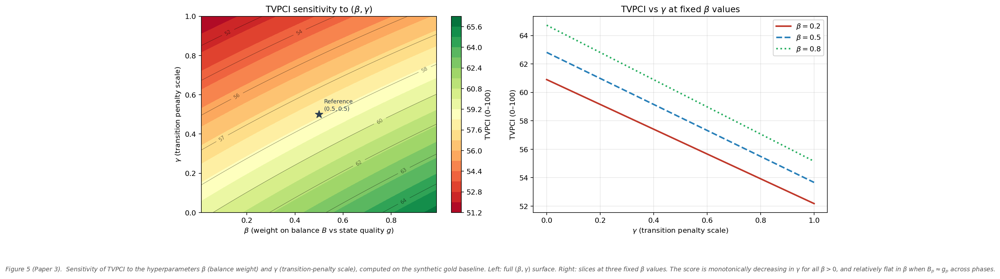

# Phase-Resolved Transparency Classification in Commodity Supply Chains: A Structural Triadic Scoring Framework (TVPCI)

**Author:** J. W. Milton, Clarity Coalition

**Version:** 1.0

**Date:** 9 April 2026

**Provisional arXiv subjects:** econ.GN; q-fin.EC (secondary: cs.SY)

---

## Abstract

Opacity in commodity supply chains is commonly described in narrative or intent-based terms. This paper proposes a structural alternative: transparency is a property of *observable evidence attached to each phase of a chain*, and can be scored by a phase-resolved framework with three functionally distinct roles. We formalize the **Transparency via Phase-resolved Classification and Indexing (TVPCI)** framework, in which each phase $p \in \{0,\ldots,P\}$ of a commodity chain hosts three non-negative observables: a **negotiation state** $N_p$ (declared position and mass-balance coherence), a **definition/limitation score** $D_p$ (bounding evidence: audit scope, policy constraints, counterparty opacity caps), and a **contribution score** $C_p$ (independent corroboration depth: third-party assays, geospatial attestations, physical touchpoints). These roles are motivated by the tholonic triadic framework; here they organize indicators rather than recurrences.

A **phase-local balance functional** $B(D_p, C_p)$ penalizes one-sided evidence: strong disclosure without corroboration, or deep tracing without audit scope, both degrade the balance score. A **transition penalty** $\tau_p$ reduces the contribution of a phase when its $N$-state carries unresolved red flags from the prior phase. A weighted aggregate index combines these components.

The methodological contribution is a reusable schema: once an indicator dictionary is fixed for a commodity, the framework produces a reproducible, phase-consistent score for any observed chain. We demonstrate with a synthetic eight-phase gold ladder (phases 0 through 7, anchored at an exchange-linked endpoint) and a parallel synthetic shea-oil profile, chosen because both commodities have well-documented opacity concerns at extraction and aggregation stages. All figures use synthetic or schematic data; no proprietary or audited datasets are calibrated in this preprint. Limitations, including post-hoc flexibility and legal definition gaps, are stated explicitly.

---

## 1. Introduction

Commodity supply chains for minerals, agricultural products, and energy feedstocks increasingly attract regulatory scrutiny. The OECD Due Diligence Guidance for minerals from conflict-affected regions, the EU Conflict Minerals Regulation (2021), and emerging mandatory human-rights due-diligence legislation in several jurisdictions all require evidence of responsible sourcing. Yet the practical bottleneck in applying these requirements is not regulatory intent but *measurement*: how does an auditor, exchange, or buyer convert a collection of documents, assay records, and counterparty attestations into a single, reproducible statement about chain transparency?

Existing approaches fall into three broad categories. First, binary pass/fail certification (conflict-free, Fairtrade) is legible but coarse; it typically reduces multi-phase evidence to a single threshold judgment that discards phase-specific variation. Second, narrative risk assessments (the dominant form in OECD guidance) are rich but poorly comparable across chains and not amenable to automated aggregation. Third, weighted indicator composites (e.g., as used in some ESG scoring) aggregate indicators without enforcing phase ordering or testing for evidence balance.

TVPCI addresses a gap that each of these approaches leaves open: a *phase-ordered, balance-tested* aggregate score. Three design principles distinguish it.

**Phase ordering matters.** Transparency evidence does not commute across phases. An assay record at refining is meaningful only if the chain upstream (aggregation, mine gate) has non-zero observability. A phase-resolved score must propagate gaps rather than allow a high-scoring phase to mask a low-scoring predecessor.

**Evidence balance is structural.** A chain that accumulates strong bounding (policy constraints, audit scope) but weak independent corroboration is structurally opaque in a different sense than one with deep corroboration but no audit limits. The balance functional $B(D,C)$ operationalizes this distinction.

**Organization precedes prediction.** TVPCI does not claim to predict enforcement outcomes, commodity prices, or fraud rates. It claims to organize available evidence into a consistent ordinal structure. Predictive applications require additional labeled data and pre-registered calibration; those are explicitly deferred.

The triadic roles $(N, D, C)$ used here share labels with the tholonic mathematical framework developed in a companion manuscript (Milton, companion paper). In that paper, $(N, D, C)$ are positions in convergent recurrences; here they are *classes of indicators* attached to a phase node. The connection is not merely an analogy. Within the tholonic framework, the integers 1, 2, 3 carry inherent qualitative meaning: one as unity (the negotiation state), two as the first differentiation (definition/limitation), and three as the first recursive closure (contribution). The supply-chain roles are instantiations of these qualitative properties in an observable domain. No mathematical results from the companion paper are imported into the scoring rules here, but the role assignments follow from the same structural argument.

The remainder of the paper is organized as follows. Section 2 surveys related work. Section 3 develops the phase-resolved ontology for gold (eight phases, schematic). Section 4 defines the triadic observables and provides a specimen indicator dictionary. Section 5 introduces the balance functional, transition penalties, and aggregate index. Section 6 presents a worked numerical example. Section 7 presents the synthetic two-commodity comparison and the sensitivity analysis. Section 8 discusses limitations. Section 9 concludes.

---

## 2. Related work

### 2.1 Regulatory frameworks: OECD and conflict minerals

The OECD five-step framework (establish strong company management systems; identify and assess risks; design and implement a strategy to respond to identified risks; carry out third-party audits of supply chain due diligence; report annually on supply chain due diligence) is the most widely cited structure for minerals due diligence. TVPCI is aligned with this framework but differs in focus: OECD guidance describes *processes* (what a company should do); TVPCI scores *evidence states* (what a chain observably demonstrates at each phase). The two are complementary. TVPCI could in principle generate a phase-resolved audit artifact that maps to OECD step 2 (risk identification) and step 3 (strategy implementation monitoring).

The EU Conflict Minerals Regulation (Regulation 2017/821/EU, effective 2021) requires importers of tin, tungsten, tantalum, and gold above threshold volumes to carry out OECD-aligned due diligence. It does not prescribe a numerical scoring method; TVPCI could serve as an audit-support layer.

### 2.2 GRI and sector reporting standards

The Global Reporting Initiative provides topic-specific standards for supply chain disclosures (GRI 204: Procurement Practices; GRI 308/414: supplier environmental and social assessment). These standards require disclosure of the proportion of screened suppliers but do not enforce phase consistency. A supplier that rates well on social criteria may still be embedded in a chain with opaque aggregation-phase intermediaries. TVPCI's phase-local scoring exposes this gap explicitly.

### 2.3 Chain-of-custody models

Chain-of-custody certification (FSC for forestry, ASC for aquaculture, RMAP for minerals) tracks material through a defined custody chain but typically does so via claims rather than independent measurement at each link. TVPCI is compatible with chain-of-custody programs: existing custody claims feed into $N_p$ (the state score), while the evidence supporting those claims determines $D_p$ and $C_p$. A chain with custody claims but low $C_p$ (weak independent corroboration) will produce low balance scores at those phases.

### 2.4 ESG composite indices

Quantitative ESG ratings aggregate many indicators but typically do not enforce sequential chain structure, phase ordering, or a balance test between complementary evidence types. Several studies have documented low inter-rater agreement among major ESG providers (Berg, Kolbel, Rigobon, 2022), attributable partly to scope and weighting differences. TVPCI's fixed indicator dictionary and phase ordering constraints are designed to reduce such variation, at the cost of requiring commodity-specific up-front specification work.

### 2.5 Systems-theoretic frameworks

Holarchy (Koestler), viable systems models (Beer), and autopoiesis theory (Maturana, Varela) each describe multi-level systems with internal role differentiation. These frameworks inform the design intuition behind $(N, D, C)$ roles but are not formally used in the scoring rules.

---

## 3. Phase-resolved ontology

### 3.1 Rationale for phase indexing

Within its defined custody horizon, a supply chain is a directed acyclic graph (DAG) of custody handoffs, physical transformations, and documentation events: material flows in one direction and no phase feeds back into an earlier phase within the same chain instance. This DAG assumption is a modeling boundary choice, not an ontological claim. At the system level, the chain is embedded in larger cycles: mined gold returns as recycled metal, financial instruments re-enter physical delivery, and ecological costs feed back through regulation and resource depletion. These outer cycles are real and structurally important (see Section 3.3 and Section 8.7), but treating them as part of the primary chain would make phase-resolved scoring intractable. The DAG scope is therefore declared explicitly as a design constraint, not assumed as a property of commodity chains in general.

For scoring purposes, we coarsen this graph into a linear sequence of **phases** by grouping nodes with similar observability characteristics and regulatory exposure. This coarsening trades resolution for tractability; the appropriate phase count is commodity-specific.

For gold, eight phases capture the dominant transformation events (extraction, aggregation, refining, fabrication, wholesale, distribution, listed storage, exchange delivery) while remaining fine enough to localize opacity. A chain that aggregates phases 0 through 3 into a single opaque "upstream" block would lose the ability to distinguish a transparent refinery from an opaque aggregator.

Phase skipping must be handled explicitly. If phase $p$ is not observed (the chain moves directly from $p-1$ to $p+1$), the model assigns a **skip penalty** as follows. First, $N_p$ inherits $N_{p-1}$ deflated by a position-weighted skip factor:

$$\sigma_p = \frac{P - p}{P},$$

where $P$ is the total number of phases (e.g., $P = 7$ for an eight-phase gold chain, with phases indexed $0$ through $7$). This gives $\sigma_0 = 1$ (no prior phase to inherit from; the formula does not apply at phase 0), $\sigma_1 = 6/7$, $\sigma_2 = 5/7$, down to $\sigma_7 = 0$ at the exchange anchor. The rationale is foundational asymmetry: skipping an early phase undermines all downstream claims, while skipping a late phase leaves earlier evidence intact. A fixed $\sigma$ (e.g., $0.5$) would treat a missing extraction phase identically to a missing vault-transfer phase, which understates the damage done by early gaps.

Second, $D_p = C_p = 0$ for the skipped phase (no bounding evidence, no corroboration, because nothing was documented). Because plugging $D_p = C_p = 0$ into the standard $B_p$ formula yields $B_p = 100$ (a spurious perfect-balance score), the skip case instead assigns $B_p = 0$ directly, representing maximum evidence failure. This is conservative by design: a gap in documentation is treated as maximum imbalance, not as perfect balance between two zeros.

### 3.2 Gold phase ladder

| Phase | Schematic label | Typical transformation or custody event |
|------:|-----------------|----------------------------------------|
| 0 | Extraction / mine gate | Ore extraction, initial weighing, first lot numbering |
| 1 | Aggregation / broker | Consolidation of material from one or more sources, first documentary claim |
| 2 | Refining / assay | Smelting, cupellation, purity certification; lot identity re-established |
| 3 | Fabrication | Bar or wire production; serial marking; LBMA-eligible or equivalent |
| 4 | Wholesale / vault chain | Transfer to secure storage, custodian documentation |
| 5 | Distribution | Retail-linked holdings, commercial delivery chains |
| 6 | Listed storage | Regulated custodian, eligible-vault status, centralized reporting |
| 7 | Exchange anchor | Delivery-eligible bars under exchange rules (e.g., COMEX, LME, LBMA) |

Phase 7 is the **high-observability anchor**: exchange rules impose delivery specifications (assay, bar markings, vault identity), and open-interest and warehouse-stock data are publicly reported. This makes phase 7 the most constrained node in the model, not the most trustworthy in an absolute sense, but the most *measurable*.

Viewed through an information-theoretic lens, the phase ladder corresponds to an entropy gradient. Phase 0 (extraction) is the highest-entropy node: material origins are uncertain, documentation is sparse, and counterparty identity is often informal. Phase 7 is the lowest-entropy node: serial numbers are registered, vault locations are named, and delivery specifications are publicly auditable. The TVPCI scoring structure mirrors this gradient. High-entropy phases are hardest to score because indicators are few and noisy; low-entropy phases are easiest because the exchange infrastructure generates verifiable records by default. This entropy framing provides a principled basis for the downstream phase-weighting discussed in Section 5.4: phases closer to the low-entropy anchor carry higher weight not merely by convention but because their observables are more reliable and less subject to measurement noise.

### 3.3 Generalization

The same machinery applies to any commodity once a phase table and indicator dictionary are fixed. Agricultural oil chains (shea, palm, soy) would replace metallurgical steps with harvest, processing, and blending phases. Battery minerals (cobalt, lithium) would follow analogous extraction-to-cell steps. The phase count need not be eight; chains with fewer distinct custody events may use four or five phases without loss of scoring validity.

**Recycling and ecological flows as a parallel chain.** The primary chain (phases 0 through $P$) models material flowing forward through custody. But every phase also generates outputs other than product: tailings, process water, emissions, packaging waste, and heat. These waste streams are not captured by $(N_p, D_p, C_p)$ because those observables describe the forward custody claim. They require a **parallel recycling observable** $R_p \in [0,100]$ defined at each phase, measuring how observable and managed the waste or ecological cost of phase $p$ is.

$R_p$ is scored analogously to the primary observables: a negotiation component (what waste is declared), a definition component (what fraction of waste is measured or bounded by policy), and a contribution component (what independent evidence corroborates the waste claim). The weight assigned to $R_p$ in any aggregate recycling index should be proportional to the waste intensity of phase $p$, not its position. Phase 0 (extraction) typically has the highest waste intensity (tailings volume, water use, habitat disturbance) and therefore the highest $R$-weight; phase 4 (vault transfer) has near-zero waste intensity and correspondingly low $R$-weight.

The recycling index is thus not a ninth phase appended to the linear chain, nor a phase zero that would catastrophically penalize the entire model if the recycling infrastructure fails. It is a parallel structure with its own weighting profile, decoupled from the primary chain's phase-position logic but linked to the same phase labels. Re-integration of recycled material back into phase 0 (secondary gold entering the mining-gate equivalent) represents the closure of the larger ecological cycle: a return from high-entropy dispersed waste to low-entropy reusable input, mirroring the entropy gradient of the primary chain in reverse temporal order. A full tholonic treatment of this cycle is deferred to future work.

---

## 4. Triadic observables and indicator dictionary

### 4.1 Role definitions

At each phase $p$, three non-negative scalars $(N_p, D_p, C_p) \in [0,100]^3$ are computed by applying a **scoring rule** to raw indicator measurements. The indicators are organized by triadic role.

The assignment of roles to the integers 1, 2, 3 is not arbitrary. Within the tholonic framework (Milton, companion paper), the integers carry inherent qualitative meaning rooted in their structural properties. One (unity) is the state of negotiation: a single, undifferentiated position whose coherence can be evaluated but which has not yet been bounded by anything external to itself. Two (the first duality) is the state of definition: something can only be defined in relation to something else, and the first act of differentiation establishes a limit. Three (the first closure) is the state of contribution: as established in Lemma 4.2 of the companion paper, three is the minimum number of elements required to close a recursive structure, making the third role the one that integrates and corroborates. The supply-chain roles $N$, $D$, $C$ are instantiations of these qualitative properties in an observable domain. We do not merely claim an analogy; we claim that the functional behavior of each evidence class (a unity state, a boundary constraint, an integrating corroboration) follows from what the corresponding integer inherently is.

**$N_p$ (negotiation / state).** The declared chain position at phase $p$, evaluated for internal consistency. Indicators assess whether the custody claim entering phase $p$ is coherent: mass balance residuals (gold mass in versus gold mass out), time-delta anomalies versus published benchmark lead times, identifier continuity (lot, serial, assay certificate chain), and document-count completeness. A clean $N_p$ means the claim of "X kg of gold at purity Y entered this phase as lot Z" is internally supported.

**$D_p$ (definition / limitation).** The extent to which the *boundaries* of the claim are defined. Indicators assess: audit scope (what fraction of material at this phase was physically inspected), counterparty documentation (is the seller's identity verified beyond self-declaration), policy existence and substance (does the operator have a written conflict-minerals policy with enforcement provisions), legal definitional alignment (does the origin claim match applicable regulatory definitions of origin), and sampling plan rigor (is the assay drawn randomly or self-selected).

**$C_p$ (contribution / corroboration).** The depth and independence of evidence that *supports* the claim from external sources. Indicators assess: third-party assay certificates (laboratory external to the chain), geospatial attestation (satellite, field-visit, or multispectral trace), cross-system endorsements (registry records, tax/customs filings, insurance records), physical touchpoints (unique markers applied and re-verified at this phase), and whistleblower/source-community corroboration.

### 4.2 Specimen indicator dictionary (gold, phases 0 and 2)

An indicator dictionary fixes the *mapping* from raw evidence items to $(N_p, D_p, C_p)$ values. The table below provides a specimen for two phases; a complete deployment would require entries for all eight phases and all observable indicator fields.

**Phase 0 (Extraction):**

| Indicator | Role | Scoring rule (schematic) |
|-----------|------|--------------------------|
| Mass-in / mass-out ratio within 2% | $N$ | +20 if within tolerance |
| Lot number traceable to mining permit | $N$ | +15 if traceable, +8 if partial |
| Written environmental / social policy exists | $D$ | +20 if substantive, +8 if nominal |
| Counterparty (artisanal aggregator) identity verified | $D$ | +20 if KYC documented |
| Independent field visit within 12 months | $C$ | +25 if within window |
| Geospatial trace (satellite / MMSD marker) | $C$ | +20 if available |
| Community benefit agreement on file | $C$ | +10 if documented |

**Phase 2 (Refining):**

| Indicator | Role | Scoring rule (schematic) |
|-----------|------|--------------------------|
| Input mass vs output mass within 0.5% | $N$ | +25 if within tolerance |
| Lot continuity from phase 1 to phase 2 | $N$ | +20 if continuous |
| LBMA GDL or equivalent refiner listing | $D$ | +30 if listed |
| Published responsible sourcing policy | $D$ | +15 if substantive |
| Third-party purity certificate (external lab) | $C$ | +30 if from accredited lab |
| Chain-of-custody document cross-matched to registry | $C$ | +20 if matched |

These scoring rules are **additive up to a cap of 100**; the cap enforces the $[0,100]$ range without requiring a precise probabilistic interpretation. Final scale and weights within each role must be pre-registered before data collection to limit researcher degrees of freedom.

**Remark on role distinctness.** Two indicators may share numerical values in a particular chain; what the triadic structure requires is that *families* of indicators remain functionally distinct. An operator can maximize $D_p$ without any improvement to $C_p$ (by writing stronger policies with no independent verification), and vice versa. The balance functional in Section 5 penalizes this one-sided optimization.

### 4.3 Specimen recycling and waste-stream dictionary (gold, all phases)

The parallel recycling observable $R_p$ (introduced in Section 3.3) requires its own indicator dictionary, structured identically to the primary one but targeting waste outputs rather than custody claims. Each phase generates characteristic waste streams; the $R_p$ score measures how observable and managed those streams are. As with the primary dictionary, the three roles apply: a negotiation component (what waste is declared), a definition component (what fraction is measured or bounded by policy), and a contribution component (what independent evidence corroborates the waste claim).

The table below lists the dominant waste streams by phase for the synthetic gold chain. Waste-intensity weight $\omega_p$ is a schematic relative value normalized so that $\sum_p \omega_p = 1$; actual calibration requires commodity-specific data (e.g., kilograms of waste per troy ounce of gold produced at each phase).

| Phase | Schematic label | Primary waste streams | Schematic $\omega_p$ |
|------:|-----------------|----------------------|---------------------:|
| 0 | Extraction / mine gate | Tailings (crushed rock, process slurry), cyanide or mercury process water (artisanal), acid mine drainage, habitat clearance, particulate dust | 0.45 |
| 1 | Aggregation / broker | Transport fuel emissions (diesel), packaging of consolidated lots, informal waste from handling sites | 0.15 |
| 2 | Refining / assay | Smelting slag, acid effluent (nitric, sulfuric), furnace off-gases (SO$_2$, NOx), spent cupels, cooling water discharge | 0.25 |
| 3 | Fabrication | Metal shavings and filings (recoverable), cutting lubricants, electroplating rinse water, energy (heat loss) | 0.08 |
| 4 | Wholesale / vault chain | Climate-control energy (HVAC), minimal packaging waste; negligible direct material waste | 0.02 |
| 5 | Distribution | Transport fuel emissions, security-packaging waste | 0.03 |
| 6 | Listed storage | Climate-control energy; near-zero material waste | 0.01 |
| 7 | Exchange anchor | Documentation and data systems energy only; essentially zero physical waste | 0.01 |

**Specimen $R_p$ indicators (phases 0 and 2):**

**Phase 0 (Extraction):**

| Indicator | Role | Scoring rule (schematic) |
|-----------|------|--------------------------|
| Tailings volume declared per lot (tonnes) | $N$ | +20 if declared with mass balance |
| Cyanide / mercury use declared and quantified | $N$ | +15 if quantified, +8 if acknowledged only |
| Written tailings management plan with containment specs | $D$ | +20 if substantive and site-specific |
| Acid mine drainage monitoring policy with discharge limits | $D$ | +15 if limits are independently set |
| Independent assay of tailings effluent (external lab) | $C$ | +25 if from accredited lab within 12 months |
| Satellite or aerial imagery confirming containment footprint | $C$ | +20 if available and dated |
| Community health monitoring report on file | $C$ | +10 if documented by third party |

**Phase 2 (Refining):**

| Indicator | Role | Scoring rule (schematic) |
|-----------|------|--------------------------|
| Slag volume and composition declared per smelting run | $N$ | +20 if declared with run records |
| SO$_2$ and NOx emissions declared per furnace cycle | $N$ | +15 if quantified against regulatory limit |
| Stack emissions permit with enforceable limits | $D$ | +25 if from national regulator |
| Acid effluent discharge policy with treatment specifications | $D$ | +15 if substantive |
| Third-party stack emissions test (external lab) | $C$ | +30 if accredited, within 24 months |
| Effluent discharge cross-checked to environmental registry | $C$ | +20 if matched |

**Remark on waste-stream role distinctness.** The same triadic logic applies as in the primary chain. A refinery can write a detailed emissions policy ($D$ high) with no independent stack test ($C$ low), producing a low $R_2$ balance score. Conversely, an independent test result exists with no governing policy ($C$ high, $D$ low), which is also a low-balance outcome: measurement without governance. The balance functional $B(D_p^R, C_p^R)$ applied to the recycling observables penalizes both failure modes identically to the primary chain.

**Aggregate recycling index.** A recycling sub-score $\mathrm{TVPCI}_R$ is computed from the $R_p$ observables using the same formula structure as the primary index (Section 5.4), with $\omega_p$ replacing $w_p$:

$$\mathrm{TVPCI}_R = \sum_{p=0}^{P} \omega_p \cdot B^R_p \cdot g(N^R_p),$$

where $B^R_p$ and $N^R_p$ are the balance and state scores computed from the recycling indicator dictionary. No transition penalty is applied to the recycling index because waste streams at adjacent phases are not causally linked in the same way as custody claims. The waste-intensity weights $\omega_p$ must be pre-registered alongside the primary phase weights $w_p$.

---

## 5. Scoring model

### 5.1 Phase-local balance

Define the **balance score**

$$B_p = 100 \exp\!\left(-\,\frac{2\,|D_p - C_p|}{\max(D_p, C_p) + \varepsilon}\right),$$

where $\varepsilon > 0$ is a small regularization constant (e.g., $10^{-6}$). Properties: (i) $B_p = 100$ if and only if $D_p = C_p$; (ii) $B_p$ is symmetric in $D_p$ and $C_p$; (iii) for fixed ratio $D_p/C_p = r \neq 1$, $B_p = 100 \exp(-2|r-1|/(r+\varepsilon'))$ is independent of the common scale, so only the *relative* imbalance is penalized; (iv) $B_p \rightarrow 0$ as the imbalance ratio grows.

The exponential form was chosen over linear alternatives for two reasons. First, it guarantees $B_p > 0$ for any finite observables, avoiding sharp boundaries that would be sensitive to measurement noise near the boundary. Second, the exponential penalty grows more steeply than linear for moderate imbalance ($|D-C|/\max(D,C) > 0.3$) while forgiving small imbalances near the diagonal.

**Signed imbalance diagnostic.** The absolute value $|D_p - C_p|$ is symmetric: a phase with $D_p = 80, C_p = 20$ (strong policy claims, weak independent corroboration) scores identically to one with $D_p = 20, C_p = 80$ (deep corroboration, no audit scope). These are structurally distinct failure modes that suggest different remediation paths. To preserve directional information without altering the aggregate formula, we define a companion **signed imbalance indicator**

$$\Delta_p = D_p - C_p,$$

where $\Delta_p > 0$ indicates over-definition relative to corroboration (bureaucratic opacity: policy exists but is unverified) and $\Delta_p < 0$ indicates over-corroboration relative to definition (measurement without governance: evidence exists but audit scope is undefined). $\Delta_p$ is reported alongside $B_p$ as a diagnostic; it does not enter the aggregate index but is a required output of any TVPCI computation.

**Skip-phase correction.** When a phase is skipped (Section 3.1), setting $D_p = C_p = 0$ and applying the standard formula yields $B_p = 100\exp(0) = 100$, a spurious perfect-balance result. The correct assignment for a skipped phase is $B_p = 0$ (maximum evidence failure), applied directly rather than through the formula. This exception must be documented in any implementation.

### 5.2 State quality mapping

Let $g: [0,100] \rightarrow [0,100]$ denote a function that takes the phase state score $N_p$ (a number in the closed interval from 0 to 100) and returns a quality-adjusted version of it (also in the interval 0 to 100). The notation $[0,100]$ denotes a continuous range of real numbers, not a list of integers. The arrow $\rightarrow$ means "maps to." In the simplest case $g(x) = x$, called the identity function (written $g = \mathrm{id}$): whatever $N_p$ is, it passes through unchanged.

More complex mappings are admissible. A **threshold-sigmoid mapping** is an S-shaped curve that is nearly flat (near zero) below a threshold, rises steeply through the threshold, and is nearly linear above it. This treats low $N_p$ values as effectively zero contribution: a phase state so weakly supported that it should not improve the aggregate score at all. The threshold must be chosen on principled, non-arbitrary grounds and declared before any chain data are observed.

A natural candidate derived from the framework's own constants is:

$$\theta = \frac{100}{\phi^2} = 100\left(1 - \frac{1}{\phi}\right) \approx 38.2,$$

where $\phi = (1+\sqrt{5})/2 \approx 1.618$ is the golden ratio. This places the threshold at the golden-ratio complement of the scale, consistent with the phi-based recursion structure in the companion paper. An alternative is $\theta = 100/e \approx 36.8$, using the natural exponential base. Both are mathematically grounded; the choice between them must be pre-registered. An arbitrary threshold such as 30 is not acceptable under the pre-registration requirement.

**Pre-registration mechanism.** "Declared in advance" means the indicator dictionary, all parameter values ($\beta$, $\gamma$, $\alpha$, $w_p$, the choice of $g$ and its threshold), and the skip-phase conventions must be committed to a versioned, timestamped record before any chain data are ingested. Appropriate venues include a public pre-registration repository (e.g., OSF.io or an institutional equivalent) or a signed, version-controlled document in the project audit trail. Any subsequent change to these parameters constitutes a model revision and must be logged as such, with the original pre-registration preserved.

For the synthetic examples in this paper, we use $g = \mathrm{id}$ (the identity mapping) throughout.

### 5.3 Transition penalty

Let $\mathrm{RF}(N_p, N_{p-1}) \geq 0$ be a **red-flag functional** that increases when the state claim entering phase $p$ is inconsistent with the state leaving phase $p-1$. Concrete instances: the absolute mass-balance discrepancy normalized to phase-$p-1$ output mass; or the count of identifier mismatches between documents from consecutive phases. The **transition penalty** is

$$\tau_p = \tanh\!\left(\alpha \cdot \mathrm{RF}(N_p, N_{p-1})\right),$$

with $\alpha > 0$ scaling sensitivity. Since $\tanh$ maps $[0,\infty) \rightarrow [0,1)$, the penalty is bounded and approaches 1 only as the red-flag value becomes very large. For the first phase, $\tau_0 = 0$ (no prior phase to compare to, or a fixed low-risk entry assumption).

### 5.4 Aggregate index

Let $w_p > 0$ with $\sum_{p=0}^{P} w_p = 1$ be phase weights. The **TVPCI aggregate** is

$$\mathrm{TVPCI} \;=\; \sum_{p=0}^{P} w_p \cdot \Bigl(\beta \, B_p + (1-\beta)\,g(N_p)\Bigr) \cdot \bigl(1 - \gamma \, \tau_p\bigr),$$

where $\beta \in (0,1)$ weights balance against state quality and $\gamma \in (0,1)$ scales the transition-penalty discount. The product form ensures that a high penalty at phase $p$ reduces the contribution of that phase without affecting other phases. The constants $(\beta, \gamma, \alpha, w_p)$ must be **declared ex ante** before observing the data.

**Monotonicity.** If $D_p = C_p$ for all $p$ (perfect balance throughout) and $\tau_p = 0$ for all $p$ (no red flags), then $\mathrm{TVPCI} = \sum_p w_p N_p$, which is simply the weighted average of state scores. The balance and penalty terms can only reduce the index below this level, never raise it; the index is thus monotonically increasing in $B_p$, $g(N_p)$, and $(1-\tau_p)$ for all $p$.

**Range.** Since $B_p, g(N_p) \in [0,100]$ and $1 - \gamma \tau_p \in (0,1]$ for $\gamma \in [0,1)$, we have $\mathrm{TVPCI} \in [0,100]$.

**Parameter count and degrees of freedom.** For $P+1$ phases the model has $P+1$ weight parameters (subject to one sum constraint), plus $\beta$, $\gamma$, $\alpha$, and the scoring rules within each indicator. Total unconstrained parameters: $P + 3$ plus the indicator dictionary. This count is manageable for $P = 7$ (ten free parameters) but must be controlled through pre-registration and sensitivity reporting.

---

## 6. Worked numerical example

To make the aggregate formula concrete, we apply it to three representative phases from the synthetic gold chain: phase 0 (extraction), phase 2 (refining), and phase 7 (exchange anchor). Parameters: $\beta = 0.5$, $\gamma = 0.5$, $\alpha = 1.0$; weights $w_0 = 0.20$, $w_2 = 0.35$, $w_7 = 0.45$ (downstream phases receive higher weight, reflecting greater commercial relevance).

| Phase | $D_p$ | $C_p$ | $N_p$ | $B_p$ | $\mathrm{RF}_p$ | $\tau_p$ | $w_p$ | Contribution |
|------:|------:|------:|------:|------:|----------------:|---------:|------:|-------------:|
| 0 | 18 | 12 | 22 | 74.1 | 0.00 | 0.000 | 0.20 | 9.61 |
| 2 | 55 | 58 | 52 | 97.9 | 0.15 | 0.149 | 0.35 | 26.08 |
| 7 | 94 | 93 | 90 | 99.5 | 0.02 | 0.020 | 0.45 | 42.81 |
| **TVPCI** | | | | | | | | **78.5** |

The three-phase sum (for illustration only; a full computation uses all eight phases) yields an aggregate of 78.5. Phase 0 contributes little both because its observables are low (extraction is genuinely hard to observe) and because its weight is lower. Phase 2 contributes substantially despite carrying a transition penalty (a small mass-balance anomaly). Phase 7 contributes most, reflecting both high local scores and dominant phase weight.

---

## 7. Synthetic comparison and sensitivity analysis

### 7.1 Two-commodity comparison

The synthetic profiles for gold and shea oil are constructed by choosing phase baselines that reflect qualitative differences in chain observability: gold benefits from standardized assay procedures and listed-exchange endpoints; shea oil has a less formalized upstream (largely artisanal collection) but well-documented refinery and cosmetics-industry quality standards. The shea profile is therefore lower at phases 0 and 1, converging toward (but not reaching) the gold profile by phase 7.

Both profiles carry 90% bootstrap confidence intervals derived by adding normally distributed indicator noise to each phase baseline (standard deviations ranging from 2 to 7 points), resampling 2,000 times. These intervals illustrate the *sensitivity to indicator measurement error*, not empirical sampling variability from a real dataset.

Key observations from the synthetic profiles: (i) Phase 1 (aggregation) shows the largest absolute gap between commodities (roughly 10 points) because artisanal shea collection has fewer standardized custody events than small-scale gold mining already subject to conflict-minerals reporting; (ii) the gold curve crosses the 50-point illustrative threshold (shown as a dotted line) at phase 2 (refining), whereas the shea curve crosses it at phase 4; (iii) both curves narrow in confidence interval at phase 7, reflecting the lower indicator noise assumed at exchange-anchored endpoints with standardized documentation.

### 7.2 Sensitivity to $\beta$ and $\gamma$

A well-calibrated TVPCI should not change its ordinal ranking of chains substantially when $\beta$ and $\gamma$ are varied within plausible ranges. The sensitivity surface below shows the aggregate score computed on the synthetic gold baseline as $\beta$ varies from 0 to 1 and $\gamma$ from 0 to 1.

Observations: (i) the score is monotonically decreasing in $\gamma$ for all $\beta$, confirming that stronger transition penalties uniformly reduce the aggregate; (ii) the score is nearly flat in $\beta$ for this synthetic chain because $B_p \approx g_p$ across most phases (the synthetic baselines were designed to be roughly balanced); (iii) the maximum score variation across the full parameter space is approximately 8 points, which is modest relative to the full $[0,100]$ scale. For chains with larger imbalances ($|D_p - C_p|$ large), $\beta$ sensitivity would be substantially higher. This motivates reporting the sensitivity surface as part of any published TVPCI calibration.

---

## 8. Discussion

### 8.1 Organizational vs predictive claims

TVPCI is an *organizational* instrument: it specifies how to aggregate evidence into a phase-resolved score. It does not claim that a score above a threshold guarantees absence of fraud, conflict sourcing, or human-rights violations. Those predictive claims require labeled outcome data and prospective validation. Framing TVPCI as a scoring schema rather than a classifier avoids overstating its current evidential status.

### 8.2 Post-hoc flexibility and pre-registration

Any multi-parameter index with analyst discretion over weights and indicator definitions risks being optimized to produce a desired result. TVPCI addresses this through three mitigations. First, indicator dictionaries and all parameters must be frozen before observing chain data; any change must be documented as a model revision. Second, sensitivity surfaces over $(\beta, \gamma)$ should be published alongside point estimates. Third, a held-out commodity provides a partial out-of-sample check; if the model was calibrated on gold, shea oil provides a structural generalization test.

### 8.3 Score stability and Lipschitz bounds

An index score is operationally useful only if small changes in indicators produce small changes in the aggregate (otherwise noise dominates). Let $\delta_p = (\delta N_p, \delta D_p, \delta C_p)$ be a perturbation at phase $p$ with $\|\delta_p\|_\infty \leq \epsilon$. Then, since $B_p$ is Lipschitz in $(D_p, C_p)$ (the exponential function has bounded derivative for bounded inputs) and $g$ is Lipschitz by assumption, the aggregate changes by at most $O(P \epsilon)$ under small perturbations. Making this Lipschitz bound explicit is a useful future result: it would allow an auditor to certify that a score of, say, 72 is robust to indicator measurement error of $\pm 3$ points.

### 8.4 Missing phases and phase skipping

Chains that lack documented evidence for an intermediate phase present a practical challenge. As noted in Section 3.1, the proposed convention is to treat a skipped phase as having maximum imbalance ($B_p \approx 0$) and no state contribution. This is conservative; if there is positive reason to believe the phase was uneventful (e.g., simple vault transfer with no transformation), a less aggressive default could be adopted, but must be pre-registered as a modeling choice.

### 8.5 Legal and jurisdictional definitions

Several indicators in the specimen dictionary refer to legal concepts (origin, conflict-affected area, KYC documentation requirements) that are jurisdiction-specific. A global deployment of TVPCI would require jurisdiction-specific indicator dictionary variants. This is a limitation of the current framework, not a fundamental obstacle; standardization bodies (e.g., OECD, LBMA) could provide a mapping.

### 8.6 Regulatory alignment

Mapping TVPCI to OECD five-step guidance is feasible. OECD step 2 (risk identification) corresponds to identifying phases and indicators with low $N_p$ or low $B_p$; OECD step 3 (strategy response) corresponds to the action required to raise specific phase scores; OECD step 4 (third-party audit) corresponds to independently verifying the $C_p$ indicators. A companion compliance note mapping TVPCI fields to OECD steps and GRI 308/414 disclosures would be a useful practical deliverable.

### 8.7 Recycling, ecological flows, and the outer cycle

TVPCI scores the forward custody chain within a defined boundary. It does not score the ecological and recycling flows that the primary chain generates. This is an intentional limitation (tractability of the DAG assumption, Section 3.1), but it becomes a structural gap when the framework is used to assess long-run sustainability rather than short-run custody integrity.

The parallel recycling observable $R_p$ introduced in Section 3.3 addresses this gap at the phase level. Three implementation considerations govern the phase-level design; a fourth addresses the chain-level integration.

**First: waste-intensity weighting.** The weight $\omega_p$ assigned to $R_p$ in the recycling aggregate should track waste intensity, not phase position. Mining (phase 1 in the gold ladder) typically generates orders-of-magnitude more waste per unit of product than vault storage (phase 6); a uniform phase weight would misrepresent the ecological profile. Each commodity requires a waste-intensity vector (e.g., tonnes of tailings per troy ounce for gold) to calibrate $\omega_p$ weights, analogous to how the position-weight $\sigma_p$ must be pre-specified for the primary index. Provisional waste-intensity weights for the eight-phase gold ladder, derived from Foran et al. (2005) and Newmont (2024), are tabulated in Section 4.3. Weights must sum to unity and must be pre-registered alongside indicator dictionaries to prevent post-hoc adjustment.

**Second: entropy reversal.** The entropy framing (Section 3.2) applies in reverse to the recycling chain. Primary production moves from high entropy (disordered extraction, phase 0) to low entropy (exchange-registered bar, phase 7). The recycling chain begins where primary production ends: the waste outputs of each phase (tailings, cyanide solution, acid pickling liquors, transport emissions) are the starting state, in high entropy. Recycling is functioning well when these dispersed streams are measured, collected, treated, and either rendered inert or re-entered into the primary chain as secondary feedstock at a lower entropy state. A TVPCI-R score tracks how visible and verified this entropy-reduction process is, with high $R_p$ scores indicating that waste streams are measured, bounded, and independently corroborated at each phase.

**Third: chain re-entry.** Secondary material re-entering the chain at phase 0 (or its equivalent) closes the larger cycle that the DAG assumption excludes. When this re-entry is documented, it should be scored as a new chain instance beginning at phase 0 with an explicit "source: secondary" flag in the $N_0$ indicators, rather than treated as a continuation of the primary instance. This preserves the DAG property of the primary chain while making the recycling linkage explicit and auditable.

**Fourth: chain-level balance and tholonic role assignment.** Once both the primary index TVPCI and the recycling index TVPCI-R are computed, they can be integrated into a single chain-level balance score $B_{\text{chain}}$ using the same exponential balance functional defined in Section 5.1:

$$B_{\text{chain}} = 100 \cdot \exp\!\left(-2 \cdot \frac{|\text{TVPCI} - \text{TVPCI-R}|}{\max(\text{TVPCI},\,\text{TVPCI-R})}\right)$$

This formula measures how equitably the supply chain accounts for what it takes (custody transparency, TVPCI) against what it gives back (ecological return transparency, TVPCI-R). A high $B_{\text{chain}}$ indicates that the chain is as accountable for its ecological outputs as it is for its forward custody claims. A low $B_{\text{chain}}$ indicates that custody transparency substantially exceeds ecological return accountability, the expected condition for most extractive commodity chains under current voluntary disclosure norms.

The signed imbalance diagnostic $\Delta_{\text{chain}} = \text{TVPCI} - \text{TVPCI-R}$ provides the directional interpretation: positive values indicate the chain is over-defining (extracting and claiming custody more transparently than it returns ecological accountability); negative values would indicate the unusual and theoretically self-undermining case of higher ecological visibility than custody visibility.

**Tholonic role assignment.** Within the tholonic framework (Section 4.1), the three-role structure at the chain level is assigned as follows:

- TVPCI plays role **D** (Definition): it is the bounding, forward-defining structure, setting what was extracted, claimed, and transferred in custody.
- TVPCI-R plays role **C** (Contribution): it is the integrating return flow, contributing the waste and secondary material back to the parent holon (the ecosystem, commons, and economic substrate from which the chain draws its inputs).
- $B_{\text{chain}}$ is the emergent **N** (Negotiation): the negotiated state of the child holon with its parent, arising from the balance between the two directed flows.

This assignment is not arbitrary. The recycling chain is by nature antithetical and asymmetric to the primary chain: where the primary chain extracts, refines, and claims, the recycling chain collects, disperses accountability, and returns. The primary chain defines what was taken; the recycling chain contributes acknowledgment of what must be given back. $B_{\text{chain}}$ then captures whether the two flows are in the proportion that a sustainable child holon would maintain with its parent system. The phi-derived zone thresholds (Section 5.2) apply directly to $B_{\text{chain}}$: $B_{\text{chain}} \geq 80$ indicates a coherent holon-parent relationship; values below $\approx 38.2$ indicate systemic breakdown in which the chain's ecological debt is effectively invisible.

For the provisional gold benchmark (TVPCI = 82.5, TVPCI-R = 49.9), $B_{\text{chain}} \approx 45.4$, placing the current gold supply chain in the Failure zone. This is the expected structural condition given the maturity of voluntary ecological disclosure relative to custody documentation standards. The regulatory scenario modeled in the accompanying data (mandatory ecological disclosure) narrows $\Delta_{\text{chain}}$ from 32.6 to 16.0, lifting $B_{\text{chain}}$ to approximately 55.7 (Stressed zone). Full tholonic coherence of the child holon with its parent system would require $B_{\text{chain}} \geq 61.8$ (Stressed-to-Coherent transition) or $\geq 80$ (full Coherence), conditions that appear achievable only under comprehensive mandatory reporting with independent third-party verification at every phase.

---

## 9. Conclusion

We introduced **TVPCI**, a phase-resolved transparency scoring framework for commodity supply chains. The framework assigns three functionally distinct observables $(N_p, D_p, C_p)$ to each phase, computes a balance score $B_p$ penalizing one-sided evidence, and applies transition penalties when chain-state claims are internally inconsistent across phases. A weighted aggregate combines these elements into a single index on $[0,100]$.

The framework was demonstrated on synthetic eight-phase gold and shea-oil profiles. Worked numerical examples, sensitivity analysis over the two primary hyperparameters $\beta$ and $\gamma$, and a two-commodity comparison illustrate the scoring machinery. All presented data are synthetic.

Immediate next steps for an empirical deployment are: (i) fix indicator dictionaries for one commodity through expert consultation and pre-registration; (ii) apply the schema to a set of real chains with known audit outcomes, using those outcomes as a validation signal; (iii) publish the sensitivity surface and held-out commodity results alongside any point estimates; and (iv) develop a Lipschitz stability certificate for the chosen indicator-noise level.

---

## References

1. OECD. *OECD Due Diligence Guidance for Responsible Supply Chains of Minerals from Conflict-Affected and High-Risk Areas: Third Edition.* OECD Publishing, 2016.
2. European Parliament and Council. *Regulation (EU) 2017/821 of 17 May 2017 laying down supply chain due diligence obligations for Union importers of tin, tantalum and tungsten, their ores, and gold originating from conflict-affected and high-risk areas.* Official Journal of the European Union, 2017.
3. Global Reporting Initiative. *GRI 308: Supplier Environmental Assessment (2016).* GRI Standards, 2016.
4. Global Reporting Initiative. *GRI 414: Supplier Social Assessment (2016).* GRI Standards, 2016.
5. Berg, F., Kolbel, J. F., and Rigobon, R. Aggregate confusion: the divergence of ESG ratings. *Review of Finance* 26(6): 1315-1344, 2022.
6. LBMA. *Responsible Sourcing: Guidance on Good Delivery Rules.* London Bullion Market Association, 2021.
7. Koestler, A. *The Ghost in the Machine.* Hutchinson, 1967. (Holarchy concept.)
8. Beer, S. *Brain of the Firm.* Allen Lane, 1972. (Viable systems model.)
9. Milton, J. W. *Emergence of Classical Constants from a Minimal Recursive Triadic Framework.* Companion manuscript, this repository, 2026. (Mathematical $(N,D,C)$ ladder; supply-chain roles are instantiations of the same qualitative properties of 1, 2, 3 established there, not mere analogies. No mathematical results from that paper are imported into the scoring rules here.)

---

## Appendix: Figure checklist

| File | Content | Section |
|------|---------|---------|
| `figures/2_gold-phase-ladder.png` | Eight-phase gold ladder with synthetic observability profile | 3.2 |
| `figures/2_balance-metric-B.png` | Balance surface $B(D,C)$ with $D=C$ diagonal | 5.1 |
| `figures/2_synthetic-transparency-by-phase.png` | Two-commodity synthetic profiles with 90% CI | 7.1 |
| `figures/2_ndc-operational-map.png` | Conceptual $(N,D,C)$ indicator-role map | 4.1 |
| `figures/2_recycling-waste-intensity.png` | Per-phase waste-stream intensity profile ($\omega_p$) for gold | 4.3 |
| `figures/2_sensitivity-surface.png` | TVPCI sensitivity over $(\beta, \gamma)$ | 7.2 |
| `figures/2_worked-example.png` | Three-phase step-by-step computation | 6 |

All figure filenames begin with **`2_`**, reserved for this paper's assets.
