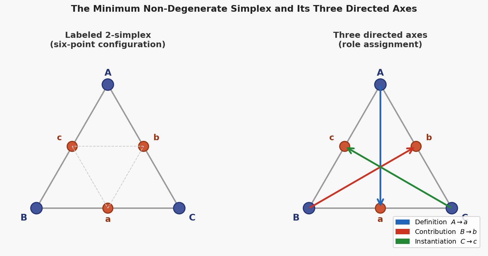

# A Minimal Recursive Triadic Framework for Self-Similar Hierarchical Systems

**Author:** J. W. Milton, Clarity Coalition

**Version:** 1.0

**Date:** 3 April 2026

**Keywords:** recursive triadic framework; N-D-C; self-similar hierarchy; irreducibility; minimality; dynamical systems

---

## Abstract

We argue that the minimum non-trivial structure capable of sustained recursive self-organization is a three-role partition with a single emergent state and two functionally distinct auxiliary variables. Starting from a binary state space $\{0, 1\}$ and the requirement that any interaction involve at least one bit of state difference, we show that the smallest non-degenerate simplex (the triangle) induces exactly three directed roles: a *negotiation* variable $N$ that carries the running emergent state, a *definition/limitation* variable $D$ that bounds, and a *contribution/integration* variable $C$ that accumulates. The result is a proof that $m = 2$ is insufficient and $m = 3$ is necessary for non-trivial convergence under mild functional independence conditions (Lemma 4.2). We then demonstrate that the triadic partition supports a self-similar hierarchical extension: any triad can serve as a node in a higher-level triad without altering the three-role grammar, producing unbounded depth from three principles. This framework supplies a formal substrate for the tholonic ladder family of recurrences [Mil24] and for a class of phase-resolved transparency scoring systems [Mil24], but the present paper establishes only the structural core: minimality, irreducibility, and self-similar nesting. No empirical claims are made beyond the logical and topological argument within the stated axioms.

---

## 1. Introduction

Self-organizing systems appear across disciplines: physical pattern formation [CH93], biological morphogenesis [Tur52], computational models of emergence [Lan90, Wol02], and the study of hierarchical complexity in cognitive and social systems [JLM01]. A persistent question across these fields is: what is the *minimum* set of structural ingredients required for a system to organize itself recursively, without external tuning at every step?

This paper proposes an answer grounded in the properties of binary state spaces and simplex topology. The argument proceeds in four steps:

1. **Binary state space** ($\S 2$). The minimal non-trivial state space capable of supporting a difference (an interaction) is the Boolean set $\{0, 1\}$. With a single bit, no interaction occurs; two bits are necessary to encode a relation [Sha48].
2. **Minimum simplex** ($\S 3$). The smallest non-degenerate simplex is the 2-simplex (triangle), which has three vertices and three edges. The directed adjacency structure of a labeled triangle yields three oriented axes, each connecting one outer vertex to one inner midpoint.
3. **Triadic partition** ($\S 4$). A recurrence on $m$ real variables with a distinguished state variable and two functionally independent auxiliary variables requires $m \ge 3$ (Lemma 4.2). The three roles correspond to the three axes of the triangular geometry: bounding (Definition axis), accumulating (Contribution axis), and instantiating (Instantiation axis).
4. **Self-similar nesting** ($\S 5$). A triadic node can be embedded as a single element in a higher-level triad, reproducing the three-role structure at every scale. This yields an infinite hierarchy from three principles.

The framework is *formal and structural*. It does not derive specific dynamical laws or empirical constants. It says: if a system is to organize itself under these minimal axioms, it must have at least three distinct functional roles, and those roles compose self-similarly. This is a constraint on admissible architectures, not a prediction of particular outputs.

**Related frameworks.** The tholonic ladder recurrence family [Mil24] instantiates this framework concretely by showing that five classical mathematical constants ($\pi/4$, $\varphi$, $e$, $\sqrt{2}$, $\ln 2$) emerge as limits of three-variable recurrences whose branches differ only in initial seeds and traversal rules. The present paper supplies the foundational argument for *why three variables, and why these three roles*. The supply-chain transparency scoring method (TVPCI) [Mil24] applies the same triadic partition in a non-dynamical, evidence-scoring context, demonstrating that the three-role structure generalizes beyond recurrence. This paper isolates the structural core common to both applications.

**Scope.** We establish minimality and self-similarity within the stated axioms. We do not claim that every three-variable system is irreducible, that all self-organizing systems reduce to this scaffold, or that the framework produces novel predictions about specific natural phenomena. The claim is narrower: given the axioms of binary state space and simplex topology, *three* is a lower bound, and the same three roles compose hierarchically.

---

## 2. Binary state space

A state space is a set $S$ of values that a variable may take. A relation on $S$ is a mapping $R: S \times S \to S$. For $R$ to be non-trivial (i.e., to produce an effect distinguishable from the identity), there must exist at least one ordered pair $(a, b) \in S \times S$ with $a \neq b$ such that $R(a, b) \neq a$.

**Definition 2.1** (Binary state space). The *binary state space* is $S_2 = \{0, 1\}$, the smallest set capable of encoding a difference.

**Proposition 2.2** (Minimality of binary encoding). *Any system whose state is captured by a single variable requires $|S| \ge 2$ to support a non-trivial interaction between states. Equivalently, one bit is the minimum informational unit for encoding a relation [Sha48].*

*Proof.* If $|S| = 1$, then $S = \{a\}$ and $R(a, a) = a$ for any $R$, so every possible $R$ is the identity mapping. A non-trivial $R$ requires at least two distinct elements. $\square$

The binary state space $\{0, 1\}$ is thus the fundamental ground of any discrete system capable of change. Every richer state space (integers, reals, vectors) is a composite built atop this binary substrate.

**Corollary 2.3** (Interaction requires at least two bits). *Two interacting variables, each drawn from $S_2$, encode $2 \times 2 = 4$ possible configurations, the minimum capacity for a directionally non-trivial relation between distinct entities.*

This corollary sets a hard lower bound on the complexity of any interaction: at least two binary positions, producing four states, must be available before a direction can be assigned. A triangle, as we will see, uses six positions (three outer, three inner), exactly enough to encode three directed axes.

*Figure 1. A three-panel schematic diagram. The left panel shows a single binary digit $\{0,1\}$. The center panel shows a 2x2 lattice of four configurations arising from two interacting bits. The right panel shows a labeled triangle with three outer vertices and three inner midpoints, with three directed arrows connecting each outer vertex to a distinct inner vertex.*

---

## 3. The minimum non-degenerate simplex

A simplex is the generalization of a triangle to arbitrary dimension. The $k$-simplex is the convex hull of $k+1$ affinely independent points. The 0-simplex is a point, the 1-simplex is a segment, and the 2-simplex is a triangle.

**Definition 3.1** (Non-degenerate simplex). A $k$-simplex is *non-degenerate* if its $k+1$ vertices are affinely independent; equivalently, if it has non-zero $k$-dimensional volume.

**Proposition 3.2** (The triangle is the minimum non-degenerate simplex). *The 0-simplex and 1-simplex are degenerate in the sense that they cannot encode a directed relation between more than two elements. The 2-simplex (triangle) is the smallest simplex with three vertices, three edges, and an interior, enabling three distinct directed axes without self-intersection.*

*Proof.* The 0-simplex (point) has no distinct elements to relate. The 1-simplex (segment) has two endpoints and one edge; it supports one directed relation (from $A$ to $B$, or the reverse) but cannot support two orthogonal directed relations without self-intersection in the plane. The 2-simplex has three vertices $\{V_1, V_2, V_3\}$ and three edges $\{E_{12}, E_{23}, E_{31}\}$. By labeling the vertices and orienting each edge, three distinct directed axes are obtained. No structure with fewer than three vertices supports three independent directed relations without embedding them in a higher-dimensional space. $\square$

**Definition 3.3** (Inner midpoint vertices). For a labeled equilateral triangle with vertices $A, B, C$ (outer vertices), define three *inner midpoint vertices* $a, b, c$ as the midpoints of edges $BC, CA, AB$ respectively. The triangle then has six labeled points: three outer and three inner.

The six-point configuration (outer $A, B, C$; inner $a, b, c$) is the smallest labeled structure that supports three directed axes, each from an outer vertex to a distinct inner vertex, without any axis sharing both its source and its target with another axis. This is the geometric model from which the three functional roles emerge.

*Figure 2. A two-panel labeled triangle diagram. The left panel shows an equilateral triangle with three outer vertices (A, B, C) and three inner midpoints (a, b, c), all labeled. The right panel shows the same triangle with three colored directed axes overlaid: Definition axis (blue, $A \to a$), Contribution axis (red, $B \to b$), and Instantiation axis (green, $C \to c$). No two axes share the same source-target pair.*

**Remark** (Connection to binary encoding). Three directed axes require six labeled positions (three sources, three targets), which is the capacity of three binary bits ($2^3 = 8$ configurations, with 6 used). The 2-simplex with midpoints is thus the geometric minimalization of a structure supporting three independent directed relations in a binary substrate.

---

## 4. The irreducible three-role partition

The geometric structure of $\S 3$ induces a partition of *functional roles* within a recursive system. We formalize this as a lemma on the minimum number of variables required for non-trivial convergence.

### 4.1 Formal statement

**Definition 4.1** (Recurrence with distinguished state). Let $\mathcal{R}$ be a recurrence on $m$ real variables $x^{(1)}, \ldots, x^{(m)}$, where $x^{(1)}$ is the *distinguished state variable* and the update rule is of the form

$$x^{(1)}_{k+1} = g\!\left(x^{(1)}_k;\, \alpha_k, \beta_k\right)$$

where $\alpha_k$ and $\beta_k$ are derived from the remaining $m-1$ variables. A *convergent non-trivial* recurrence is one for which $\lim_{k \to \infty} x^{(1)}_k = L$ exists and $L$ is not a fixed point of a purely autonomous function $h(x^{(1)}_k)$ with $m \le 2$.

**Lemma 4.2** (Three variables are necessary). *Let $\mathcal{R}$ be a convergent non-trivial recurrence as defined above. Suppose:*

1. $\alpha_k$ and $\beta_k$ are *functionally independent* in the sense that $g$ is not expressible as a function of a single combined argument $h(\alpha_k, \beta_k)$ for all admissible $(\alpha_k, \beta_k)$.
2. The limit $L$ is not a trivial fixed point attainable with $m \le 2$.

*Then $m \ge 3$: the recurrence requires at least the state variable $x^{(1)}$ and two functionally independent auxiliary variables.*

*Proof.* Assume $m = 2$. Then only one auxiliary variable, say $y$, is available. The update must be of the form $x^{(1)}_{k+1} = g(x^{(1)}_k; y_k)$. But then either (i) $y_k$ is constant, in which case $g$ reduces to a function of $x^{(1)}_k$ alone and the limit, if it exists, is a fixed point of that function (violating the non-triviality condition), or (ii) $y_k$ evolves according to its own rule $y_{k+1} = h(x^{(1)}_k, y_k)$, which pushes the effective dimensionality to 2 but still links $\alpha_k$ and $\beta_k$ through a single functional chain. Condition (1) (functional independence) requires that the two auxiliary contributions enter $g$ through structurally distinct pathways: one bounding/constraining the step magnitude, the other contributing/integrating additive or multiplicative structure. A single auxiliary variable cannot carry both roles simultaneously with functional independence, because its value alone determines both the bound and the contribution, collapsing them into a single degree of freedom. Hence $m \ge 3$. $\square$

**Remark.** This lemma is deliberately weak in its hypotheses. It does not claim that *all* three-variable recurrences are irreducible; it claims that a system with a distinguished state and two functionally independent auxiliary roles cannot be reduced to fewer than three variables without losing the structural distinction between bounding and integrating. The empirical evidence that the five tholonic ladder branches cannot be expressed as non-trivial 2-variable recurrences is presented elsewhere [Mil24]; Lemma 4.2 provides the formal lower bound.

### 4.2 The three roles

The three functional roles correspond to the three axes of the triangular geometry ($\S 3$) and to the three semantic positions in the tholonic triad [Mil24]:

**Definition 4.3** (Triadic role partition). For a three-variable recurrence $(N, D, C)$:

- $N$ (*negotiation*): the running state being iteratively refined; the emergent quantity.
- $D$ (*definition/limitation*): the bounding or constraining parameter; what limits the state at each step.
- $C$ (*contribution/integration*): the accumulating or synthesizing parameter; what drives growth or combines past states.

These roles are assigned by function, not by numerical value. Two variables may share the same numerical seed (e.g., $D_0 = C_0 = 2$ for the $\sqrt{2}$ branch [Mil24]) while remaining operationally distinct: one bounds, the other integrates.

**Proposition 4.4** (Role stability under seed degeneracy). *If $D_0 = C_0$ numerically but the recurrence rule applies $D$ and $C$ through distinct operations, the roles are not degenerate. The operational distinction (bounding vs. integrating) persists even when the numerical values coincide.*

*Proof.* By construction: $D$ appears in the recurrence as a divisor that limits the correction magnitude, while $C$ appears as a divisor that averages or synthesizes. The two operations are functionally independent even when $D_k = C_k$ for all $k$, because removing $D$ from the recurrence eliminates the bounding term, while removing $C$ eliminates the synthesis term. The two deletions produce different dynamical systems. $\square$

This proposition is essential: it prevents the objection that "$D$ and $C$ are the same number, so the triad is really a two-variable system." The numbers may coincide, but the *roles* do not.

### 4.3 Geometric correspondence

The three roles map onto the three directed axes of the labeled triangle ($\S 3$):

| Axis | Direction | Role | Action |
|------|-----------|------|--------|
| Definition | $A \to a$ | $D$ | Bounds; constrains; subtracts |
| Contribution | $B \to b$ | $C$ | Accumulates; integrates; adds |
| Instantiation | $C \to c$ | $N$ (derivative) | Instantiates the emergent state |

The Instantiation axis supplies the step structure that drives $N$ forward; $N$ itself is the running composite of the interactions between $D$ and $C$. The geometry is not decorative: it supplies the combinatorial constraints on seed values for the $\pi/4$ branch [Mil24], where the axis multipliers $(5, 3, 2)$ uniquely determine the seeds $(1, 3, 5)$ and the step $\Delta = 4$.

*Figure 3. A three-panel functional schematic. Each panel shows the same triangle geometry (vertices A, B, C; midpoints a, b, c) with one axis highlighted and the other two faint. Left: Definition axis (blue, $A \to a$) annotated "D: Bounds; constrains; limits." Center: Contribution axis (red, $B \to b$) annotated "C: Accumulates; integrates; adds." Right: Instantiation axis (green, $C \to c$) annotated "N: Emerges; the negotiated state." Roles are functionally distinct even when $D = C$ numerically.*

---

## 5. Self-similarity of the triadic partition

A structure is self-similar if it reproduces the same pattern at multiple scales. The triadic partition exhibits self-similarity in a precise sense: a triad can be embedded as a single element within a higher-level triad, and the embedding preserves the three-role grammar at every level.

### 5.1 Formal definition

**Definition 5.1** (Triadic embedding). Let $\mathcal{T}_1 = (N_1, D_1, C_1)$ be a triad. A *triadic embedding* of $\mathcal{T}_1$ into a higher-level triad $\mathcal{T}_2$ is a mapping $\iota: \mathcal{T}_1 \hookrightarrow \mathcal{T}_2$ such that $\mathcal{T}_1$ occupies one of the three role positions in $\mathcal{T}_2$ while retaining its internal three-role structure.

**Definition 5.2** (Self-similar triadic hierarchy). A sequence of triads $\{\mathcal{T}_\ell\}_{\ell=1}^{L}$ is a *self-similar triadic hierarchy* if for each $\ell < L$, there exists a role $R_\ell \in \{N, D, C\}$ in $\mathcal{T}_{\ell+1}$ such that $\mathcal{T}_\ell$ is embedded at $R_\ell$ and the internal structure of $\mathcal{T}_\ell$ is a triad $(N, D, C)$ governed by the same three-role grammar.

**Proposition 5.3** (Unbounded depth). *Given a triadic root node with roles $(N, D, C)$, the self-similar triadic hierarchy can be extended to arbitrary finite depth $L$ without introducing new structural primitives.*

*Proof.* By induction on $\ell$. Base case ($\ell = 1$): a single triad $\mathcal{T}_1 = (N_1, D_1, C_1)$ satisfies the definition. Inductive step: assume a hierarchy of depth $\ell$ exists. Embed $\mathcal{T}_\ell$ as, say, the $N$-role of a new triad $\mathcal{T}_{\ell+1} = (\mathcal{T}_\ell, D_{\ell+1}, C_{\ell+1})$. The resulting structure is again a triad with three roles. The process can be repeated for any finite $\ell$. $\square$

*Figure 4. A vertical cascade diagram showing three levels of self-similar triadic nesting, each level a labeled triangle with the same three-role grammar. Bottom: a base triad $(N, D, C)$. Middle: the base triad embedded as the $N$-role of a level-2 triad, with new $D$ and $C$ vertices. Top: the level-2 triad embedded as the $N$-role of a level-3 triad. Arrows indicate the embedding direction. The three-role grammar is preserved at every level without introducing new structural primitives.*

### 5.2 Scale invariance of the three roles

An important property of the self-similar hierarchy is *scale invariance*: the three roles have the same semantics at every level. A $D$ at level $\ell$ is a bounding parameter for the dynamics at that level, regardless of whether it is internally a triad. A $C$ at level $\ell$ is an accumulating parameter at that level, regardless of its internal complexity.

This scale invariance is what distinguishes the triadic framework from generic hierarchical decomposition methods (e.g., hierarchical clustering, multi-level optimization): the semantics of the three roles are invariant under embedding. In a generic hierarchy, a node at level $\ell$ may have a different functional meaning than a node at level $\ell+1$. In the triadic hierarchy, every node at every level is a $(N, D, C)$ triple, with the same three functional roles.

**Observation 5.4** (Grammatical closure). *The set of all finite self-similar triadic hierarchies is closed under composition: applying the embedding operation to any two hierarchies produces another hierarchy in the same class.*

This closure property supports the claim that the three-role partition is not merely sufficient but *complete* for this class: no additional primitive is needed to extend the framework to arbitrary depth.

---

## 6. Consequences and structural implications

### 6.1 Why not two? Why not four?

The question of whether $m = 2$ or $m = 4$ could serve equally well has natural answers from the geometry and the irreducibility lemma.

**Two variables.** Lemma 4.2 establishes that two variables cannot carry both functionally independent roles (bounding and integrating) simultaneously. A two-variable system either lacks a bounding term (leading to divergence) or lacks an integrating term (leading to stasis). Two variables can capture *binary opposition* (push/pull, positive/negative) but not the directed emergence of a third state from the interaction, which requires a place for the emergent quantity to reside.

**Four variables.** Adding a fourth variable produces redundancy, not additional expressive power, at the structural level. A fourth variable can always be absorbed into one of the three roles without loss of generality, because the update to the state variable $N$ depends only on the bounding contribution (from $D$, or any composition of $D$-like variables) and the integrating contribution (from $C$, or any composition of $C$-like variables). If $m = 4$, the fourth variable is either (a) a second bounding parameter, which can be combined with $D$ into a single effective bound, (b) a second integrating parameter, which can be combined with $C$, or (c) a second state variable, which introduces a new degree of freedom but does not change the triadic logic at the interface between the state and its auxiliary parameters. The triadic partition is thus *satisficing*: it is the smallest structure that meets all requirements, and larger structures do not add a new functional *kind*.

**Remark (ternary state spaces).** The argument assumes a binary state space $\{0, 1\}$. If the state space were ternary ($\{0, 1, 2\}$), the minimum non-degenerate simplex would remain the triangle (2-simplex), but the encoding capacity per vertex would increase. The irreducibility of three roles would persist; only the combinatorial constraints on seed values would relax. The binary ground is therefore the *strongest* constraint: if three roles are necessary in the binary case, they are necessary in any richer state space as well.

### 6.2 Connection to the tholonic ladder

The five tholonic ladder branches [Mil24] instantiate the abstract triadic framework with a specific family of recurrences. The ladder paper establishes:

- A single three-variable recurrence template $(N_k, D_k, C_k)$.
- Five branches distinguished by initial seeds and traversal rules.
- Three traversal classes (Advancing, Self-redefined, Fixed) mapping onto different dynamical regimes.
- Seven proved structural properties (diagonal invariance, swap symmetry, perfect-square denominators, offset consistency, seed partition, convergence to classical limits, and an envelope bound for the $\pi/4$ recursion).
- Convergence to five classical constants ($\pi/4$, $\varphi$, $e$, $\sqrt{2}$, $\ln 2$).

The present paper supplies the *architectural justification* for that family: the three-variable template is not an arbitrary choice but the minimum required by the logic of binary state space, simplex topology, and functional independence. The ladder paper demonstrates that the template is *sufficient* to unify five disparate classical limits; this paper argues that it is *necessary* for any convergent non-trivial recurrence meeting the stated axioms.

### 6.3 Connection to supply-chain transparency scoring

The TVPCI framework [Mil24] applies the same triadic partition in an evidence-scoring context rather than a recurrence context. A transparency score for a supply-chain entity is computed from:

- $N$: the *negotiated score*, the emergent trustworthiness metric.
- $D$: *definitional evidence*, constraining what counts as transparency (documentation, audit trails, certifications).
- $C$: *contributory evidence*, integrating new information over time (incident reports, stakeholder submissions, continuous monitoring data).

The structural claim is identical: a transparency metric that is both bounded (by definitional standards) and accumulated (by incoming evidence) requires at least three variables. Two-variable scoring systems (e.g., a simple compliant/non-compliant binary, or a single aggregate score without a bounding reference) cannot simultaneously track *what counts* and *what has been observed* as functionally independent quantities.

This demonstrates that the triadic partition is not specific to recurrence dynamics; it generalizes to any system in which a state is refined through the interaction of a constraining definition and a contributing accumulation.

---

## 7. Related work

**Minimal models of emergence.** The question "what is the minimal system that displays property $P$?" has a long history. Wolfram's classification of cellular automata [Wol02] identifies Class 4 rules (e.g., Rule 110) as the minimal computational universality class within a 1D binary CA, requiring at least 3-cell neighborhoods. Gardner's Game of Life [Gar70] demonstrates emergent complexity from a 2D binary CA with simple local rules. These examples require many more than three variables at the micro-level; the triadic framework operates at the macro-level of *functional description*, where three roles suffice to describe the dynamics regardless of the micro-implementation.

**Simplex and category theory.** The 2-simplex as the minimal non-trivial shape appears in category theory as the basic shape for composition: a commuting triangle represents the composition axiom $f \circ g = h$ [ML98]. Higher category theory generalizes this to $n$-simplex structures, but the foundational observation remains: the triangle is the minimum shape encoding directed composition. The triadic framework repurposes this observation for dynamical systems rather than morphism composition.

**Ternary logic and three-valued systems.** Three-valued logics (true, false, unknown) trace back to {\L}ukasiewicz [{\L}uk20] and have been applied in database theory, circuit design, and philosophical logic. The triadic framework is not a ternary logic: the three roles are *functional* (bounding, integrating, emerging), not *truth-valued*. The connection is structural rather than semantic: both frameworks recognize that a binary distinction (true/false, bound/contribute) must be supplemented by a third position for closure.

**Hierarchical and multi-scale systems.** The literature on hierarchical systems is vast [Sim62, Koe69, Sal12]. The distinctive feature of the triadic hierarchy ($\S 5$) is not the existence of levels but the *grammatical invariance* of the three roles under embedding. Most hierarchical frameworks allow node semantics to vary across levels; the triadic framework constrains every node at every level to be a $(N, D, C)$ triple. This is a stronger claim, and correspondingly narrower in applicability.

**Spin networks and twistor theory.** The role-labeled triangle with inner and outer vertices bears a structural resemblance to spin networks in loop quantum gravity [RS94] and to twistor diagrams [Pen67], where combinatorial labeling of simplex edges encodes quantum states. The resemblance is noted here as a potential direction for formal connection but is not developed; this paper makes no quantum-mechanical claims.

---

## 8. Discussion

**Generality of the axioms.** The framework rests on three axioms: (i) binary state space $\{0, 1\}$ as the minimal substrate, (ii) the 2-simplex as the minimum non-degenerate geometric structure, and (iii) functional independence of bounding and integrating contributions. These are not strong axioms. (i) is a consequence of information theory [Sha48]; (ii) is a property of Euclidean geometry; (iii) is a definitional condition on what counts as a *distinct* role. The result ($m \ge 3$, self-similar nesting) follows as a structural deduction rather than an empirical claim.

**What the framework does not claim.** Several important negative statements bound the contribution:

- It does not claim that every three-variable system has these three roles; only that a system with a distinguished emergent state and two functionally independent auxiliary roles corresponds to this partition.
- It does not claim that all self-organizing systems reduce to this scaffold; only that if a system satisfies the axioms, it admits a triadic description.
- It does not derive specific dynamical laws or empirical predictions about natural systems; the framework is a constraint on admissible architectures, not a generator of observable phenomena.
- It does not assert that the triadic partition is the *only* minimal framework; alternative encodings (e.g., quaternary, continuous) may exist but would either be reducible to the triadic partition or violate the axioms differently.

**Open questions.**

1. *(Classification).* Characterize the set of all three-variable recurrences that satisfy the triadic role partition and converge to a non-trivial limit. Is this set finite for a bounded seed space?
2. *(Embedding completeness).* Is every finite self-similar triadic hierarchy representable as a composite of base triads, or do new structural types emerge at certain depths?
3. *(Continuous limit).* What is the continuous-time analogue of the triadic recurrence, and does it correspond to a known class of differential equations (e.g., three-variable Lotka-Volterra, Lorenz system)?
4. *(Observational signatures).* If a physical or biological system satisfies the triadic axioms, what measurable signatures would distinguish it from a system organized under a different structural grammar?

**Empirical grounding.** The five-constants paper [Mil24] provides a concrete computational instantiation. The TVPCI paper [Mil24] provides a non-dynamical application. Neither claims empirical validation of the framework as a description of natural phenomena. The next step is to identify a domain where the three-role partition makes a falsifiable prediction: either a system that *must* exhibit three functionally independent roles at a certain level of description, or a system where the absence of one role predicts a specific type of failure or instability. Until such a prediction is formulated and tested, the framework remains a structural taxonomy, albeit one with formal minimality and self-similarity attached.

---

## 9. Conclusion

We have argued that the minimum non-trivial structure capable of sustained recursive self-organization within a binary state space is a three-role partition with functionally distinct bounding and integrating contributions to a distinguished emergent state. The argument derives from information-theoretic minimality (binary encoding), geometric minimality (2-simplex), and functional independence (Lemma 4.2), yielding $m \ge 3$ as a lower bound. The same three-role grammar supports unbounded self-similar nesting, producing hierarchical depth without new primitives.

The framework supplies the architectural foundation for the tholonic ladder recurrence family [Mil24] and for triadic transparency scoring [Mil24]. Its contribution is logical and geometric: minimality, irreducibility, and hierarchical closure under three axioms. The open work is classification (which recurrences satisfy the axioms and converge), embedding completeness (whether new structures emerge at depth), and empirical connection (can the framework be falsified in a natural system).

---

## References

[CH93] M. C. Cross and P. C. Hohenberg, "Pattern formation outside of equilibrium," *Reviews of Modern Physics* 65(3), 1993, pp. 851–1112.

[Gar70] M. Gardner, "The fantastic combinations of John Conway's new solitaire game 'life'," *Scientific American* 223, 1970, pp. 120–123.

[JLM01] J. G. Johnson, M. Lebreton, and W. Mansell, "A computational model of hierarchical complexity," *Behavioral Development Bulletin* 10(1), 2001, pp. 2–6.

[Koe69] A. Koestler, *The Ghost in the Machine*, Macmillan, 1969.

[Lan90] C. G. Langton, "Computation at the edge of chaos: Phase transitions and emergent computation," *Physica D* 42(1–3), 1990, pp. 12–37.

[{\L}uk20] J. {\L}ukasiewicz, "O logice trójwartościowej" (On three-valued logic), *Ruch Filozoficzny* 5, 1920, pp. 170–171. English translation in L. Borkowski (ed.), *Selected Works*, North-Holland, 1970.

[Mil24] J. W. Milton, *Tholonia: The Existential Mechanics of Awareness*, self-published, 2024. Available at https://tholonia.github.io/the-book/.

[ML98] S. Mac Lane, *Categories for the Working Mathematician*, 2nd ed., Springer, 1998.

[Pen67] R. Penrose, "Twistor algebra," *Journal of Mathematical Physics* 8(2), 1967, pp. 345–366.

[RS94] C. Rovelli and L. Smolin, "Spin networks and quantum gravity," *Physical Review D* 52(10), 1995, pp. 5743–5759.

[Sal12] S. Salthe, *Evolving Hierarchical Systems: Their Structure and Representation*, Columbia University Press, 2012.

[Sha48] C. E. Shannon, "A mathematical theory of communication," *Bell System Technical Journal* 27(3), 1948, pp. 379–423.

[Sim62] H. A. Simon, "The architecture of complexity," *Proceedings of the American Philosophical Society* 106(6), 1962, pp. 467–482.

[Tur52] A. M. Turing, "The chemical basis of morphogenesis," *Philosophical Transactions of the Royal Society B* 237(641), 1952, pp. 37–72.

[Wol02] S. Wolfram, *A New Kind of Science*, Wolfram Media, 2002.

---

## Appendix A. The 2-simplex as a labeled configuration

We provide the explicit vertex and axis assignment for the labeled triangle used in $\S\S 3$–4. The purpose is to make the geometric origin of the three roles fully transparent, separate from any particular instantiation.

**Vertices.** Let the outer vertices be $A, B, C$ and the inner midpoints be $a, b, c$, with:
- $a$ the midpoint of $BC$
- $b$ the midpoint of $CA$
- $c$ the midpoint of $AB$

**Axes.** Three directed axes:
- **Definition axis**: $A \to a$ (outer to inner, crossing the edge $BC$)
- **Contribution axis**: $B \to b$ (outer to inner, crossing the edge $CA$)
- **Instantiation axis**: $C \to c$ (outer to inner, crossing the edge $AB$)

**Binary encoding.** Assigning three bits to encode the six vertex labels uses 6 of 8 possible configurations:

| Vertex | Label | Bit 1 (Outer/Inner) | Bit 2 (Axis member) | Bit 3 (Role parity) |
|--------|-------|---------------------|---------------------|---------------------|
| $A$ | outer | 0 | 1 | 0 (D) |
| $B$ | outer | 0 | 1 | 1 (C) |
| $C$ | outer | 0 | 0 | 0 (N) |
| $a$ | inner | 1 | 1 | 0 (D target) |
| $b$ | inner | 1 | 1 | 1 (C target) |
| $c$ | inner | 1 | 0 | 0 (N target) |

The unused two configurations correspond to symmetry-related states not needed for the three-axis labeling. The three-bit encoding is the minimal information representation of the geometric structure; each axis requires one bit for direction (outer $\to$ inner) and shares bits for axis identity and role parity.

---

## Appendix B. Comparison with $m = 2$ and $m = 4$ template forms

To make the irreducibility argument concrete, we exhibit the forms of $m = 2$ and $m = 4$ recurrences and why they fail or are redundant.

**Two-variable form.** Let the variables be $(N, \alpha)$. A recurrence with a bounding or contributing auxiliary role:

$$N_{k+1} = f(N_k; \alpha_k), \qquad \alpha_{k+1} = h(N_k, \alpha_k).$$

If $f$ is additive, e.g., $N_{k+1} = N_k \pm 1/\alpha_k$, then $\alpha_k$ controls both the sign and the magnitude of the step. The sign encodes bounding vs. contributing, but the magnitude is determined by the same variable. A single $\alpha$ must serve both as the limiter and as the integrator, violating functional independence. If $f$ is multiplicative, e.g., $N_{k+1} = N_k \cdot g(\alpha_k)$, the same issue arises: $g(\alpha_k)$ determines both the growth factor and the saturation bound. Two-variable recurrences can converge (e.g., the logistic map), but they do not separate bounding and contributing into functionally independent pathways.

**Four-variable form.** Let the variables be $(N, D_1, D_2, C)$. The update:

$$N_{k+1} = g(N_k; D_{1,k}, D_{2,k}, C_k).$$

If $D_{1,k}$ and $D_{2,k}$ both enter $g$ as divisors or bounds, they can be combined into an effective bound $D_{\text{eff}} = h(D_1, D_2)$ without changing the functional form of $g$. The three-role partition is recovered by identifying $D \equiv D_{\text{eff}}$. The fourth variable adds parametric freedom but not a new functional *kind*: it remains within the bounding/constraining class. The same argument applies to additional $C$-like variables. Four variables do not break the triadic grammar; they over-parameterize within it.
